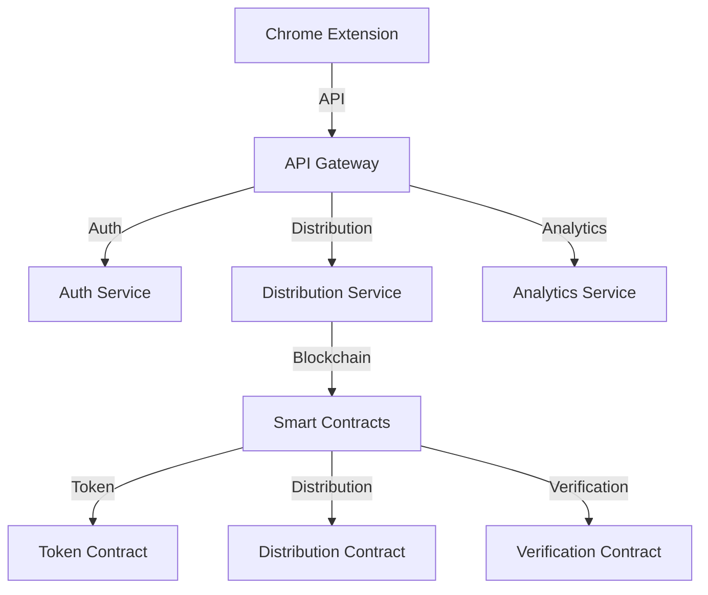

# System Architecture

## Overview

### System Components

1. **Chrome Extension**
   - User interface
   - Twitter integration
   - Wallet connection
   - Distribution logic

2. **Backend Services**
   - API gateway
   - Authentication service
   - Distribution service
   - Analytics service

3. **Blockchain Layer**
   - Smart contracts
   - Token logic
   - Distribution contracts
   - Verification system

### Architecture Diagram



## Component Details

### Chrome Extension

1. **User Interface**
   ```typescript
   // UI Components
   interface UIComponents {
       // Distribution interface
       DistributionPanel: {
           createDistribution(): void;
           viewStatus(): void;
           trackProgress(): void;
       };
       
       // Wallet interface
       WalletPanel: {
           connect(): Promise<void>;
           disconnect(): void;
           getBalance(): Promise<number>;
       };
       
       // Settings interface
       SettingsPanel: {
           configure(): void;
           updatePreferences(): void;
           viewHistory(): void;
       };
   }
   ```

2. **Twitter Integration**
   ```typescript
   // Twitter Service
   class TwitterService {
       // Post detection
       async detectPosts() {
           const posts = await this.scanPage();
           return this.filterRelevantPosts(posts);
       }
       
       // Engagement tracking
       async trackEngagement(postId: string) {
           const stats = await this.getEngagementStats(postId);
           return this.processEngagement(stats);
       }
       
       // Action verification
       async verifyAction(action: Action) {
           const proof = await this.generateProof(action);
           return this.validateProof(proof);
       }
   }
   ```

3. **Distribution Logic**
   ```typescript
   // Distribution Manager
   class DistributionManager {
       // Create distribution
       async createDistribution(params: DistributionParams) {
           const validation = await this.validateParams(params);
           if (validation.success) {
               return this.executeDistribution(params);
           }
           throw new ValidationError(validation.errors);
       }
       
       // Track distribution
       async trackDistribution(id: string) {
           const status = await this.getStatus(id);
           return this.updateUI(status);
       }
       
       // Process claims
       async processClaim(claim: Claim) {
           const verification = await this.verifyClaim(claim);
           if (verification.valid) {
               return this.executeClaim(claim);
           }
           throw new ClaimError(verification.reason);
       }
   }
   ```

### Backend Services

1. **API Gateway**
   ```typescript
   // Gateway Service
   class GatewayService {
       // Request routing
       async routeRequest(request: Request) {
           const service = this.determineService(request);
           return this.forwardRequest(service, request);
       }
       
       // Response handling
       async handleResponse(response: Response) {
           const processed = await this.processResponse(response);
           return this.formatResponse(processed);
       }
       
       // Error handling
       async handleError(error: Error) {
           const logged = await this.logError(error);
           return this.formatError(logged);
       }
   }
   ```

2. **Authentication Service**
   ```typescript
   // Auth Service
   class AuthService {
       // User authentication
       async authenticateUser(credentials: Credentials) {
           const user = await this.validateCredentials(credentials);
           return this.generateToken(user);
       }
       
       // Session management
       async manageSession(session: Session) {
           const valid = await this.validateSession(session);
           return this.updateSession(valid);
       }
       
       // Permission control
       async checkPermission(user: User, action: Action) {
           const permissions = await this.getUserPermissions(user);
           return this.validatePermission(permissions, action);
       }
   }
   ```

3. **Distribution Service**
   ```typescript
   // Distribution Service
   class DistributionService {
       // Distribution creation
       async createDistribution(params: DistributionParams) {
           const contract = await this.prepareContract();
           return this.executeDistribution(contract, params);
       }
       
       // Status tracking
       async trackStatus(id: string) {
           const events = await this.getEvents(id);
           return this.processEvents(events);
       }
       
       // Claim processing
       async processClaim(claim: Claim) {
           const validation = await this.validateClaim(claim);
           return this.executeClaim(validation);
       }
   }
   ```

### Blockchain Layer

1. **Token Contract**
   ```solidity
   // Token Implementation
   contract FairToken is ERC20 {
       // Token configuration
       constructor() ERC20("FANS", "FANS") {
           _mint(msg.sender, INITIAL_SUPPLY);
       }
       
       // Transfer logic
       function transfer(
           address recipient,
           uint256 amount
       ) public override returns (bool) {
           _transfer(_msgSender(), recipient, amount);
           return true;
       }
       
       // Burning mechanism
       function burn(uint256 amount) public {
           _burn(_msgSender(), amount);
       }
   }
   ```

2. **Distribution Contract**
   ```solidity
   // Distribution Implementation
   contract Distribution {
       // Distribution creation
       function createDistribution(
           uint256 amount,
           address[] calldata recipients
       ) external {
           require(
               token.transferFrom(msg.sender, address(this), amount),
               "Transfer failed"
           );
           
           uint256 share = amount / recipients.length;
           for (uint i = 0; i < recipients.length; i++) {
               token.transfer(recipients[i], share);
           }
       }
       
       // Claim processing
       function processClaim(
           bytes calldata proof,
           uint256 amount
       ) external {
           require(
               verifyProof(proof),
               "Invalid proof"
           );
           
           token.transfer(msg.sender, amount);
       }
   }
   ```

3. **Verification Contract**
   ```solidity
   // Verification Implementation
   contract Verification {
       // Proof verification
       function verifyProof(
           bytes calldata proof
       ) public view returns (bool) {
           return _verify(proof);
       }
       
       // Action validation
       function validateAction(
           bytes calldata action,
           bytes calldata signature
       ) public view returns (bool) {
           return _validateSignature(action, signature);
       }
   }
   ```

## Performance Optimization

### Caching Strategy

1. **Client-side Cache**
   ```typescript
   // Cache Manager
   class CacheManager {
       // Cache handling
       async handleCache(key: string, data: any) {
           const cached = await this.getCache(key);
           if (cached) {
               return cached;
           }
           return this.setCache(key, data);
       }
       
       // Cache invalidation
       async invalidateCache(pattern: string) {
           const keys = await this.findKeys(pattern);
           return this.removeKeys(keys);
       }
   }
   ```

2. **Server-side Cache**
   ```typescript
   // Redis Cache
   class RedisCache {
       // Data caching
       async cacheData(key: string, data: any) {
           const serialized = this.serialize(data);
           return this.redis.set(key, serialized);
       }
       
       // Cache retrieval
       async retrieveCache(key: string) {
           const data = await this.redis.get(key);
           return this.deserialize(data);
       }
   }
   ```

3. **Smart Contract Cache**
   ```solidity
   // Contract Cache
   contract CacheManager {
       // State caching
       mapping(bytes32 => bytes) private cache;
       
       // Cache storage
       function storeCache(
           bytes32 key,
           bytes calldata data
       ) external {
           cache[key] = data;
       }
       
       // Cache retrieval
       function retrieveCache(
           bytes32 key
       ) external view returns (bytes memory) {
           return cache[key];
       }
   }
   ```

### Load Balancing

1. **API Load Balancing**
   ```typescript
   // Load Balancer
   class LoadBalancer {
       // Request distribution
       async distributeRequest(request: Request) {
           const server = await this.selectServer();
           return this.forwardRequest(server, request);
       }
       
       // Health checking
       async checkHealth() {
           const servers = await this.getServers();
           return this.updateHealth(servers);
       }
   }
   ```

2. **Service Scaling**
   ```typescript
   // Auto Scaler
   class AutoScaler {
       // Scale management
       async manageScale() {
           const metrics = await this.getMetrics();
           return this.adjustScale(metrics);
       }
       
       // Resource allocation
       async allocateResources() {
           const needs = await this.calculateNeeds();
           return this.provision(needs);
       }
   }
   ```

### Monitoring System

1. **Performance Monitoring**
   ```typescript
   // Performance Monitor
   class PerformanceMonitor {
       // Metric collection
       async collectMetrics() {
           const metrics = await this.gatherData();
           return this.processMetrics(metrics);
       }
       
       // Alert system
       async checkAlerts() {
           const status = await this.checkStatus();
           return this.triggerAlerts(status);
       }
   }
   ```

2. **Error Tracking**
   ```typescript
   // Error Tracker
   class ErrorTracker {
       // Error logging
       async logError(error: Error) {
           const formatted = this.formatError(error);
           return this.storeError(formatted);
       }
       
       // Analysis
       async analyzeErrors() {
           const errors = await this.getErrors();
           return this.generateReport(errors);
       }
   }
   ```

## Security Implementation

### Access Control

1. **Authentication System**
   ```typescript
   // Auth System
   class AuthSystem {
       // User authentication
       async authenticateUser(credentials: Credentials) {
           const user = await this.validateUser(credentials);
           return this.generateSession(user);
       }
       
       // Permission management
       async managePermissions(user: User) {
           const roles = await this.getUserRoles(user);
           return this.applyPermissions(roles);
       }
   }
   ```

2. **Rate Limiting**
   ```typescript
   // Rate Limiter
   class RateLimiter {
       // Request limiting
       async limitRequests(ip: string) {
           const count = await this.getRequestCount(ip);
           return this.checkLimit(count);
       }
       
       // Limit management
       async manageLimits() {
           const limits = await this.getLimits();
           return this.updateLimits(limits);
       }
   }
   ```

### Data Protection

1. **Encryption System**
   ```typescript
   // Encryption Manager
   class EncryptionManager {
       // Data encryption
       async encryptData(data: any) {
           const key = await this.getKey();
           return this.encrypt(data, key);
       }
       
       // Key management
       async manageKeys() {
           const keys = await this.getKeys();
           return this.rotateKeys(keys);
       }
   }
   ```

2. **Privacy Controls**
   ```typescript
   // Privacy Manager
   class PrivacyManager {
       // Data anonymization
       async anonymizeData(data: any) {
           const sensitive = this.identifySensitive(data);
           return this.anonymize(sensitive);
       }
       
       // Compliance checking
       async checkCompliance() {
           const status = await this.getStatus();
           return this.enforceCompliance(status);
       }
   }
   ```
