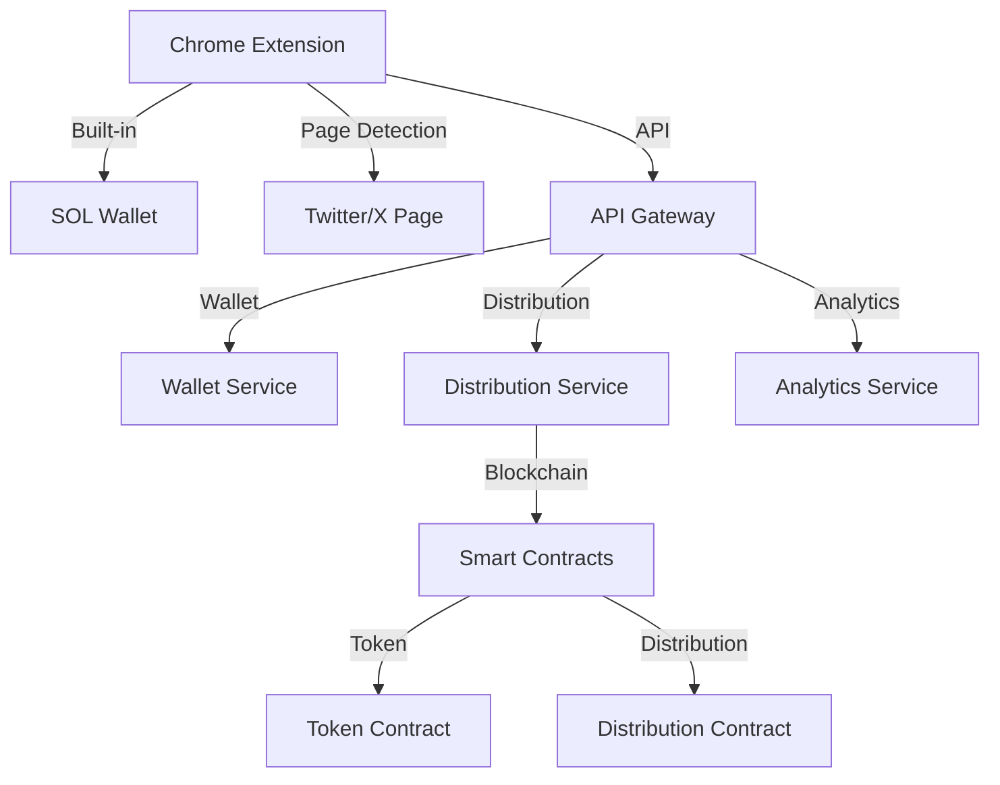

# System Architecture

## Overview

### System Components

1. **Chrome Extension**
   - User interface
   - Built-in SOL wallet
   - Twitter/X page detection
   - Distribution logic
   - Security module

2. **Backend Services**
   - API gateway
   - Wallet service
   - Distribution service
   - Analytics service

3. **Blockchain Layer**
   - Smart contracts
   - Token logic
   - Distribution contracts
   - Verification system

### Architecture Diagram



## Component Details

### Chrome Extension

1. **Page Detection**
   ```typescript
   // Page Detector
   class PageDetector {
       // Detect Twitter/X page
       async detectPage(): Promise<TwitterPage> {
           const url = window.location.href;
           if (this.isTwitterPage(url)) {
               return this.analyzePage(url);
           }
           return null;
       }
       
       // Extract post info
       async extractPostInfo(): Promise<PostInfo> {
           const elements = document.querySelectorAll('[data-testid="tweet"]');
           return this.parseElements(elements);
       }
   }
   ```

2. **Wallet Management**
   ```typescript
   // Wallet Manager
   class WalletManager {
       // Generate new wallet
       async generateWallet(): Promise<SolanaWallet> {
           const keyPair = await this.generateKeyPair();
           return this.createWallet(keyPair);
       }
       
       // Import wallet
       async importWallet(privateKey: string): Promise<SolanaWallet> {
           const keyPair = await this.importKeyPair(privateKey);
           return this.createWallet(keyPair);
       }
       
       // Export wallet
       async exportWallet(): Promise<string> {
           const wallet = await this.getCurrentWallet();
           return this.exportPrivateKey(wallet);
       }
   }
   ```

3. **Distribution Logic**
   ```typescript
   // Distribution Manager
   class DistributionManager {
       // Create distribution
       async createDistribution(params: DistributionParams) {
           const wallet = await this.getWallet();
           const postInfo = await this.getPostInfo();
           return this.executeDistribution(wallet, postInfo, params);
       }
       
       // Track distribution
       async trackDistribution(id: string) {
           const status = await this.getStatus(id);
           return this.updateUI(status);
       }
   }
   ```

### Backend Services

1. **Wallet Service**
   ```typescript
   // Wallet Service
   class WalletService {
       // Create wallet
       async createWallet(): Promise<WalletResponse> {
           const wallet = await this.generateSolanaWallet();
           return this.registerWallet(wallet);
       }
       
       // Get balance
       async getBalance(address: string): Promise<number> {
           const connection = await this.getConnection();
           return connection.getBalance(address);
       }
       
       // Send transaction
       async sendTransaction(tx: Transaction): Promise<string> {
           const connection = await this.getConnection();
           return connection.sendTransaction(tx);
       }
   }
   ```

2. **Distribution Service**
   ```typescript
   // Distribution Service
   class DistributionService {
       // Create distribution
       async createDistribution(params: CreateDistributionParams) {
           const contract = await this.getContract();
           return contract.createDistribution(params);
       }
       
       // Get distribution status
       async getDistributionStatus(id: string) {
           const contract = await this.getContract();
           return contract.getStatus(id);
       }
       
       // Process claims
       async processClaim(id: string, address: string) {
           const contract = await this.getContract();
           return contract.processClaim(id, address);
       }
   }
   ```

### Smart Contracts

1. **Distribution Contract**
   ```solidity
   contract Distribution {
       // Distribution data
       struct DistributionData {
           address creator;
           uint256 amount;
           uint256 recipientCount;
           uint256 endTime;
           bool active;
       }
       
       // Create distribution
       function createDistribution(
           uint256 amount,
           uint256 recipientCount,
           uint256 duration
       ) external {
           // Create new distribution
           // Transfer tokens
           // Set parameters
       }
       
       // Claim tokens
       function claim(uint256 distributionId) external {
           // Verify eligibility
           // Process claim
           // Update state
       }
   }
   ```

2. **Token Contract**
   ```solidity
   contract Token {
       // Token data
       string public name = "MEMEFANS";
       string public symbol = "MF";
       uint8 public decimals = 18;
       
       // Transfer tokens
       function transfer(
           address recipient,
           uint256 amount
       ) external returns (bool) {
           _transfer(msg.sender, recipient, amount);
           return true;
       }
       
       // Distribution transfer
       function distributionTransfer(
           address[] calldata recipients,
           uint256[] calldata amounts
       ) external returns (bool) {
           require(
               recipients.length == amounts.length,
               "Length mismatch"
           );
           
           for (uint i = 0; i < recipients.length; i++) {
               _transfer(msg.sender, recipients[i], amounts[i]);
           }
           
           return true;
       }
   }
   ```

## Security Implementation

### Wallet Security

1. **Key Generation**
   ```typescript
   // Key Generator
   class KeyGenerator {
       // Generate key pair
       async generateKeyPair(): Promise<KeyPair> {
           const entropy = await this.getSecureEntropy();
           return this.createKeyPair(entropy);
       }
       
       // Create backup
       async createBackup(keyPair: KeyPair): Promise<string> {
           const mnemonic = await this.generateMnemonic(keyPair);
           return this.encryptMnemonic(mnemonic);
       }
   }
   ```

2. **Secure Storage**
   ```typescript
   // Storage Manager
   class StorageManager {
       // Store private key
       async storePrivateKey(key: string): Promise<void> {
           const encrypted = await this.encrypt(key);
           return this.secureStore(encrypted);
       }
       
       // Retrieve private key
       async retrievePrivateKey(): Promise<string> {
           const encrypted = await this.secureRetrieve();
           return this.decrypt(encrypted);
       }
   }
   ```

### Page Security

1. **Content Detection**
   ```typescript
   // Content Detector
   class ContentDetector {
       // Verify page content
       async verifyContent(url: string): Promise<boolean> {
           const content = await this.getPageContent(url);
           return this.validateContent(content);
       }
       
       // Extract safe data
       async extractSafeData(content: any): Promise<SafeData> {
           return this.sanitizeData(content);
       }
   }
   ```

2. **Safe Interaction**
   ```typescript
   // Safe Interaction
   class SafeInteraction {
       // Safe DOM operation
       async safeOperation(operation: Operation): Promise<void> {
           const verified = await this.verifyOperation(operation);
           if (verified) {
               return this.executeOperation(operation);
           }
       }
       
       // Safe data extraction
       async safeExtraction(selector: string): Promise<Data> {
           const element = await this.findElement(selector);
           return this.extractData(element);
       }
   }
   ```
