# Community and Ecosystem Development

## Ecosystem Overview

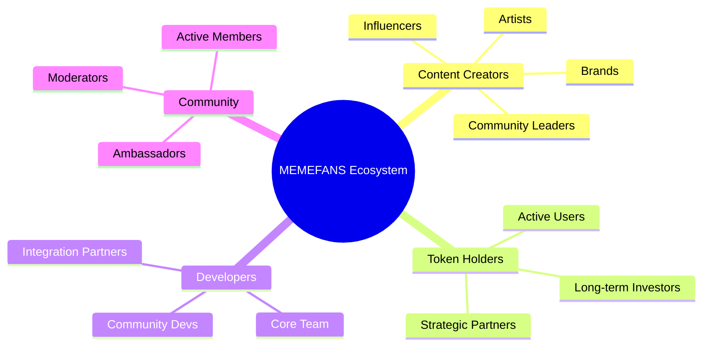

## Community Structure

### 1. Governance Framework
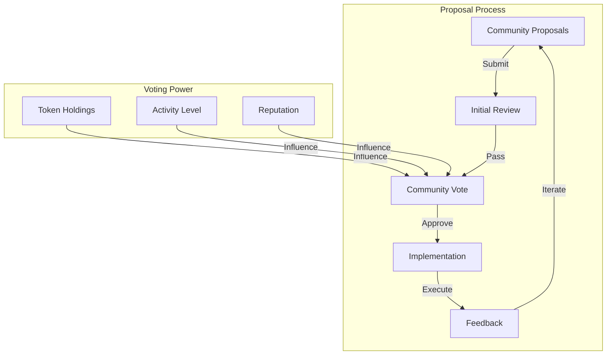

### 2. Engagement Flow
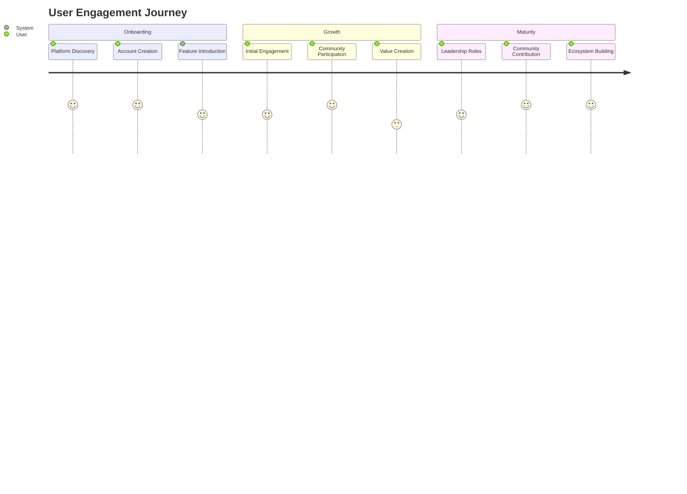

## Community Programs

### 1. Reward System
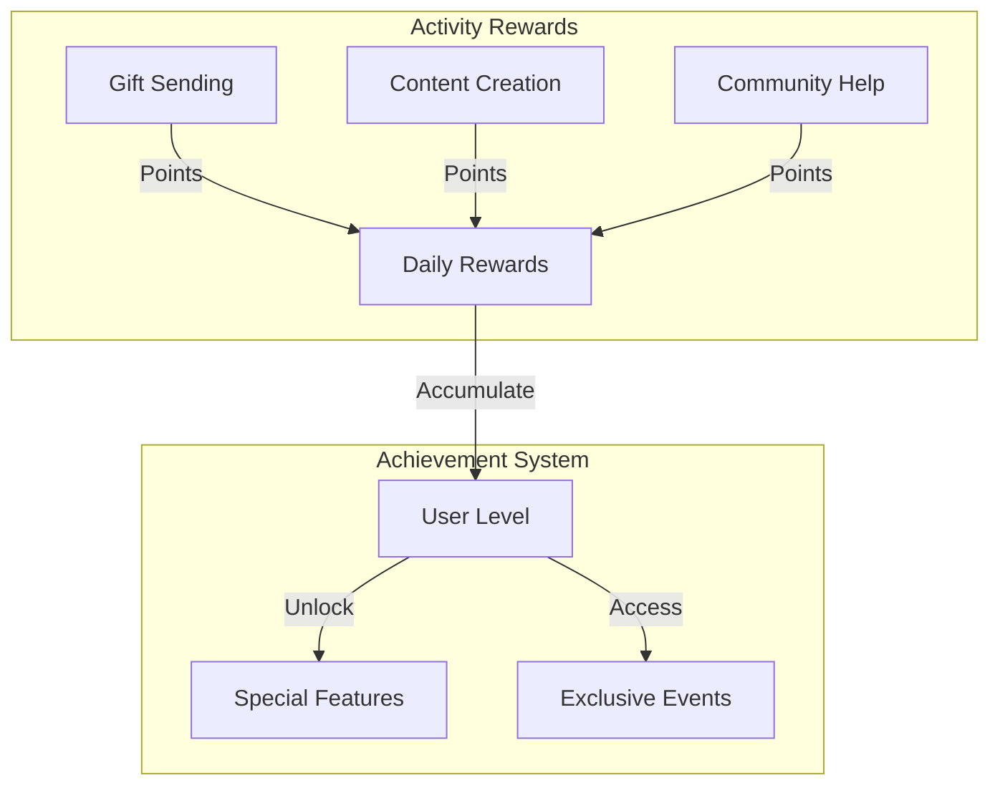

### 2. Event Calendar
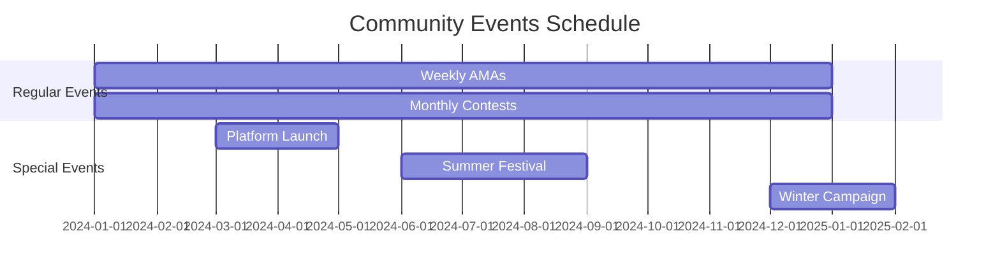

## Educational Hub

### 1. Learning Path
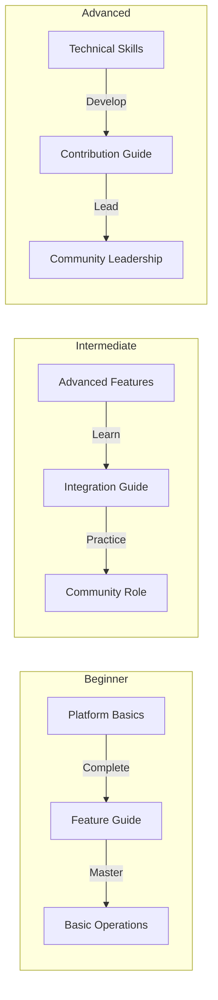

### 2. Resource Structure
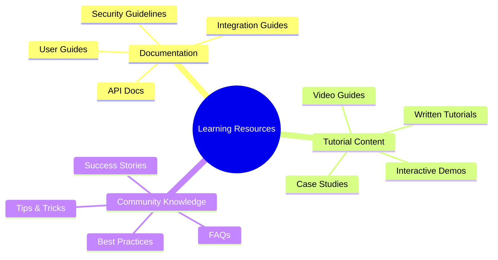

## Communication Framework

### 1. Channel Structure
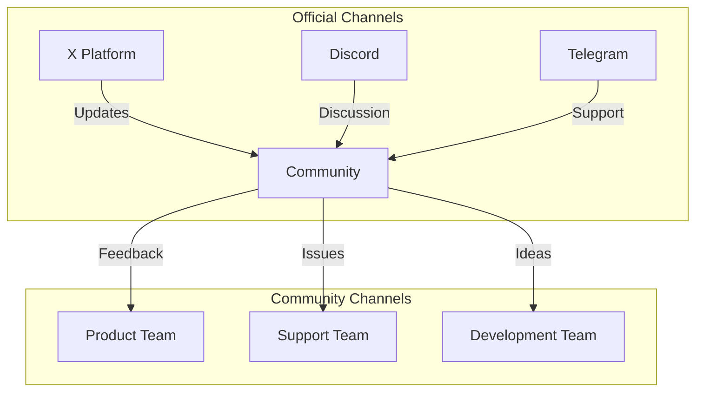

### 2. Information Flow
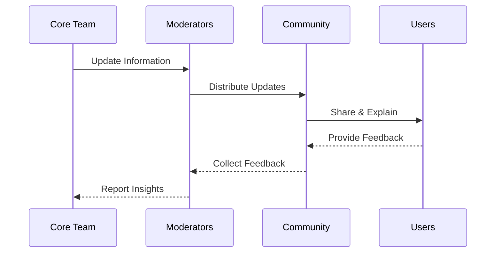

## Growth Strategy

### 1. User Journey
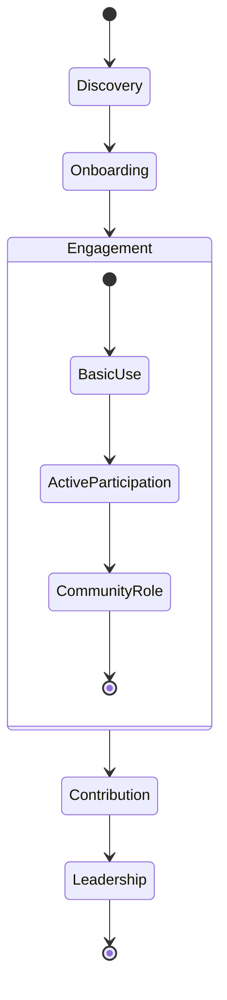

### 2. Growth Metrics
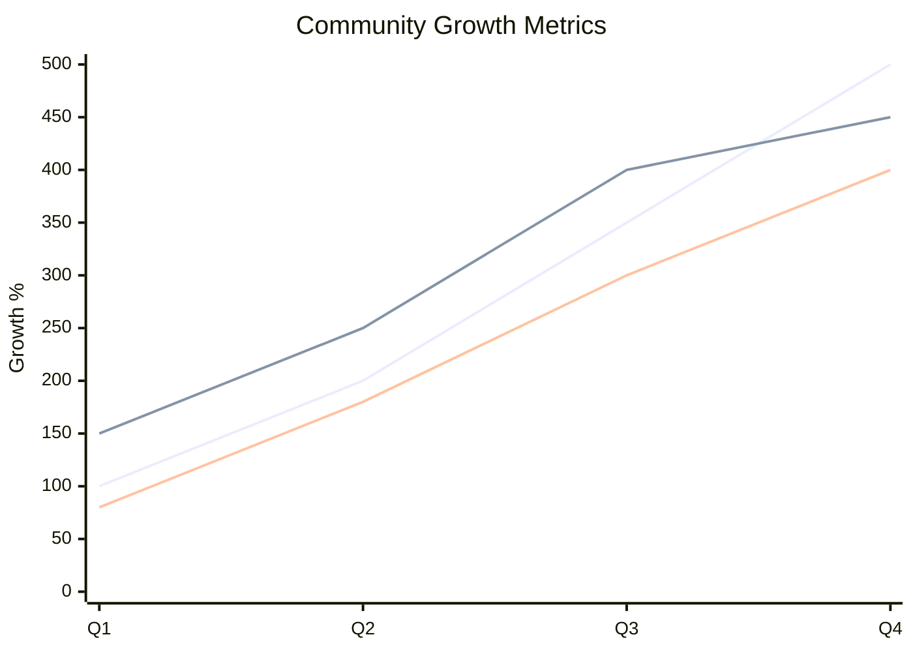

## Partnership Ecosystem

### 1. Partnership Network
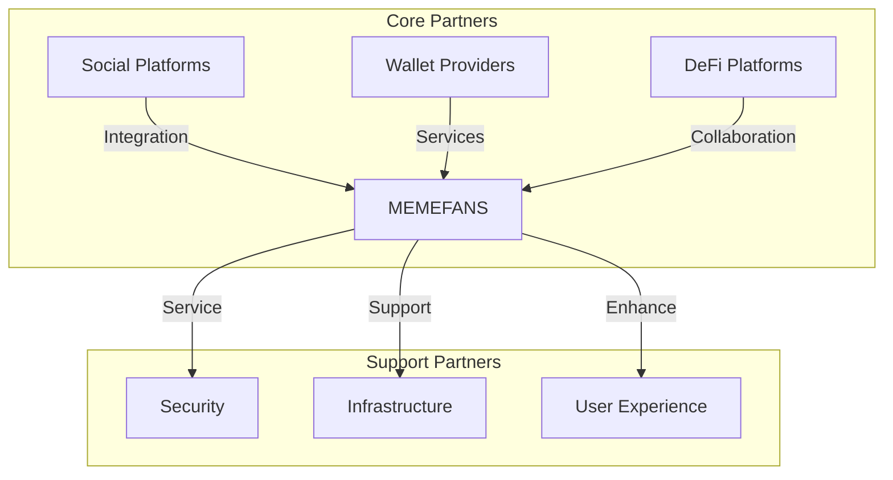

### 2. Value Flow
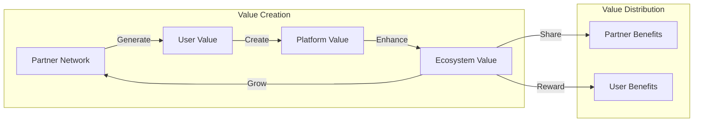

## Innovation Pipeline

### 1. Development Process
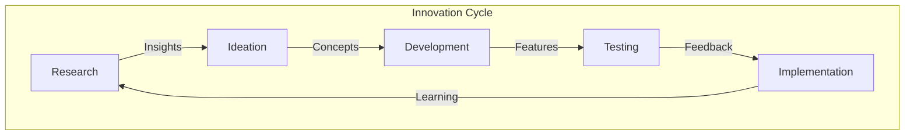

### 2. Feature Timeline
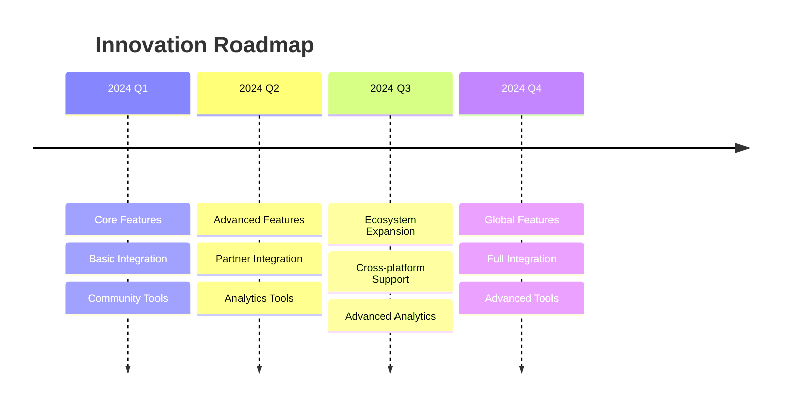

## Sustainability Model

### 1. Value Creation
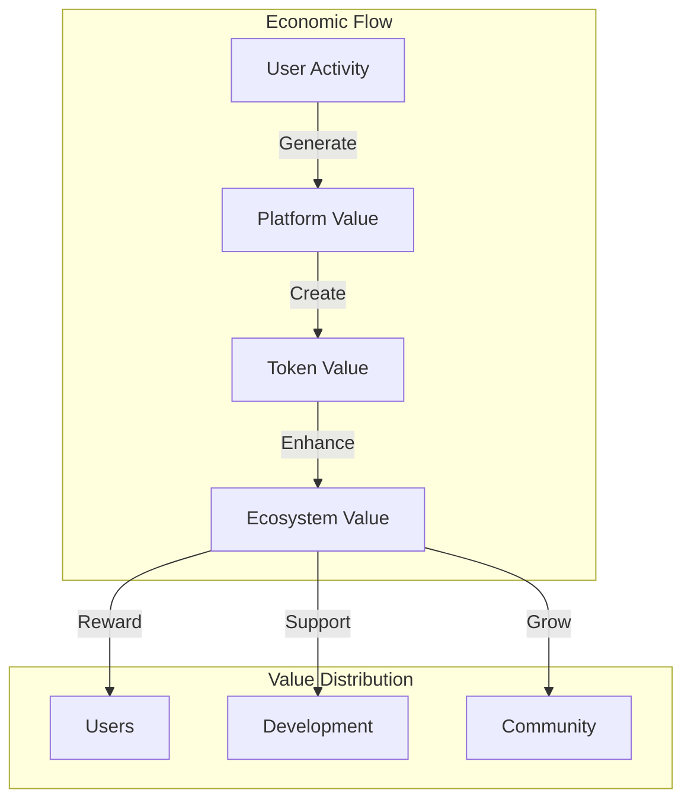

### 2. Resource Allocation
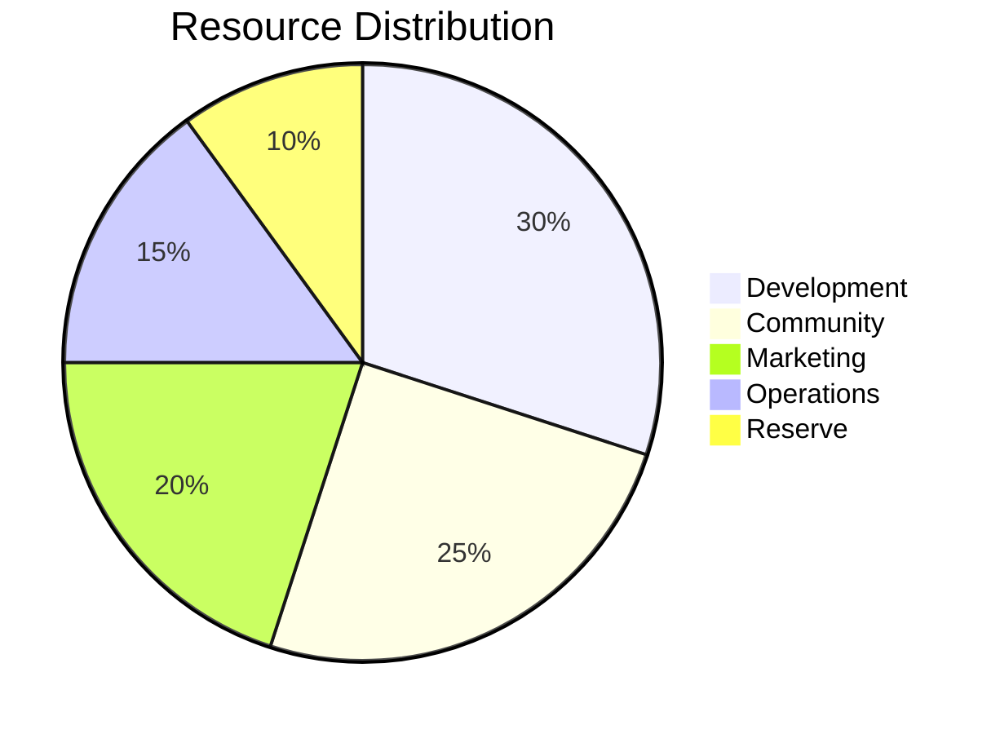
