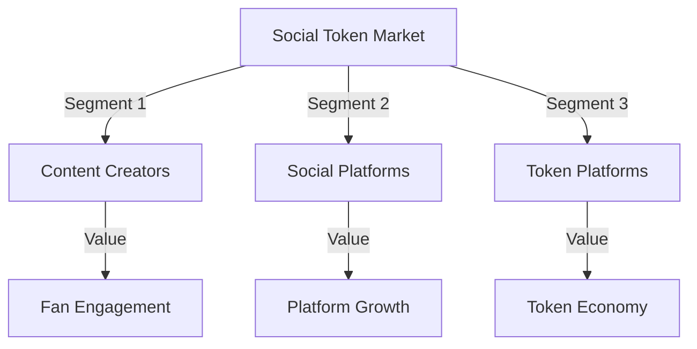
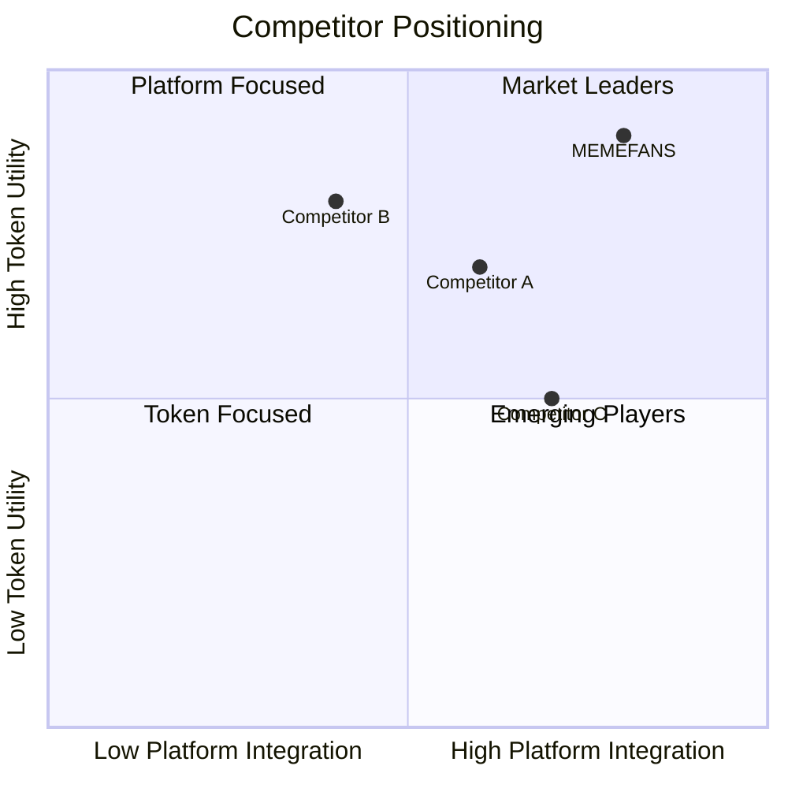
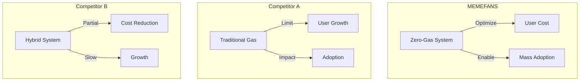
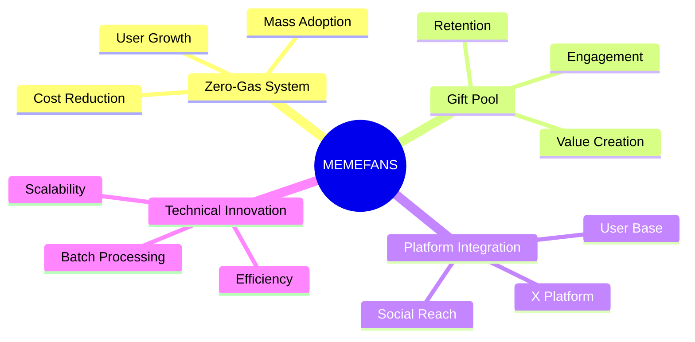
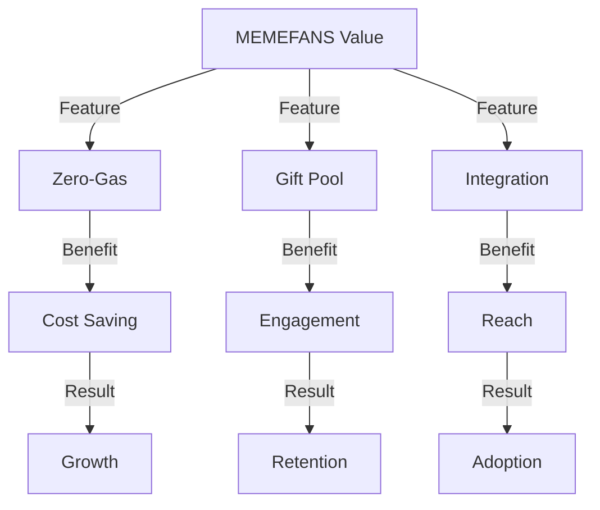
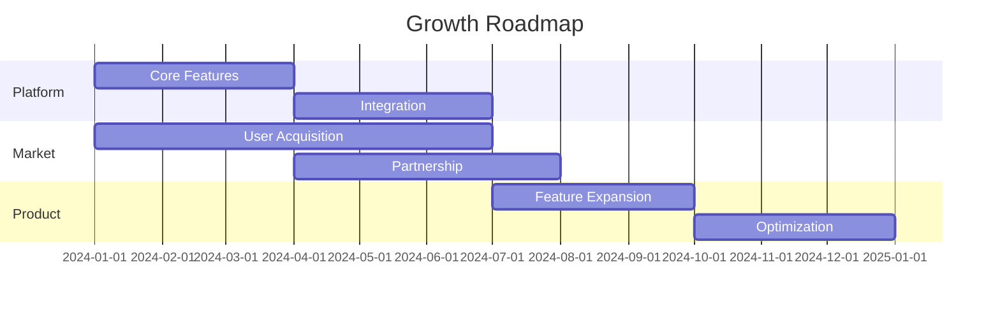
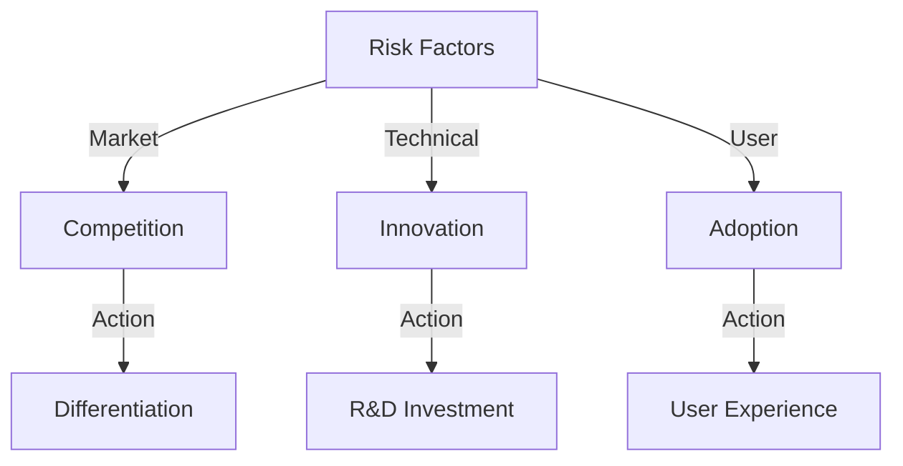

# Competition Analysis Report

## Market Overview

### 1. Market Landscape



- **Market Size & Growth**
  ```mermaid
  pie title Market Share Distribution
    "Content Creators" : 45
    "Social Platforms" : 30
    "Token Platforms" : 25
  ```

- **Industry Trends**
  * Web3 Social Integration: 40% YoY growth
  * Creator Economy: $104B market size
  * Token Adoption: 25% annual increase
  * Platform Evolution: Moving towards decentralization

### 2. Competitive Landscape



## Competitor Analysis

### 1. Feature Comparison

| Feature | MEMEFANS | Competitor A | Competitor B | Competitor C |
|---------|----------|--------------|--------------|--------------|
| Zero-Gas | ✅ | ❌ | ❌ | ❌ |
| Batch Processing | ✅ | ❌ | ✅ | ❌ |
| X Integration | ✅ | ✅ | ❌ | ✅ |
| Built-in Wallet | ✅ | ❌ | ✅ | ❌ |
| Gift Pool | ✅ | ❌ | ❌ | ❌ |

### 2. Technical Comparison



## Competitive Advantages

### 1. MEMEFANS Unique Features



### 2. Value Proposition



## Market Strategy

### 1. Growth Strategy



### 2. Competitive Response

1. **Market Position Defense**
   - **Innovation Leadership**
     * Continuous feature development
     * Technical advancement
     * User experience optimization
     * Performance improvement

   - **Market Expansion**
     * Geographic growth
     * User segment expansion
     * Partnership development
     * Community building

2. **Strategic Initiatives**
   ```mermaid
   graph TD
       A[Strategic Focus] -->|Product| B[Innovation]
       A -->|Market| C[Expansion]
       A -->|Community| D[Growth]
       B -->|Action| E[Feature Development]
       C -->|Action| F[User Acquisition]
       D -->|Action| G[Engagement Programs]
   ```

## Risk Analysis

### 1. Competitive Risks



### 2. Mitigation Strategies

1. **Technical Leadership**
   - Continuous innovation
   - Feature advancement
   - Performance optimization
   - Security enhancement

2. **Market Position**
   - Brand building
   - User engagement
   - Community growth
   - Partnership development

## Competitive Matrix

### 1. Feature Comparison
```markdown
| Feature              | MEMEFANS | Competitor A | Competitor B |
|---------------------|----------|--------------|--------------|
| Zero-gas Collection | ✓        | ✗            | ✗            |
| Batch Processing    | ✓        | Partial      | ✗            |
| Platform Integration| ✓        | ✓            | Partial      |
| Cost Efficiency     | High     | Medium       | Low          |
| User Experience     | Advanced | Basic        | Medium       |
| Market Coverage     | Growing  | Established  | Limited      |
```

### 2. Market Position
```markdown
| Aspect              | MEMEFANS | Competitor A | Competitor B |
|---------------------|----------|--------------|--------------|
| Target Market       | Broad    | Niche       | Limited      |
| Technical Innovation| High     | Medium      | Low          |
| User Base           | Growing  | Large       | Small        |
| Growth Rate         | High     | Stable      | Low          |
| Market Share        | Growing  | Large       | Small        |
| Innovation Focus    | High     | Medium      | Low          |
```

## Recommendations

### 1. Strategic Focus
- **Priority Areas**
  * Technical innovation
  * User experience
  * Market expansion
  * Value creation

- **Development Areas**
  * Feature enhancement
  * Platform integration
  * User growth
  * Market presence

### 2. Action Plan
- **Short-term Actions**
  * Feature development
  * User acquisition
  * Market positioning
  * Partnership growth

- **Long-term Strategy**
  * Innovation focus
  * Market leadership
  * Value enhancement
  * Sustainable growth
