# Economic Model Analysis

## Token Economics Overview

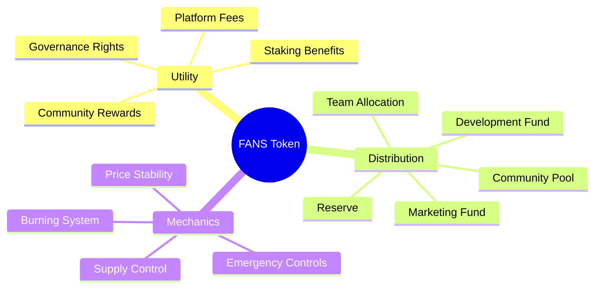
```mermaid
mindmap
    root((FANS Token))
        Utility
            Platform Fees
            Governance Rights
            Staking Benefits
            Community Rewards
        Distribution
            Community Pool
            Development Fund
            Team Allocation
            Marketing Fund
            Reserve
        Mechanics
            Burning System
            Supply Control
            Price Stability
            Emergency Controls
```

### Token Distribution

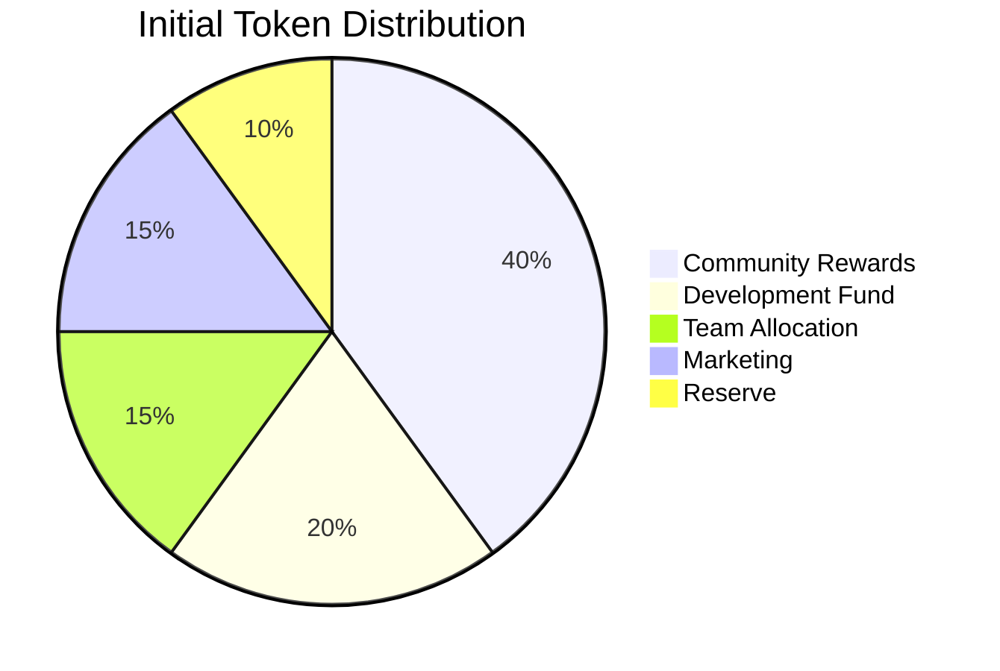
```mermaid
pie title Initial Token Distribution
    "Community Rewards" : 40
    "Development Fund" : 20
    "Team Allocation" : 15
    "Marketing" : 15
    "Reserve" : 10
```

### Vesting Schedule

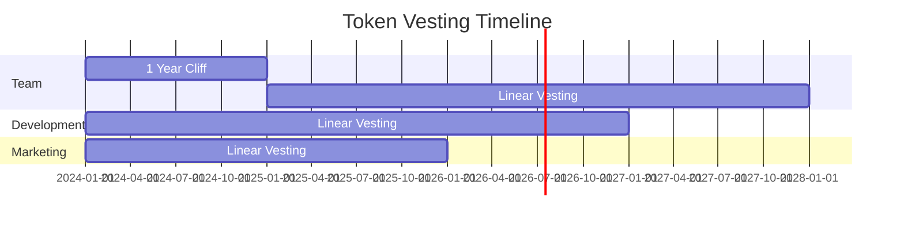
```mermaid
gantt
    title Token Vesting Timeline
    dateFormat YYYY-MM
    section Team
    1 Year Cliff     :2024-01, 12M
    Linear Vesting   :2025-01, 36M
    section Development
    Linear Vesting   :2024-01, 36M
    section Marketing
    Linear Vesting   :2024-01, 24M
```

## Economic Flow

### Token Circulation

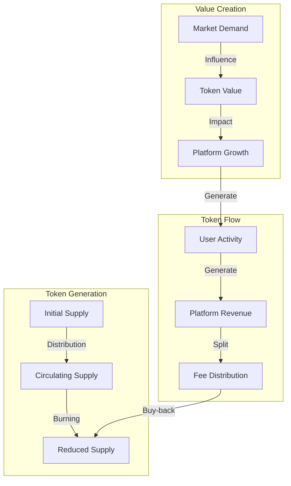
```mermaid
graph TD
    subgraph Token Generation
        A[Initial Supply] -->|Distribution| B[Circulating Supply]
        B -->|Burning| C[Reduced Supply]
    end
    
    subgraph Token Flow
        D[User Activity] -->|Generate| E[Platform Revenue]
        E -->|Split| F[Fee Distribution]
        F -->|Buy-back| C
    end
    
    subgraph Value Creation
        G[Market Demand] -->|Influence| H[Token Value]
        H -->|Impact| I[Platform Growth]
        I -->|Generate| D
    end
```

### Revenue Model

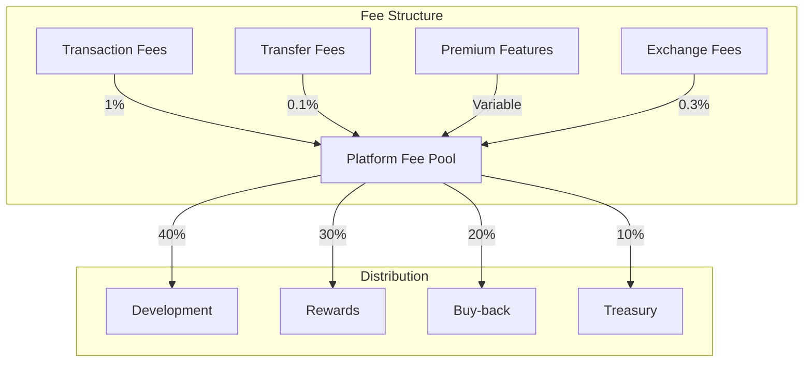
```mermaid
graph TD
    subgraph Fee Structure
        A1[Transaction Fees] -->|1%| B1[Platform Fee Pool]
        A2[Transfer Fees] -->|0.1%| B1
        A3[Premium Features] -->|Variable| B1
        A4[Exchange Fees] -->|0.3%| B1
    end
    
    subgraph Distribution
        B1 -->|40%| C1[Development]
        B1 -->|30%| C2[Rewards]
        B1 -->|20%| C3[Buy-back]
        B1 -->|10%| C4[Treasury]
    end
```

## Staking System

### Staking Tiers

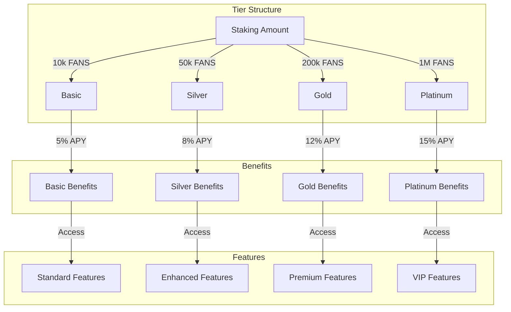
```mermaid
graph TD
    subgraph Tier Structure
        A[Staking Amount] -->|10k FANS| B[Basic]
        A -->|50k FANS| C[Silver]
        A -->|200k FANS| D[Gold]
        A -->|1M FANS| E[Platinum]
    end
    
    subgraph Benefits
        B -->|5% APY| F[Basic Benefits]
        C -->|8% APY| G[Silver Benefits]
        D -->|12% APY| H[Gold Benefits]
        E -->|15% APY| I[Platinum Benefits]
    end
    
    subgraph Features
        F -->|Access| J[Standard Features]
        G -->|Access| K[Enhanced Features]
        H -->|Access| L[Premium Features]
        I -->|Access| M[VIP Features]
    end
```

### Reward Calculation

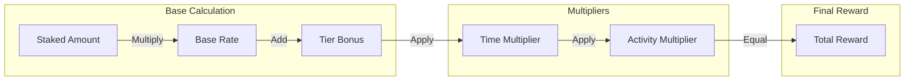
```mermaid
graph LR
    subgraph Base Calculation
        A[Staked Amount] -->|Multiply| B[Base Rate]
        B -->|Add| C[Tier Bonus]
    end
    
    subgraph Multipliers
        C -->|Apply| D[Time Multiplier]
        D -->|Apply| E[Activity Multiplier]
    end
    
    subgraph Final Reward
        E -->|Equal| F[Total Reward]
    end
```

## Market Dynamics

### Supply Control

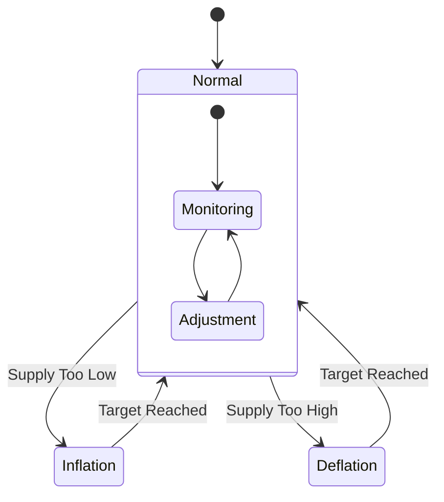
```mermaid
stateDiagram-v2
    [*] --> Normal
    Normal --> Inflation: Supply Too Low
    Normal --> Deflation: Supply Too High
    Inflation --> Normal: Target Reached
    Deflation --> Normal: Target Reached
    
    state Normal {
        [*] --> Monitoring
        Monitoring --> Adjustment
        Adjustment --> Monitoring
    }
```

### Price Stability

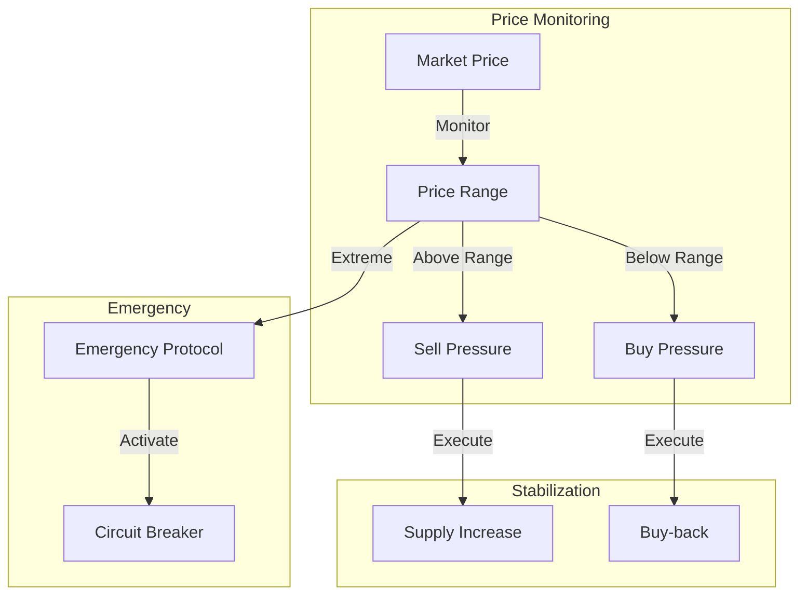
```mermaid
graph TD
    subgraph Price Monitoring
        A[Market Price] -->|Monitor| B[Price Range]
        B -->|Above Range| C[Sell Pressure]
        B -->|Below Range| D[Buy Pressure]
    end
    
    subgraph Stabilization
        C -->|Execute| E[Supply Increase]
        D -->|Execute| F[Buy-back]
    end
    
    subgraph Emergency
        B -->|Extreme| G[Emergency Protocol]
        G -->|Activate| H[Circuit Breaker]
    end
```

## Risk Management

### Risk Matrix

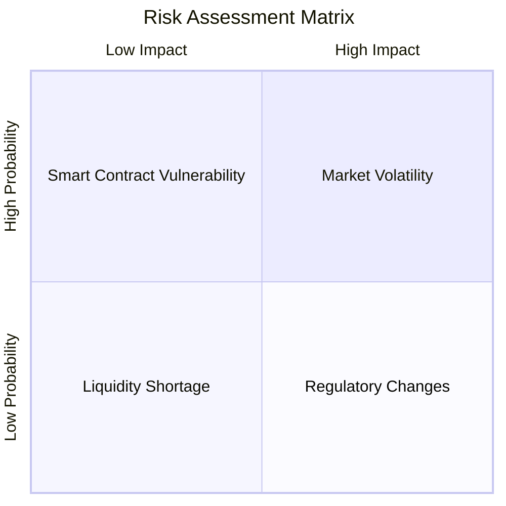
```mermaid
quadrantChart
    title Risk Assessment Matrix
    x-axis Low Impact --> High Impact
    y-axis Low Probability --> High Probability
    quadrant-1 Market Volatility
    quadrant-2 Smart Contract Vulnerability
    quadrant-3 Liquidity Shortage
    quadrant-4 Regulatory Changes
```

### Mitigation Strategy

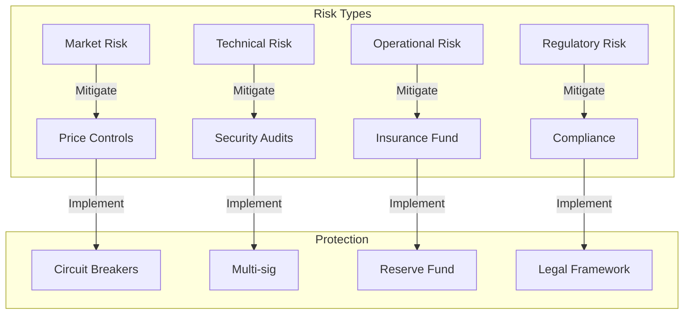
```mermaid
graph TD
    subgraph Risk Types
        A1[Market Risk] -->|Mitigate| B1[Price Controls]
        A2[Technical Risk] -->|Mitigate| B2[Security Audits]
        A3[Operational Risk] -->|Mitigate| B3[Insurance Fund]
        A4[Regulatory Risk] -->|Mitigate| B4[Compliance]
    end
    
    subgraph Protection
        B1 -->|Implement| C1[Circuit Breakers]
        B2 -->|Implement| C2[Multi-sig]
        B3 -->|Implement| C3[Reserve Fund]
        B4 -->|Implement| C4[Legal Framework]
    end
```

## Growth Model

### User Growth Projection

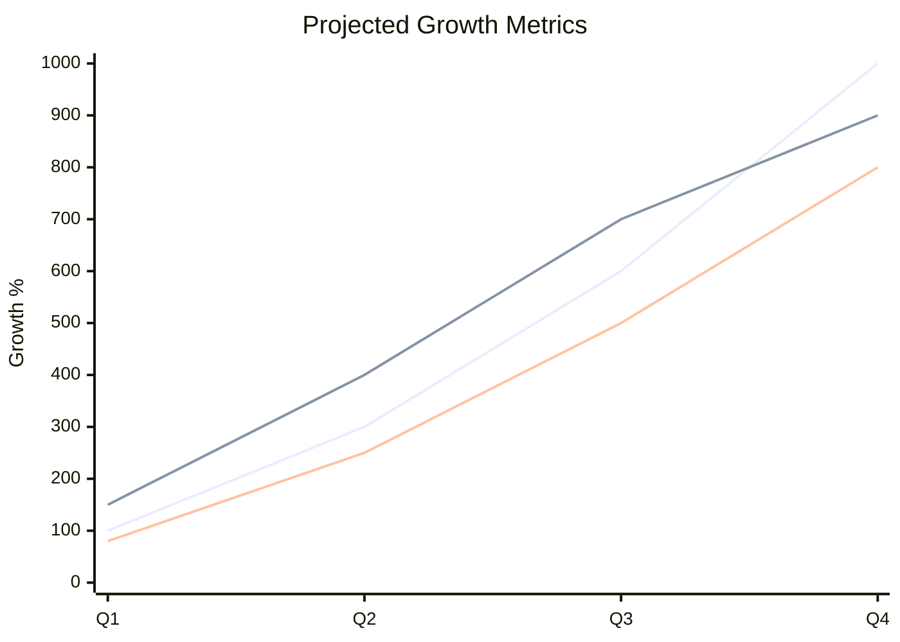
```mermaid
xychart-beta
    title "Projected Growth Metrics"
    x-axis [Q1, Q2, Q3, Q4]
    y-axis "Growth %" 0 --> 1000
    line "Users" [100, 300, 600, 1000]
    line "Transactions" [150, 400, 700, 900]
    line "Revenue" [80, 250, 500, 800]
```

### Value Creation Flow

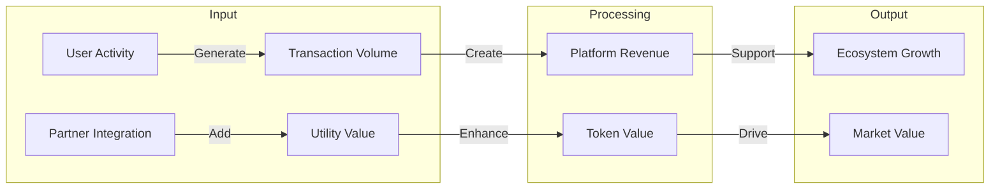
```mermaid
graph LR
    subgraph Input
        A[User Activity] -->|Generate| B[Transaction Volume]
        C[Partner Integration] -->|Add| D[Utility Value]
    end
    
    subgraph Processing
        B -->|Create| E[Platform Revenue]
        D -->|Enhance| F[Token Value]
    end
    
    subgraph Output
        E -->|Support| G[Ecosystem Growth]
        F -->|Drive| H[Market Value]
    end
```

## Sustainability Model

### Economic Balance

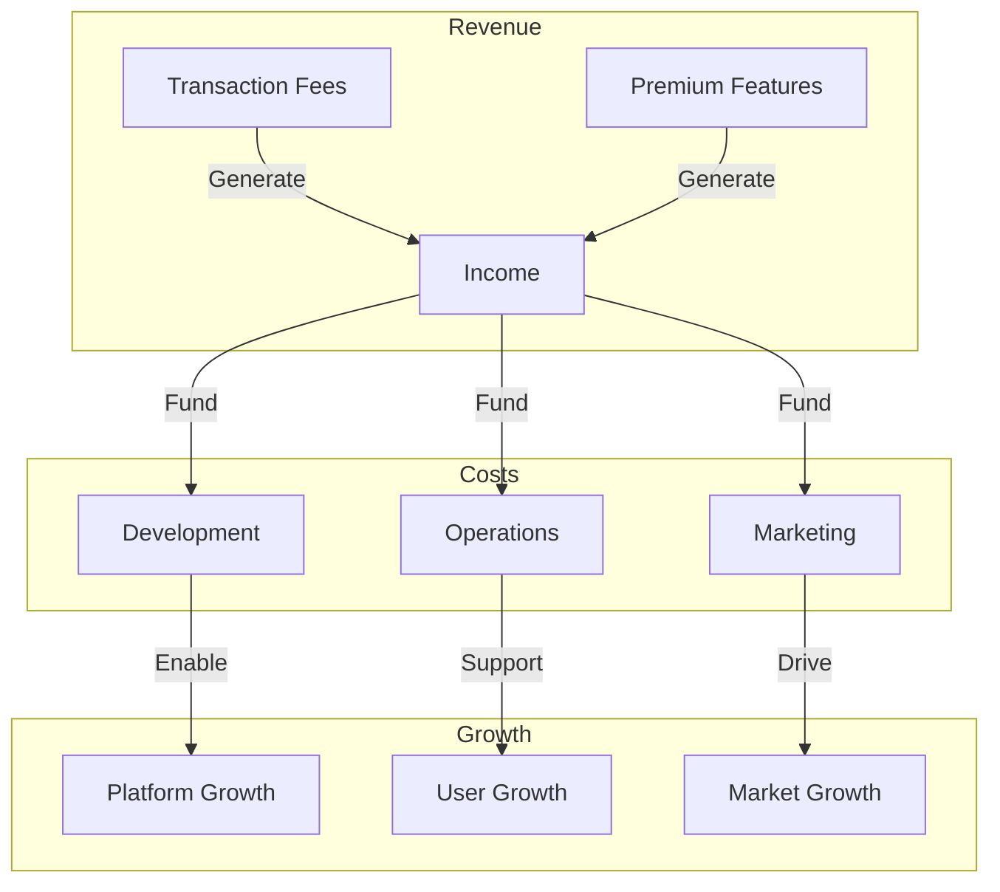
```mermaid
graph TD
    subgraph Revenue
        A1[Transaction Fees] -->|Generate| B1[Income]
        A2[Premium Features] -->|Generate| B1
    end
    
    subgraph Costs
        B1 -->|Fund| C1[Development]
        B1 -->|Fund| C2[Operations]
        B1 -->|Fund| C3[Marketing]
    end
    
    subgraph Growth
        C1 -->|Enable| D1[Platform Growth]
        C2 -->|Support| D2[User Growth]
        C3 -->|Drive| D3[Market Growth]
    end
```

### Resource Allocation

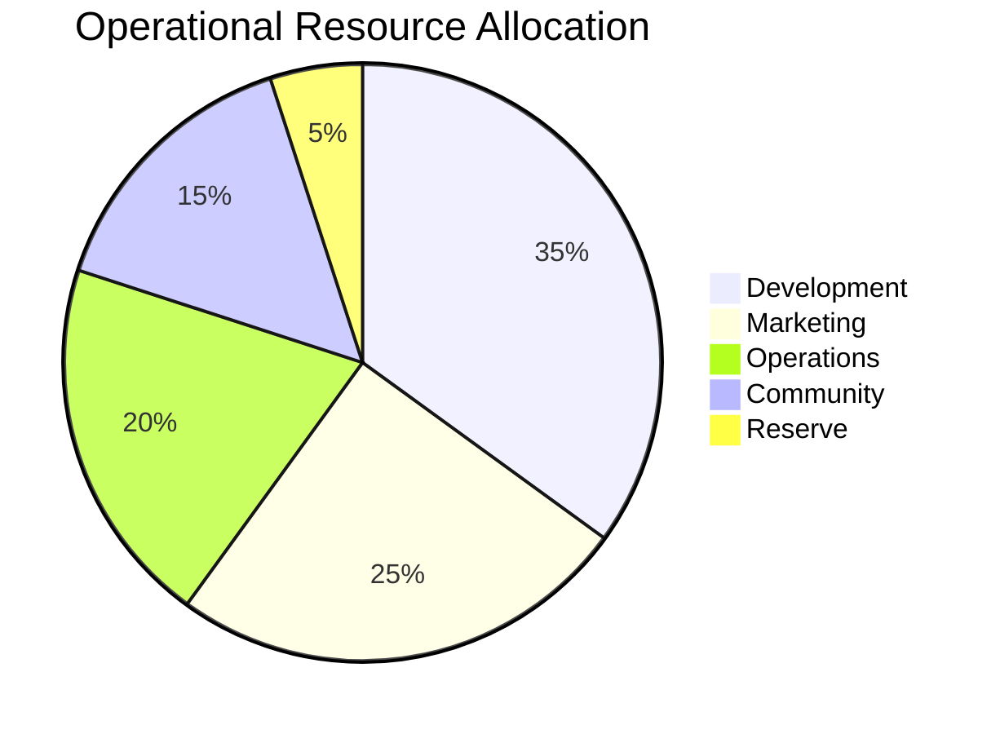
```mermaid
pie title Operational Resource Allocation
    "Development" : 35
    "Marketing" : 25
    "Operations" : 20
    "Community" : 15
    "Reserve" : 5
```

## Economic Model Analysis

### Token Economics

#### Token Overview

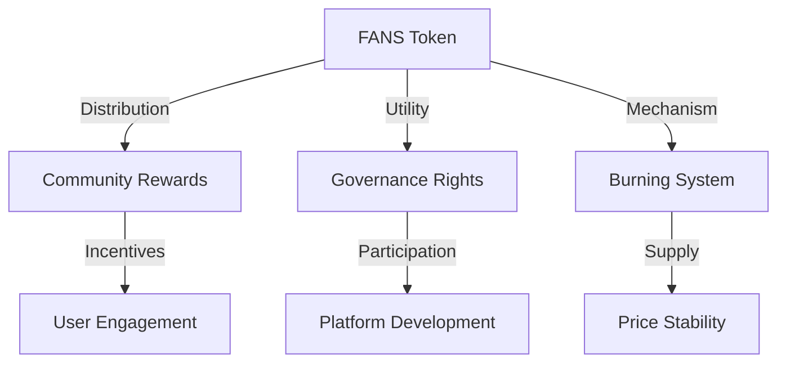
```mermaid
graph TD
    A[FANS Token] -->|Distribution| B[Community Rewards]
    A -->|Utility| C[Governance Rights]
    A -->|Mechanism| D[Burning System]
    B -->|Incentives| E[User Engagement]
    C -->|Participation| F[Platform Development]
    D -->|Supply| G[Price Stability]
```

#### Token Details

* Name: FANS Token
* Symbol: FANS
* Blockchain: Solana
* Standard: SPL Token
* Total Supply: 1,000,000,000 FANS

#### Token Utility

* Distribution rewards
* Governance rights
* Platform fees
* Community incentives

### Distribution Model

#### Token Distribution

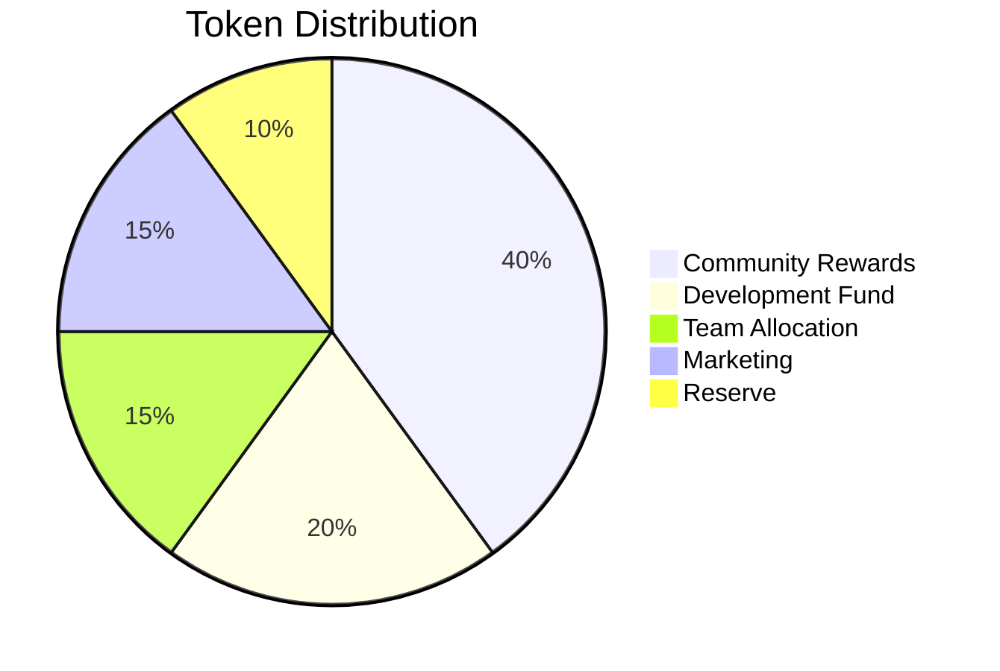
```mermaid
pie title Token Distribution
    "Community Rewards" : 40
    "Development Fund" : 20
    "Team Allocation" : 15
    "Marketing" : 15
    "Reserve" : 10
```

#### Vesting Schedule

* Team tokens: 4-year vesting, 1-year cliff
* Development fund: 3-year linear vesting
* Marketing: 2-year linear vesting
* Community rewards: No vesting, activity-based

### Token Mechanics

#### Burning Mechanism

* Transaction fee burning
* Buy-back and burn
* Community-voted burning events

#### Supply Control

* Fixed total supply
* No inflation mechanism
* Supply tracking via Solana blockchain

## Economic Incentives

### Distribution System

#### Gift Flow

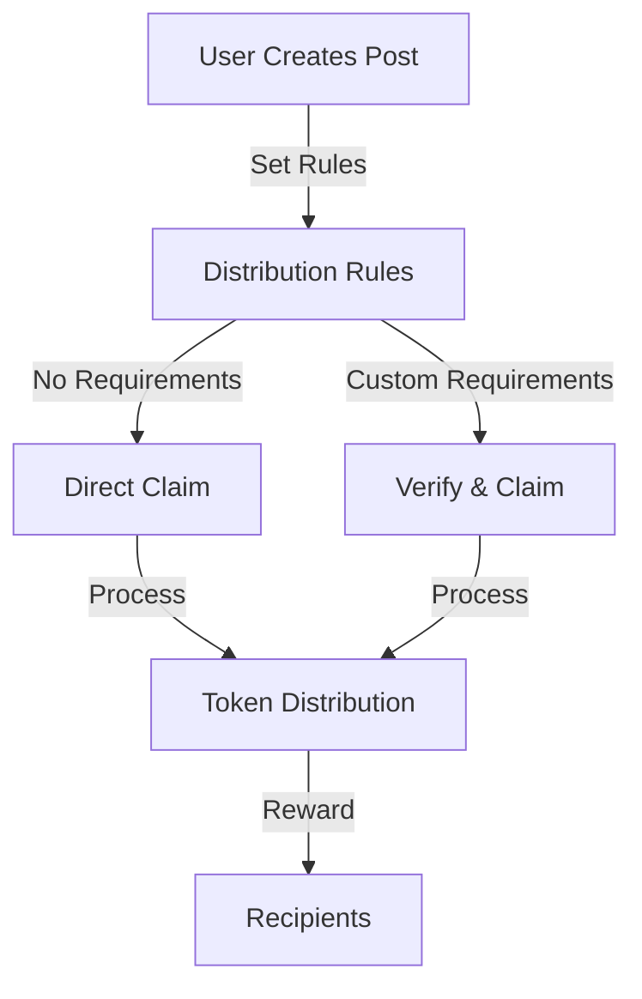
```mermaid
graph TD
    A[User Creates Post] -->|Set Rules| B[Distribution Rules]
    B -->|No Requirements| C[Direct Claim]
    B -->|Custom Requirements| D[Verify & Claim]
    C -->|Process| E[Token Distribution]
    D -->|Process| E
    E -->|Reward| F[Recipients]
```

#### Reward Structure

* Creator Rewards
	+ Distribution creation bonus
	+ Engagement multiplier
	+ Quality score bonus
	+ Long-term activity rewards
* Participant Rewards
	+ Participation points
	+ Early bird bonus
	+ Referral rewards
	+ Activity streaks

### Staking Benefits

#### Staking Tiers

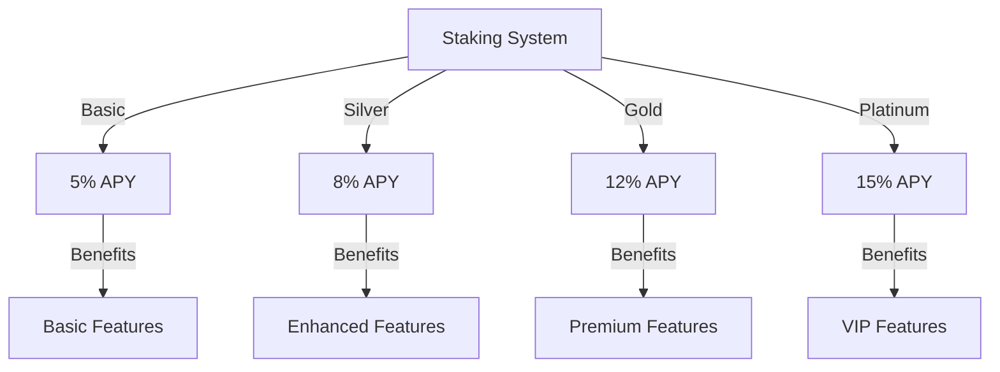
```mermaid
graph TD
    A[Staking System] -->|Basic| B[5% APY]
    A -->|Silver| C[8% APY]
    A -->|Gold| D[12% APY]
    A -->|Platinum| E[15% APY]
    B -->|Benefits| F[Basic Features]
    C -->|Benefits| G[Enhanced Features]
    D -->|Benefits| H[Premium Features]
    E -->|Benefits| I[VIP Features]
```

#### Additional Benefits

* Platform Benefits
	+ Governance weight multiplier
	+ Fee reduction (up to 50%)
	+ Premium features access
	+ Early access to new features
* Community Benefits
	+ Enhanced voting power
	+ Special badge display
	+ Priority support
	+ Exclusive events access

### Platform Economics

#### Revenue Model

* Transaction Fees
	+ Distribution creation: 1%
	+ Token transfer: 0.1%
	+ Premium features: Variable
	+ Exchange fees: 0.3%
* Fee Distribution
	+ Platform development: 40%
	+ Community rewards: 30%
	+ Buy-back and burn: 20%
	+ Treasury: 10%

#### Value Drivers

* Platform usage and growth
* Network effects
* Utility expansion
* Market demand
* PUMP trading volume

## Market Dynamics

### Supply and Demand

#### Supply Factors

* Token Release
	+ Initial distribution
	+ Vesting schedules
	+ Community rewards
	+ Burning events
* Supply Control
	+ Algorithmic adjustment
	+ Community governance
	+ Market stabilization
	+ Emergency controls

#### Demand Drivers

* Utility Demand
	+ Platform usage
	+ Feature access
	+ Governance participation
	+ Staking requirements
* Market Demand
	+ Trading activity
	+ Investment interest
	+ Partnership integration
	+ Ecosystem expansion

#### Price Stability

* Stabilization Mechanisms
	+ Dynamic supply adjustment
	+ Staking incentives
	+ Buy-back program
	+ Market making
* Risk Management
	+ Price monitoring
	+ Volatility controls
	+ Emergency procedures
	+ Insurance fund

### Growth Model

#### User Growth

* Acquisition Strategy
	+ Organic growth
	+ Marketing campaigns
	+ Partnership programs
	+ Community referrals
* Retention Mechanics
	+ Engagement rewards
	+ Long-term incentives
	+ Community building
	+ Value creation

#### Economic Growth

* Revenue Growth
	+ Transaction volume
	+ User base expansion
	+ Service diversification
	+ Market penetration
* Value Creation
	+ Token utility expansion
	+ Ecosystem development
	+ Partnership value
	+ Innovation rewards

#### Sustainability

* Long-term Viability
	+ Revenue sustainability
	+ Cost optimization
	+ Community growth
	+ Technology advancement
* Ecosystem Development
	+ Partner integration
	+ Developer incentives
	+ Innovation funding
	+ Research & development

## Risk Analysis

### Economic Risks

#### Market Risks

* Price Volatility
	+ Market sentiment
	+ Trading volume
	+ External factors
	+ Competitor actions
* Liquidity Risks
	+ Trading depth
	+ Market makers
	+ Exchange listings
	+ Emergency liquidity

#### Operational Risks

* Technical Risks
	+ Smart contract security
	+ Platform stability
	+ Integration issues
	+ Scalability challenges
* Business Risks
	+ Revenue sustainability
	+ Cost management
	+ Market competition
	+ Regulatory compliance

#### Mitigation Strategies

* Risk Management
	+ Insurance fund
	+ Emergency procedures
	+ Community governance
	+ Technical audits
* Contingency Plans
	+ Emergency response
	+ Communication protocol
	+ Recovery procedures
	+ Stakeholder protection
