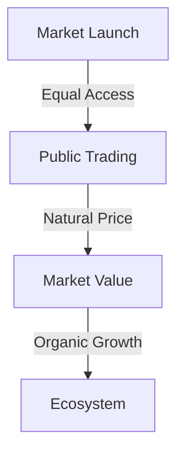

# MEMEFANS: The Future of Social Token Distribution

## Executive Summary

MEMEFANS represents a paradigm shift in social media engagement through blockchain technology, specifically designed to revolutionize the creator economy. Built on Solana's high-performance blockchain and integrated with PUMP DEX, MEMEFANS introduces a seamless token distribution mechanism that bridges the gap between content creators and their communities.

## Token Launch Highlights

### Fair Launch Commitment
- **100% Market Distribution**
  - No private sale rounds
  - No institutional investors
  - No early investor allocations
  - Pure market-driven pricing

### Community First Approach
- **Equal Opportunity**
  - All participants start equal
  - No privileged access
  - No price advantages
  - Fair market competition

### Launch Mechanism

### Key Advantages
1. **True Decentralization**
   - No central control
   - Community driven
   - Natural growth
   - Sustainable development

2. **Market Integrity**
   - Natural price discovery
   - No price manipulation
   - Organic demand
   - Fair distribution

### Vision & Mission
- **Vision**: Become the world's leading social token distribution platform
- **Mission**: Empower creators, activate communities, create value
- **Values**: Fairness, Transparency, Innovation, Win-Win

### Core Features
- One-click token distribution through PUMP DEX
- Automated reward system
- Real-time analytics dashboard
- Enhanced security protocols
- Seamless social media integration

### Market Opportunity
- Creator Economy Size: $104.2B (2021)
- Projected Growth: $400B by 2027
- Target Users: 50M+ creators
- Potential Reach: 2B+ social media users

### Technical Innovation
- Sub-second transaction speeds
- Minimal gas fees
- Advanced security measures
- Intuitive user interface

### Competitive Advantages
1. **Technical Edge**
   - Solana-based high performance
   - Innovative token distribution algorithm
   - Patent-pending reward mechanism

2. **Product Advantages**
   - One-click operation experience
   - Comprehensive data analytics
   - Flexible customization options

3. **Ecosystem Benefits**
   - Deep PUMP DEX integration
   - Multi-platform support
   - Active community

### Development Roadmap
- **2024 Q1**: Platform Launch
  - Chrome plugin release
  - Basic token functionality
  - Community building initiation

- **2024 Q2**: Feature Enhancement
  - Advanced analytics tools
  - Automated strategies
  - Community governance mechanisms

- **2024 Q3-Q4**: Scale Expansion
  - Multi-chain support
  - Institutional partnerships
  - Global market expansion

[Continue to Technical Architecture →](technical-architecture.md)
