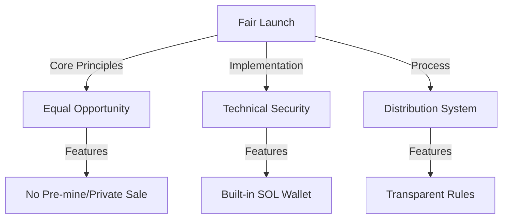

# Fair Launch Mechanism

## Launch Overview



## Core Principles

### Fair Distribution

1. **Equal Opportunity**
   ```mermaid
   pie title Token Launch Distribution
     "Public Distribution" : 100
   ```
   - No pre-mine
   - No team allocation
   - No private sales
   - No early access

2. **Transparent Rules**
   - Clear distribution rules
   - Public verification
   - Open source code
   - Real-time tracking

3. **Security First**
   - Built-in SOL wallet
   - Local key generation
   - Secure storage
   - No external connections

### Distribution Mechanism

1. **Built-in Wallet**
   ```mermaid
   graph TD
       A[Extension Install] -->|Auto Generate| B[SOL Wallet]
       B -->|Secure Storage| C[Encrypted Keys]
       C -->|User Control| D[Import/Export]
       D -->|Backup| E[Recovery Options]
   ```

2. **Distribution Process**
   - Automatic wallet creation
   - Secure key storage
   - Easy backup/restore
   - Simple distribution

3. **Security Features**
   - Local key generation
   - Encrypted storage
   - No external dependencies
   - Full user control

## Technical Implementation

### Wallet System

1. **Architecture Flow**
   ```mermaid
   graph TD
       A[Extension Install] -->|Auto Generate| B[SOL Wallet]
       B -->|Secure Storage| C[Encrypted Keys]
       C -->|User Control| D[Import/Export]
       D -->|Backup| E[Recovery Options]
       B -->|Features| F[Transaction Management]
       F -->|Functions| G[Send/Receive]
       F -->|Functions| H[Token Management]
   ```

2. **Key Management**
   ```typescript
   class WalletGenerator {
       // Generate new wallet
       async generateWallet(): Promise<SolanaWallet> {
           const entropy = await crypto.getRandomValues(new Uint8Array(32));
           const keyPair = await this.createKeyPair(entropy);
           return new SolanaWallet(keyPair);
       }
       
       // Secure storage with encryption
       async storeWallet(wallet: SolanaWallet): Promise<void> {
           const encrypted = await this.encryptWallet(wallet);
           await chrome.storage.local.set({ wallet: encrypted });
       }
       
       // Recovery system
       async recoverWallet(mnemonic: string): Promise<SolanaWallet> {
           const seed = await mnemonicToSeed(mnemonic);
           const keyPair = await this.createKeyPairFromSeed(seed);
           return new SolanaWallet(keyPair);
       }
   }
   ```

3. **Security Layer**
   ```typescript
   class SecurityManager {
       // Encrypt wallet data
       async encryptWallet(wallet: SolanaWallet): Promise<string> {
           const key = await this.getEncryptionKey();
           return this.encrypt(wallet.toJSON(), key);
       }
       
       // Decrypt wallet data
       async decryptWallet(encrypted: string): Promise<SolanaWallet> {
           const key = await this.getEncryptionKey();
           const data = await this.decrypt(encrypted, key);
           return SolanaWallet.fromJSON(data);
       }
       
       // Key derivation
       private async getEncryptionKey(): Promise<CryptoKey> {
           const password = await this.getPassword();
           const salt = await this.getSalt();
           return await this.deriveKey(password, salt);
       }
   }
   ```

### Distribution System

1. **Launch Process**
   ```mermaid
   graph TD
       A[Launch Start] -->|Phase 1| B[Wallet Creation]
       B -->|Phase 2| C[Distribution Period]
       C -->|Phase 3| D[Token Claim]
       D -->|Final| E[Trading Enable]
       B -->|Security| F[Verification]
       C -->|Rules| G[Fair Distribution]
       D -->|Check| H[Balance Verification]
   ```

2. **Verification System**
   ```typescript
   class DistributionVerifier {
       // Verify distribution eligibility
       async verifyEligibility(address: string): Promise<boolean> {
           const balance = await this.getSOLBalance(address);
           const previousClaims = await this.getPreviousClaims(address);
           return this.checkEligibility(balance, previousClaims);
       }
       
       // Verify transaction
       async verifyTransaction(tx: Transaction): Promise<boolean> {
           const simulation = await this.simulateTransaction(tx);
           return this.validateSimulation(simulation);
       }
       
       // Monitor distribution
       async monitorDistribution(): Promise<DistributionStats> {
           const totalDistributed = await this.getTotalDistributed();
           const uniqueRecipients = await this.getUniqueRecipients();
           return { totalDistributed, uniqueRecipients };
       }
   }
   ```

3. **Error Prevention**
   ```typescript
   class ErrorHandler {
       // Transaction validation
       async validateTransaction(tx: Transaction): Promise<ValidationResult> {
           try {
               const feeEstimate = await this.estimateFees(tx);
               const balanceCheck = await this.checkBalance(tx);
               return { valid: true, feeEstimate, balanceCheck };
           } catch (error) {
               return { valid: false, error };
           }
       }
       
       // Recovery procedures
       async handleFailedTransaction(tx: Transaction): Promise<void> {
           await this.logError(tx);
           await this.notifyUser(tx);
           await this.attemptRecovery(tx);
       }
   }
   ```

## User Experience

### Wallet Management

1. **Setup Process**
   - Automatic wallet creation
   - Simple interface
   - Clear instructions
   - Backup prompts

2. **Key Management**
   - Secure storage
   - Easy backup
   - Simple import
   - Export options

3. **User Control**
   - Full ownership
   - No dependencies
   - Direct access
   - Privacy focused

### Distribution Interface

1. **Simple Creation**
   - One-click setup
   - Clear parameters
   - Status tracking
   - Real-time updates

2. **Monitoring Tools**
   - Distribution status
   - Token tracking
   - Transaction history
   - Analytics dashboard

3. **Safety Features**
   - Transaction confirmation
   - Amount verification
   - Error prevention
   - Risk warnings

## Security Measures

### Wallet Security

1. **Key Generation**
   - Secure entropy source
   - Local generation
   - No external calls
   - Immediate encryption

2. **Storage Security**
   - Encrypted storage
   - Local only
   - No cloud sync
   - Regular backups

3. **Access Control**
   - User ownership
   - No sharing
   - Local verification
   - Secure export

### Transaction Security

1. **Verification System**
   - Amount checking
   - Balance verification
   - Fee estimation
   - Error prevention

2. **Safety Checks**
   - Double confirmation
   - Risk assessment
   - Limit checking
   - Error handling

3. **Recovery Options**
   - Backup system
   - Recovery process
   - Emergency procedures
   - Support system

## User Interface

### Wallet Interface
```typescript
interface WalletUI {
    // Main wallet functions
    connect(): Promise<void>;
    disconnect(): Promise<void>;
    getBalance(): Promise<number>;
    
    // Transaction management
    sendTransaction(tx: Transaction): Promise<string>;
    signMessage(message: string): Promise<string>;
    
    // Token management
    getTokenAccounts(): Promise<TokenAccount[]>;
    createTokenAccount(mint: PublicKey): Promise<TokenAccount>;
}
```

### Distribution Interface
```typescript
interface DistributionUI {
    // Distribution status
    checkEligibility(): Promise<boolean>;
    getDistributionInfo(): Promise<DistributionInfo>;
    
    // Claim process
    claimTokens(): Promise<Transaction>;
    checkClaimStatus(): Promise<ClaimStatus>;
    
    // History tracking
    getClaimHistory(): Promise<ClaimHistory[]>;
    exportHistory(): Promise<string>;
}
