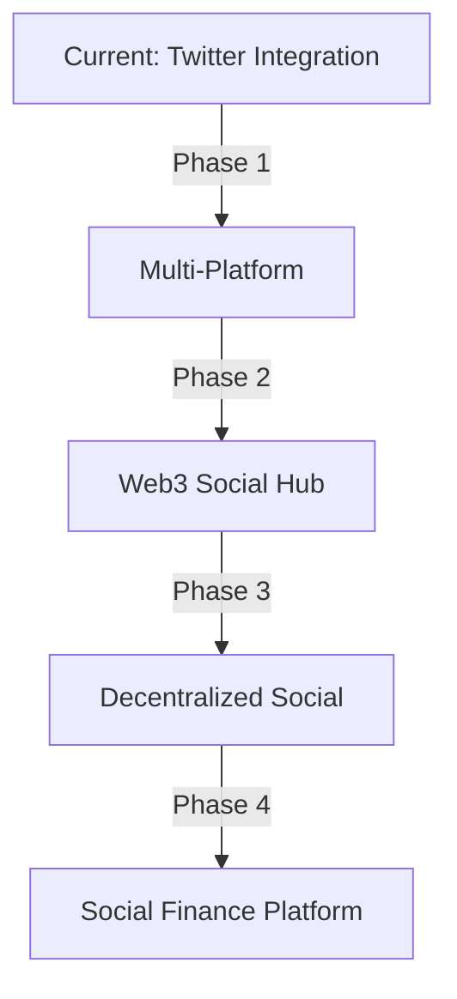
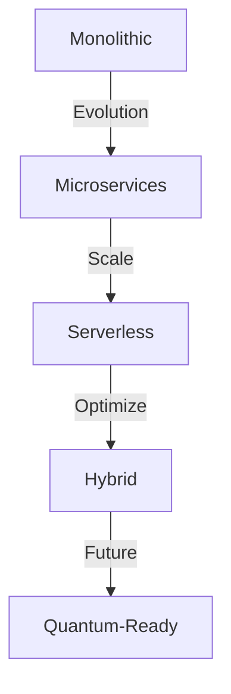
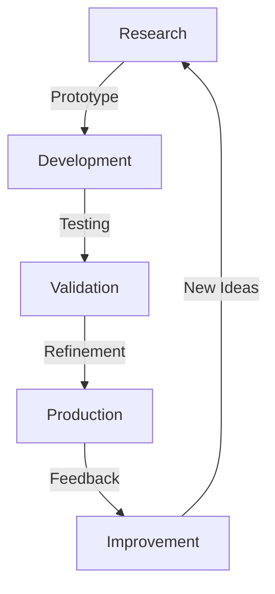
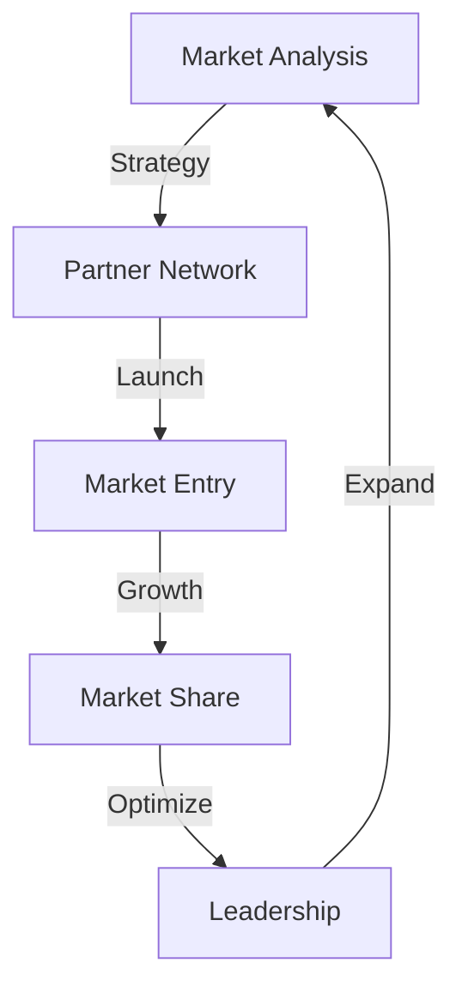

# Future Development

## Vision & Strategy

### 1. Long-term Vision


### 2. Strategic Goals
- **Market Leadership**
  - 50% market share
  - Industry standard
  - Innovation leader
  - Global presence

- **Technology Excellence**
  - Advanced features
  - Superior performance
  - Best security
  - Perfect UX

### 3. Success Metrics
```typescript
interface SuccessMetrics {
  // User metrics
  users: {
    totalUsers: number;
    activeUsers: number;
    retention: number;
    satisfaction: number;
  };

  // Financial metrics
  financial: {
    revenue: number;
    growth: number;
    profitability: number;
    efficiency: number;
  };

  // Platform metrics
  platform: {
    uptime: number;
    performance: number;
    security: number;
    scalability: number;
  };
}
```

## Development Roadmap

### 1. Phase 1: Foundation (2024 Q1-Q2)
- **Core Features**
  - Twitter integration
  - Basic token features
  - Essential security
  - MVP launch

- **Infrastructure**
  - Scalable architecture
  - Security framework
  - Monitoring system
  - Backup solution

### 2. Phase 2: Growth (2024 Q3-Q4)
- **Platform Expansion**
  - Multi-platform support
  - Advanced features
  - Enhanced security
  - Performance optimization

- **Community Building**
  - Developer tools
  - Community programs
  - Educational content
  - Partnership network

### 3. Phase 3: Innovation (2025 Q1-Q2)
- **Advanced Features**
  - AI integration
  - Predictive analytics
  - Advanced automation
  - Custom solutions

- **Ecosystem Development**
  - Partner network
  - Integration marketplace
  - Developer community
  - Research initiatives

### 4. Phase 4: Leadership (2025 Q3-Q4)
- **Market Dominance**
  - Global expansion
  - Industry standards
  - Strategic acquisitions
  - Market leadership

- **Future Technologies**
  - Quantum-ready
  - Advanced AI
  - New paradigms
  - Innovation leadership

## Technical Evolution

### 1. Architecture


### 2. Technology Stack
- **Current Stack**
  - Solana blockchain
  - Node.js backend
  - React frontend
  - Cloud infrastructure

- **Future Stack**
  - Multi-chain support
  - Advanced AI/ML
  - Edge computing
  - Quantum-resistant

### 3. Performance Goals
```typescript
interface PerformanceTargets {
  // Response times
  latency: {
    p50: '50ms';
    p95: '100ms';
    p99: '200ms';
  };

  // Scalability
  scale: {
    users: '100M+';
    transactions: '1M/s';
    storage: 'Petabyte';
  };

  // Reliability
  reliability: {
    uptime: '99.999%';
    dataLoss: '0%';
    recovery: '< 1min';
  };
}
```

## Feature Pipeline

### 1. Near-term Features
- **Q1 2024**
  - Enhanced analytics
  - Advanced automation
  - Improved security
  - Better UX

- **Q2 2024**
  - Multi-platform support
  - Advanced token features
  - Enhanced privacy
  - Developer tools

### 2. Mid-term Features
- **Q3-Q4 2024**
  - AI integration
  - Predictive analytics
  - Custom solutions
  - Advanced security

### 3. Long-term Features
- **2025+**
  - Quantum computing
  - Advanced AI
  - New paradigms
  - Future tech

## Research & Innovation

### 1. Research Areas
- **Blockchain Technology**
  - Scalability solutions
  - Privacy features
  - Cross-chain integration
  - New consensus mechanisms

- **Artificial Intelligence**
  - Natural language processing
  - Predictive analytics
  - Automated trading
  - Risk management

### 2. Innovation Projects


### 3. Partnerships
- Academic institutions
- Research labs
- Industry partners
- Technology providers

## Community Growth

### 1. Developer Ecosystem
- **Tools & Resources**
  - SDK development
  - Documentation
  - Sample code
  - Testing tools

- **Support Programs**
  - Technical support
  - Training programs
  - Certification
  - Grants program

### 2. User Community
- **Engagement Programs**
  - User groups
  - Events & meetups
  - Educational content
  - Support forums

- **Feedback Systems**
  - Feature requests
  - Bug reports
  - User surveys
  - Beta testing

### 3. Partnership Network
- **Types of Partners**
  - Technology partners
  - Integration partners
  - Service providers
  - Resellers

- **Partnership Benefits**
  - Technical support
  - Marketing support
  - Revenue sharing
  - Joint development

## Market Expansion

### 1. Geographic Expansion
- **Phase 1: Core Markets**
  - North America
  - Western Europe
  - Advanced Asia

- **Phase 2: Growth Markets**
  - Eastern Europe
  - Latin America
  - Southeast Asia

### 2. Market Segments
- **Current Focus**
  - Content creators
  - Social influencers
  - Online communities
  - Digital artists

- **Future Segments**
  - Enterprise users
  - Government sector
  - Educational institutions
  - Non-profit organizations

### 3. Go-to-Market Strategy


## Sustainability

### 1. Economic Sustainability
- **Revenue Streams**
  - Transaction fees
  - Premium features
  - Enterprise solutions
  - Partnership revenue

- **Cost Management**
  - Efficient operations
  - Automated processes
  - Resource optimization
  - Smart scaling

### 2. Environmental Impact
- **Green Initiatives**
  - Energy efficiency
  - Carbon neutrality
  - Sustainable practices
  - Environmental policy

### 3. Social Impact
- **Community Benefits**
  - Job creation
  - Skill development
  - Economic empowerment
  - Social inclusion

## Risk Management

### 1. Technical Risks
- **Identification**
  - Security threats
  - Performance issues
  - Scalability challenges
  - Technical debt

- **Mitigation**
  - Regular audits
  - Continuous testing
  - Backup systems
  - Contingency plans

### 2. Market Risks
- **Analysis**
  - Competition
  - Market changes
  - Regulatory issues
  - Economic factors

- **Management**
  - Diversification
  - Adaptation strategy
  - Risk monitoring
  - Quick response

### 3. Future Challenges
- **Preparation**
  - Technology changes
  - Market evolution
  - User needs
  - Regulatory landscape

- **Response**
  - Innovation focus
  - Adaptable strategy
  - Strong partnerships
  - Continuous learning

[Back to Home](README.md)
