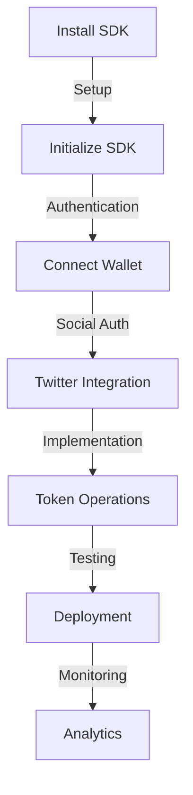

# Extended Integration Guide

## Platform Integration

### 1. X Platform Integration
- **Content Detection**
  * Post monitoring
  * Gift tracking
  * User interaction
  * Event handling

- **User Experience**
  * Seamless integration
  * Native feel
  * Responsive design
  * Intuitive interface

### 2. Technical Requirements
- **System Requirements**
  * Browser compatibility
  * Device support
  * Network requirements
  * Performance standards

- **Integration Points**
  * API endpoints
  * Event listeners
  * Data handlers
  * State management

## Implementation Details

### 1. Frontend Integration
- **User Interface**
  ```javascript
  // Gift Button Component
  const GiftButton = () => {
    const [giftAmount, setGiftAmount] = useState(0);
    const [recipient, setRecipient] = useState('');
    
    const handleGiftSend = async () => {
      // Gift sending logic
      // Transaction handling
      // UI updates
    };
    
    return (
      // Button UI implementation
    );
  };

  // Balance Display Component
  const BalanceDisplay = () => {
    const [balance, setBalance] = useState(0);
    
    useEffect(() => {
      // Balance fetching
      // Real-time updates
    }, []);
    
    return (
      // Balance display UI
    );
  };
  ```

- **State Management**
  ```javascript
  // Global State Management
  const GiftContext = createContext({
    gifts: [],
    balance: 0,
    pending: [],
    history: []
  });

  // State Provider
  const GiftProvider = ({ children }) => {
    // State implementation
    // Update handlers
    // Event listeners
    
    return (
      <GiftContext.Provider value={state}>
        {children}
      </GiftContext.Provider>
    );
  };
  ```

### 2. Backend Integration
- **API Implementation**
  ```javascript
  // API Routes
  router.post('/api/gifts', async (req, res) => {
    try {
      // Gift processing
      // Transaction handling
      // Response formatting
    } catch (error) {
      // Error handling
    }
  });

  // Event Handlers
  const handleGiftEvent = async (event) => {
    // Event processing
    // Database updates
    // Notification dispatch
  };
  ```

- **Database Schema**
  ```sql
  -- Gift Records
  CREATE TABLE gift_records (
    id SERIAL PRIMARY KEY,
    sender VARCHAR(255),
    recipient VARCHAR(255),
    amount DECIMAL,
    timestamp TIMESTAMP,
    status VARCHAR(50)
  );

  -- User Balances
  CREATE TABLE user_balances (
    user_id VARCHAR(255) PRIMARY KEY,
    balance DECIMAL,
    last_updated TIMESTAMP
  );
  ```

## Security Considerations

### 1. Transaction Security
- **Validation**
  * Input sanitization
  * Amount verification
  * User authentication
  * Rate limiting

- **Error Handling**
  * Transaction failures
  * Network issues
  * Invalid states
  * Recovery procedures

### 2. Data Protection
- **Privacy Measures**
  * Data encryption
  * Access control
  * Secure storage
  * Audit logging

- **Compliance**
  * Data regulations
  * Privacy laws
  * Security standards
  * Industry requirements

## Performance Optimization

### 1. Frontend Performance
- **Loading Optimization**
  * Code splitting
  * Lazy loading
  * Asset optimization
  * Cache strategy

- **State Management**
  * Efficient updates
  * Data caching
  * Memory management
  * Event handling

### 2. Backend Performance
- **Query Optimization**
  * Database indexing
  * Query caching
  * Connection pooling
  * Load balancing

- **Resource Management**
  * Server resources
  * Database connections
  * Cache utilization
  * Network bandwidth

## Testing Strategy

### 1. Test Cases
- **Unit Tests**
  ```javascript
  describe('Gift Processing', () => {
    test('should process valid gift', async () => {
      // Test implementation
    });
    
    test('should handle invalid amount', async () => {
      // Test implementation
    });
  });
  ```

- **Integration Tests**
  ```javascript
  describe('API Integration', () => {
    test('should handle gift creation', async () => {
      // Test implementation
    });
    
    test('should update balances', async () => {
      // Test implementation
    });
  });
  ```

### 2. Performance Testing
- **Load Tests**
  * Transaction throughput
  * Response times
  * Error rates
  * Resource usage

- **Stress Testing**
  * Peak load handling
  * Recovery testing
  * Failure scenarios
  * Performance limits

## Monitoring and Analytics

### 1. System Monitoring
- **Performance Metrics**
  * Transaction success rate
  * Response times
  * Error frequency
  * Resource utilization

- **User Metrics**
  * Active users
  * Transaction volume
  * Usage patterns
  * User behavior

### 2. Analytics Integration
- **Data Collection**
  * Usage statistics
  * Performance data
  * Error tracking
  * User analytics

- **Reporting**
  * Performance reports
  * Usage analytics
  * Error analysis
  * Trend analysis

## Deployment Guide

### 1. Setup Process
- **Environment Setup**
  * Development environment
  * Staging environment
  * Production environment
  * Testing environment

- **Configuration**
  * Environment variables
  * API keys
  * Security settings
  * Performance tuning

### 2. Deployment Steps
- **Frontend Deployment**
  * Build process
  * Asset deployment
  * Cache configuration
  * CDN setup

- **Backend Deployment**
  * Server setup
  * Database migration
  * Service configuration
  * Monitoring setup

## Maintenance Procedures

### 1. Regular Maintenance
- **Updates**
  * Security patches
  * Feature updates
  * Bug fixes
  * Performance improvements

- **Monitoring**
  * System health
  * Performance metrics
  * Error tracking
  * Usage statistics

### 2. Issue Resolution
- **Problem Handling**
  * Issue identification
  * Root cause analysis
  * Solution implementation
  * Verification

- **Communication**
  * Status updates
  * User notifications
  * Team coordination
  * Documentation updates

## Getting Started

### Prerequisites
- Node.js v16+
- Solana CLI
- Chrome Extension Developer Mode
- Twitter Developer Account

### Installation
```bash
# Install MEMEFANS SDK
npm install @memefans/sdk

# Install dependencies
npm install @solana/web3.js @solana/spl-token
```

## Integration Flow



## SDK Overview

### Core Components
```typescript
// Token Management
interface TokenManager {
  createToken(params: TokenParams): Promise<Token>;
  distribute(recipients: string[], amount: number): Promise<Transaction>;
  getBalance(address: string): Promise<number>;
}

// Social Integration
interface SocialManager {
  connectTwitter(): Promise<TwitterAccount>;
  trackEngagement(tweetId: string): Promise<EngagementMetrics>;
  setupAutomation(rules: DistributionRules): Promise<void>;
}

// Analytics
interface AnalyticsManager {
  getMetrics(): Promise<Metrics>;
  generateReport(params: ReportParams): Promise<Report>;
  exportData(format: ExportFormat): Promise<Buffer>;
}
```

### Authentication Flow
```typescript
// Initialize SDK
const memefans = new MEMEFANS({
  apiKey: 'your-api-key',
  network: 'mainnet', // or 'devnet'
  wallet: 'your-wallet-address'
});

// Connect wallet
await memefans.connect();

// Authenticate with Twitter
await memefans.social.authenticate();
```

## Implementation Details

### 1. Frontend Integration
```typescript
// Gift Button Component
const GiftButton = () => {
  const [giftAmount, setGiftAmount] = useState(0);
  const [recipient, setRecipient] = useState('');
  
  const handleGiftSend = async () => {
    try {
      const distribution = {
        recipients: [recipient],
        amount: giftAmount,
        rules: {
          engagement: {
            likes: 1,
            retweets: 2,
            comments: 3
          },
          timeWeight: {
            enabled: true,
            factor: 1.5
          }
        }
      };
      
      await memefans.token.distribute(distribution);
    } catch (error) {
      console.error('Gift sending failed:', error);
    }
  };
  
  return (
    <div className="gift-button">
      <input 
        type="number" 
        value={giftAmount} 
        onChange={(e) => setGiftAmount(e.target.value)} 
      />
      <input 
        type="text" 
        value={recipient} 
        onChange={(e) => setRecipient(e.target.value)} 
      />
      <button onClick={handleGiftSend}>Send Gift</button>
    </div>
  );
};
```
