# Market Strategy Analysis

## Market Overview

### Current Market State
- Global social token market cap: $500M+ (2023)
- YoY growth rate: 245%
- Active projects: 150+
- Total users: 2M+

### Market Landscape

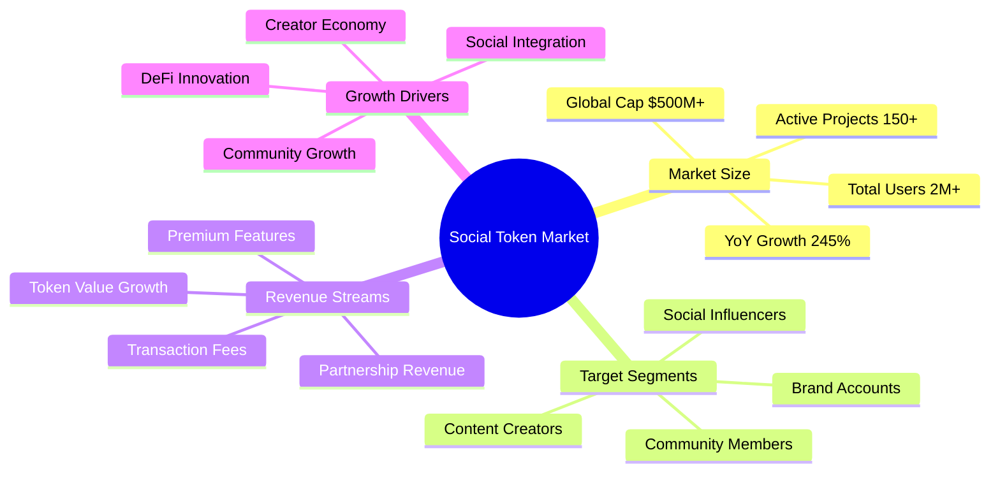

### Market Flow

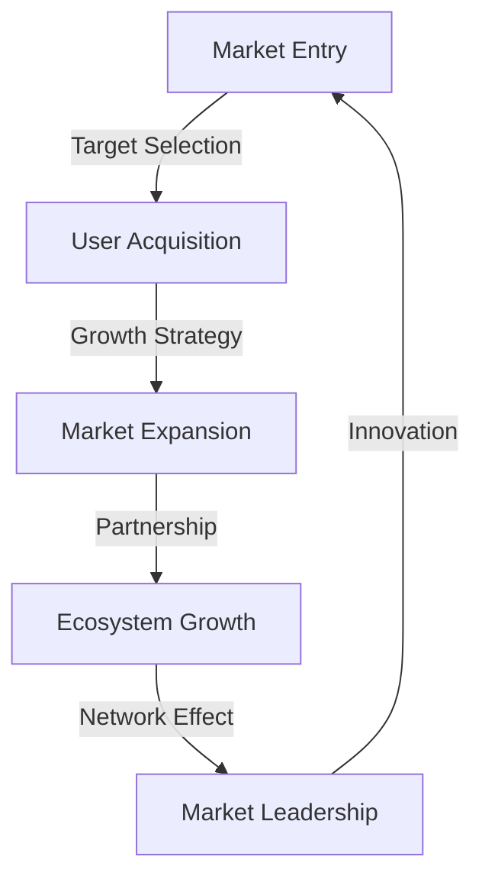

## Market Positioning

### 1. Target Market
- **Primary Users**
  * Content creators ($10B+ annual revenue)
  * Social media influencers
  * Active community members
  * Brand accounts

- **Market Segments**
  * Professional creators (30-50% platform revenue share)
  * Emerging influencers
  * Active supporters
  * Brand marketers

### 2. Value Proposition
- **Core Benefits**
  * Zero-gas gift collection
  * Efficient batch processing
  * Cost-effective transactions
  * Seamless integration

- **Competitive Advantages**
  * Technical innovation
  * Superior user experience
  * Cost efficiency
  * Deep platform integration

## Competitive Analysis

### Direct Competitors

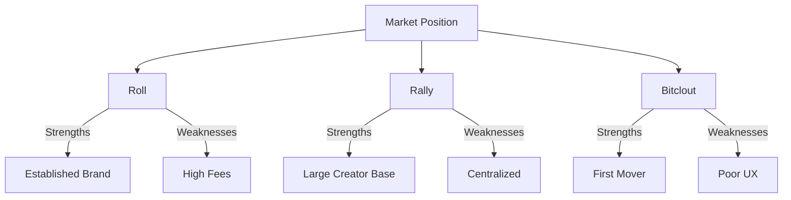

### Market Pain Points
1. **Creator Challenges**
   - High platform fees
   - Limited revenue streams
   - Payment delays
   - Geographic restrictions

2. **Fan Challenges**
   - High entry barriers
   - Limited participation options
   - Poor reward systems
   - Payment difficulties

## Growth Strategy

### 1. User Acquisition
- **Creator Onboarding**
  * Influencer partnerships
  * Platform integration
  * Educational content
  * Support resources

- **Supporter Growth**
  * Community building
  * User incentives
  * Feature promotion
  * Network effects

### 2. Market Expansion
- **Geographic Focus**
  * Initial markets
  * Expansion phases
  * Regional adaptation
  * Local partnerships

## Marketing Channels

### 1. Digital Marketing
- **Social Media**
  * Platform presence
  * Content strategy
  * Community engagement
  * Influencer collaboration

- **Content Marketing**
  * Educational content
  * Tutorial videos
  * Case studies
  * Success stories

### 2. Community Marketing
- **Community Building**
  * User groups
  * Events
  * Workshops
  * Meetups

- **Ambassador Program**
  * Community leaders
  * Brand advocates
  * Technical experts
  * Content creators

## Partnership Strategy

### 1. Strategic Alliances
- **Platform Partners**
  * Social media platforms
  * Content platforms
  * Technology providers
  * Service partners

- **Integration Partners**
  * Wallet providers
  * DeFi platforms
  * Data services
  * Security services

### 2. Collaboration Programs
- **Joint Initiatives**
  * Co-marketing
  * Product integration
  * Resource sharing
  * Market development

- **Value Creation**
  * Mutual benefits
  * Market expansion
  * User growth
  * Innovation

## Marketing Campaigns

### 1. Launch Campaign
- **Campaign Elements**
  * Feature introduction
  * User education
  * Early adoption
  * Community building

- **Implementation Plan**
  * Phase 1: Awareness
  * Phase 2: Education
  * Phase 3: Adoption
  * Phase 4: Growth

### 2. Ongoing Promotion
- **Regular Activities**
  * Feature updates
  * User stories
  * Community events
  * Educational content

- **Performance Tracking**
  * Metrics monitoring
  * Success analysis
  * Adjustment planning
  * Optimization

## User Retention

### 1. Engagement Strategy
- **User Activities**
  * Regular interaction
  * Feature usage
  * Community participation
  * Value creation

- **Retention Programs**
  * Loyalty rewards
  * User benefits
  * Special features
  * Community status

### 2. Value Enhancement
- **Feature Development**
  * User feedback
  * Feature requests
  * Performance improvement
  * Innovation

- **User Experience**
  * Interface optimization
  * Process improvement
  * Support enhancement
  * Value delivery

## Performance Metrics

### 1. Key Indicators
- **Growth Metrics**
  * User acquisition
  * Active users
  * Transaction volume
  * Revenue growth

- **Engagement Metrics**
  * User activity
  * Feature usage
  * Community participation
  * Retention rates

### 2. Success Measurement
- **Performance Analysis**
  * Goal achievement
  * Market impact
  * User satisfaction
  * Business growth

- **Optimization Strategy**
  * Data analysis
  * Performance improvement
  * Strategy adjustment
  * Growth planning

## Future Development

### 1. Market Evolution
- **Trend Analysis**
  * Market changes
  * User needs
  * Technology advancement
  * Competition

- **Adaptation Strategy**
  * Feature development
  * Market positioning
  * User experience
  * Value proposition

### 2. Growth Planning
- **Expansion Plans**
  * Market coverage
  * User segments
  * Feature set
  * Partnership network

- **Development Strategy**
  * Innovation focus
  * Market leadership
  * User value
  * Sustainable growth

## Target Segments

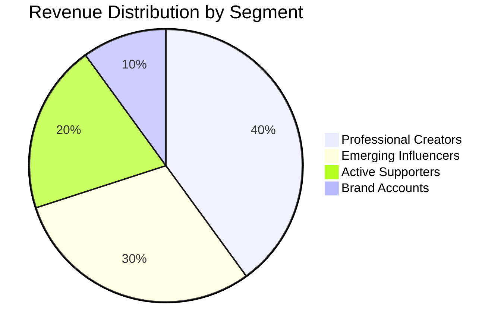

## Value Matrix

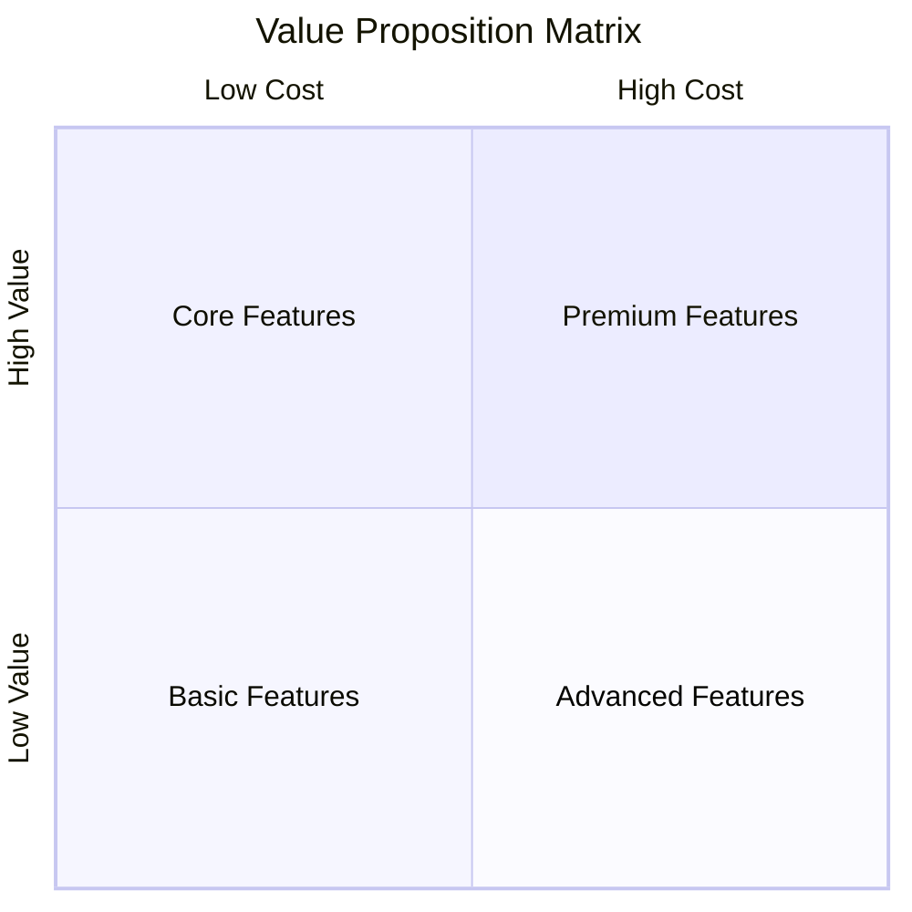

## Market Position

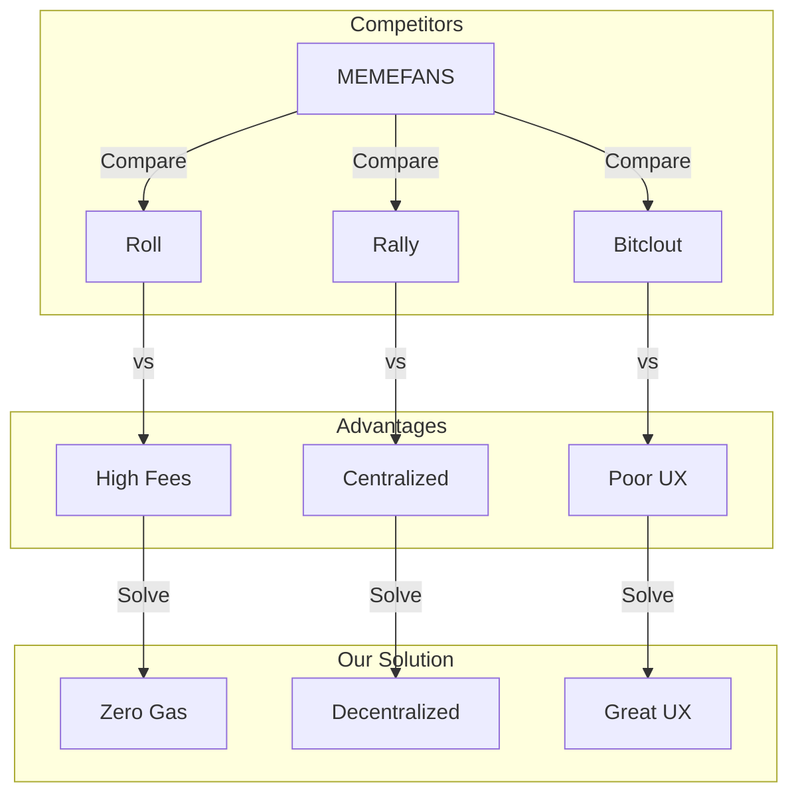

## Feature Comparison

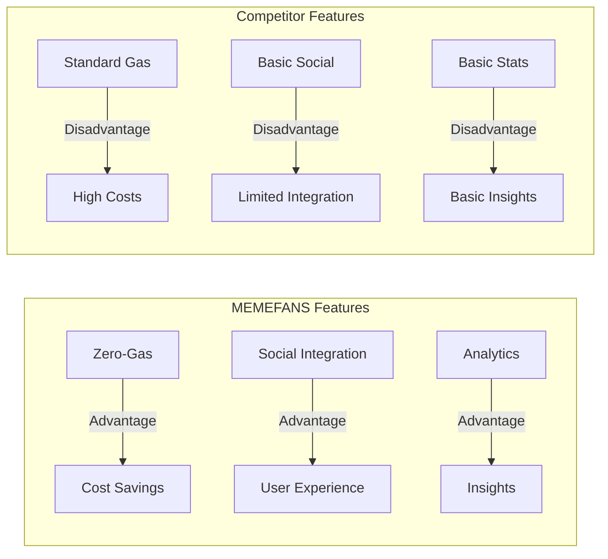

## User Acquisition

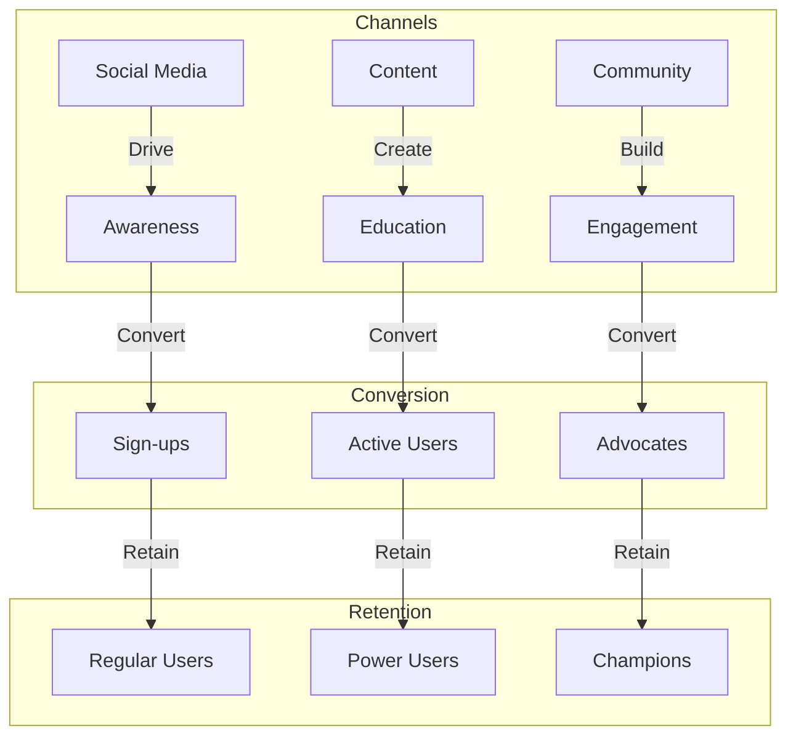

## Geographic Expansion

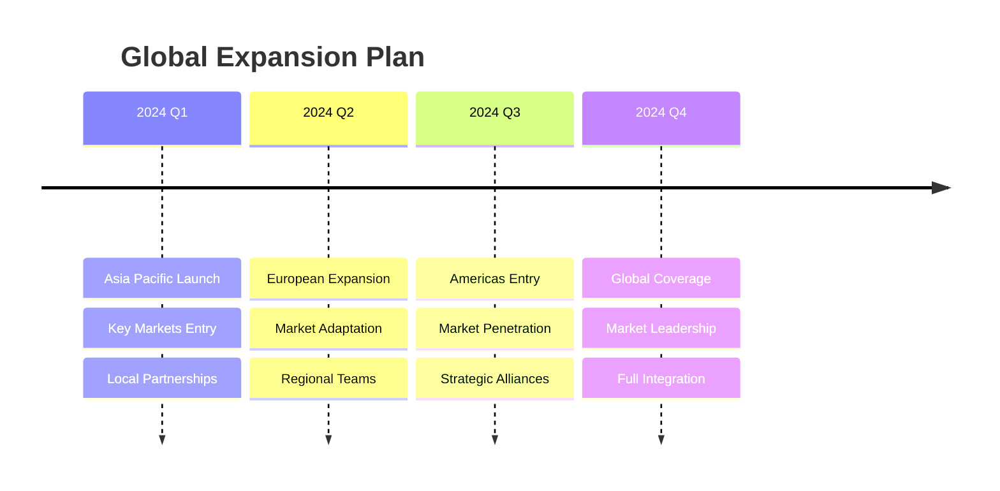

## Channel Mix

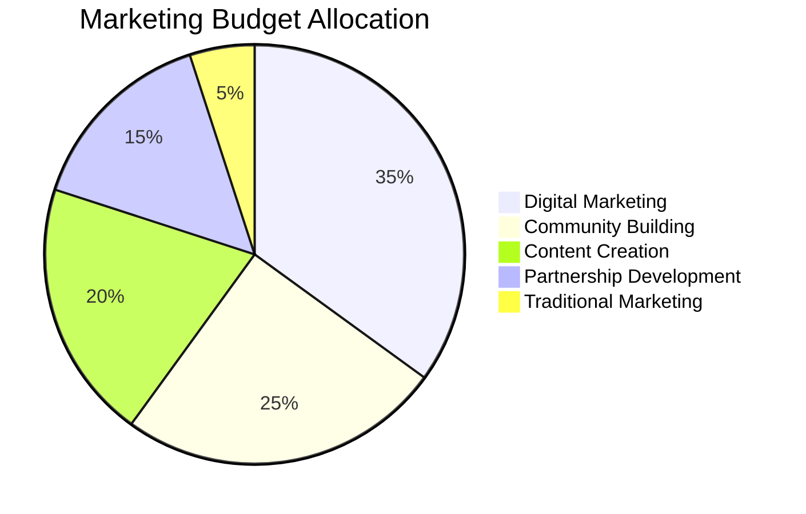

## Campaign Flow

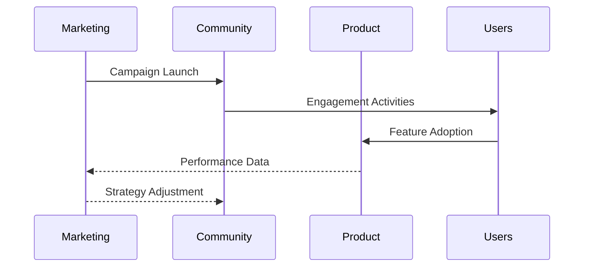

## Ecosystem Development

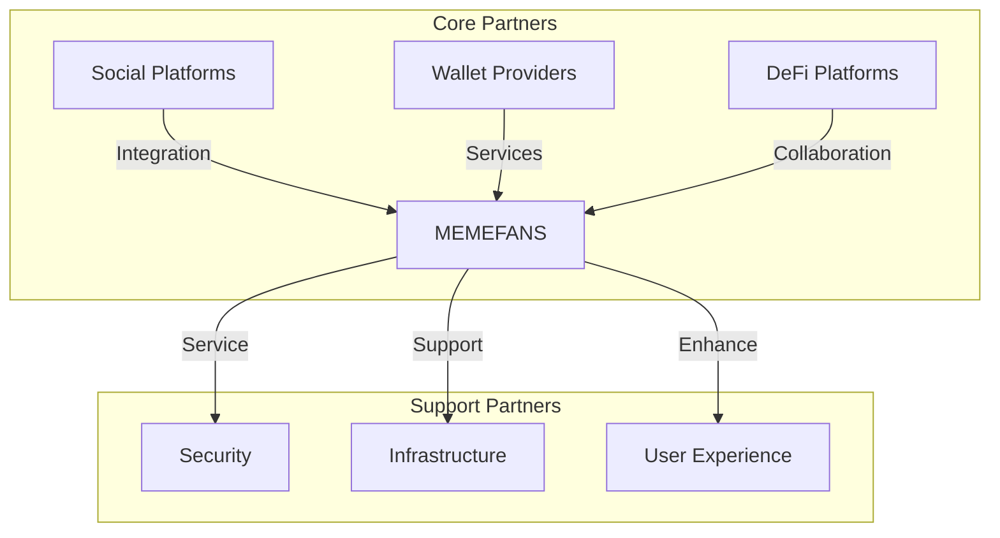

## Value Creation

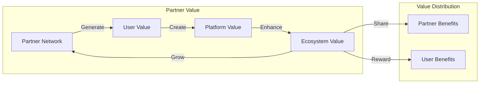

## Growth Tracking

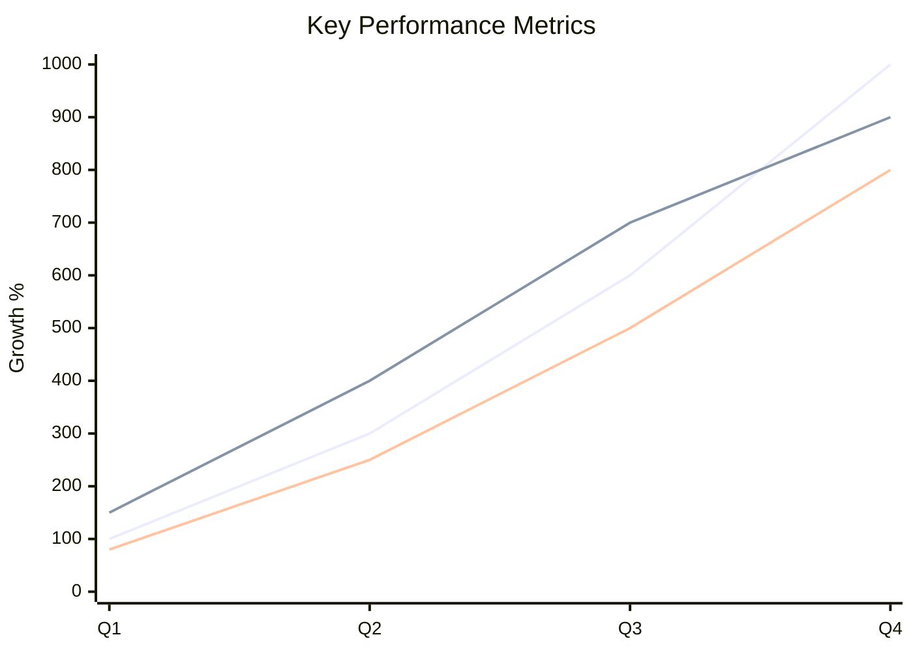

## Success Metrics

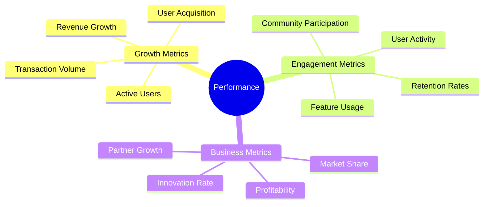

## Market Evolution

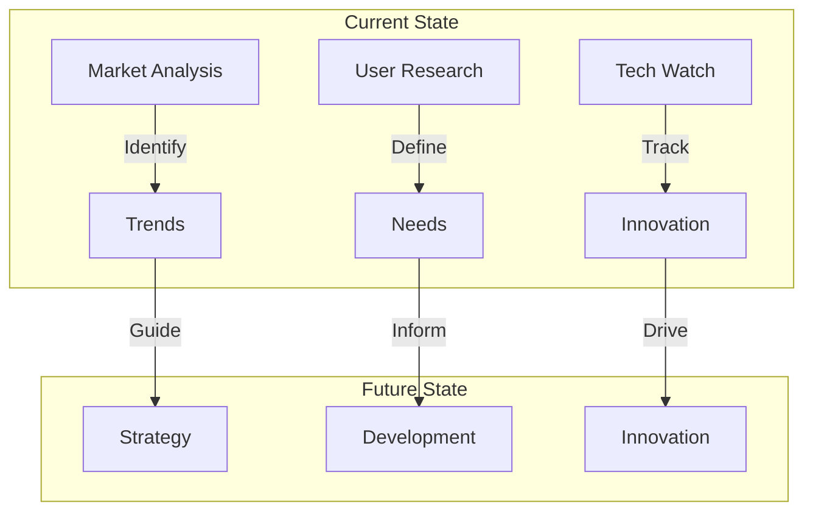

## Growth Planning

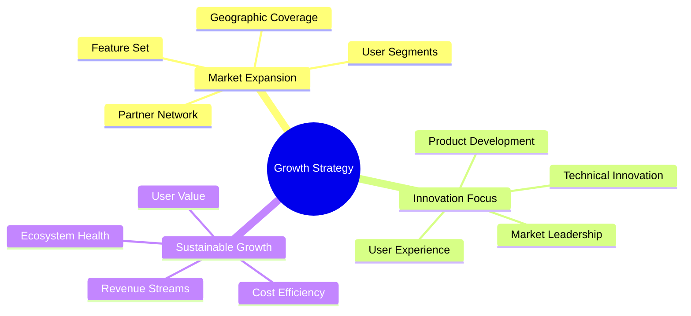
