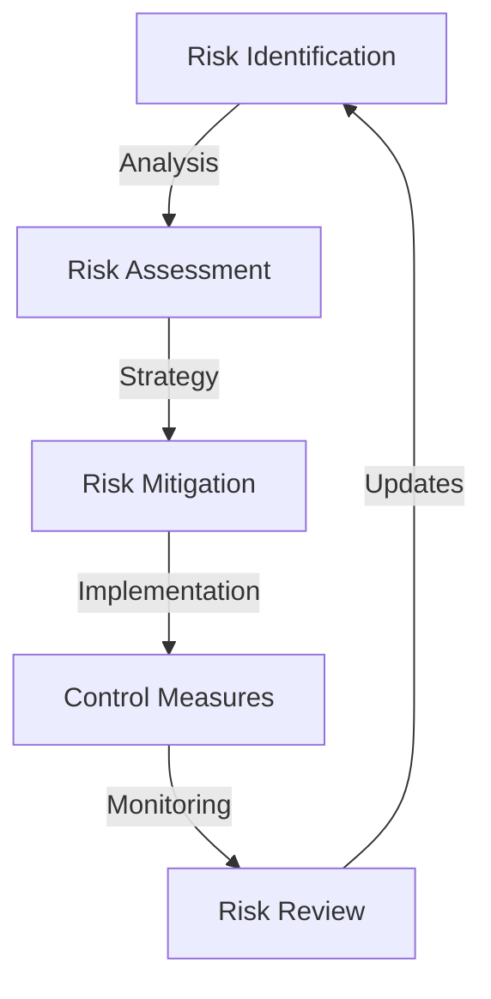
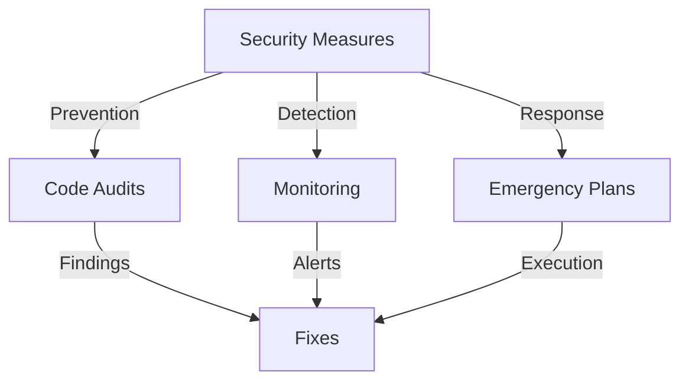
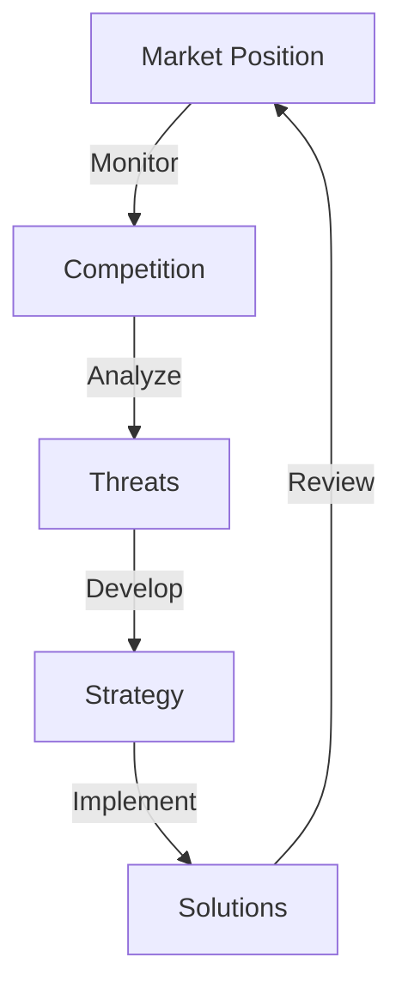

# Comprehensive Risk Assessment Report

## Risk Management Framework

### Risk Assessment Flow

## Technical Risks

### 1. Blockchain Infrastructure
- **Network Risks**
  * Solana network congestion
  * Transaction failures
  * High gas fees
  * Network upgrades

- **Mitigation Strategies**
  * Multiple node providers
  * Transaction retry mechanism
  * Gas optimization
  * Upgrade compatibility testing

### 2. Smart Contract Security

- **Potential Vulnerabilities**
  * Code exploits
  * Logic errors
  * Upgrade risks
  * Integration bugs

- **Security Measures**
  * Multiple audits
  * Bug bounty program
  * Upgrade timelock
  * Emergency pause function

### 3. Platform Stability
- **Technical Issues**
  * System downtime
  * Performance degradation
  * Data inconsistency
  * Integration failures

- **Prevention Methods**
  * Redundant systems
  * Load balancing
  * Regular maintenance
  * Real-time monitoring

## Operational Risks

### 1. System Performance
- **Potential Risks**
  * High transaction volume
  * Network congestion
  * Processing delays
  * System overload

- **Mitigation Strategies**
  * Scalability planning
  * Load balancing
  * Performance monitoring
  * Resource optimization

### 2. User Experience
- **Potential Issues**
  * Interface complexity
  * Feature bugs
  * User confusion
  * Adoption barriers

- **Solutions**
  * User testing
  * Feature validation
  * Comprehensive support
  * Clear documentation

## Market Risks

### 1. Competition Analysis

- **Competitive Threats**
  * New competitors
  * Feature copying
  * Market saturation
  * Price competition

- **Strategic Response**
  * Innovation focus
  * User experience enhancement
  * Community building
  * Strategic partnerships

### 2. Market Conditions
- **External Factors**
  * Economic downturn
  * Crypto market volatility
  * Social media changes
  * Consumer trends

- **Risk Management**
  * Market diversification
  * Reserve funds
  * Adaptable strategy
  * Continuous monitoring

## Regulatory Risks

### 1. Compliance Framework
- **Regulatory Areas**
  * Securities laws
  * KYC/AML requirements
  * Data protection
  * Consumer protection

- **Compliance Strategy**
  * Legal consultation
  * Regular audits
  * Policy updates
  * User verification

### 2. Geographic Considerations
- **Jurisdictional Challenges**
  * Regional regulations
  * Cross-border compliance
  * Local restrictions
  * Market access

- **Management Approach**
  * Legal expertise
  * Regional partnerships
  * Compliance monitoring
  * Market-specific strategies

## Security Risks

### 1. Asset Security
- **Potential Risks**
  * Unauthorized access
  * Fund theft
  * Smart contract exploitation
  * System compromise

- **Mitigation Strategies**
  * Security protocols
  * Access controls
  * Monitoring systems
  * Emergency procedures

### 2. Data Protection
- **Potential Risks**
  * Data breaches
  * Privacy violations
  * Information leaks
  * Unauthorized access

- **Mitigation Strategies**
  * Encryption
  * Access control
  * Privacy measures
  * Security audits

## Compliance Risks

### 1. Regulatory Compliance
- **Potential Risks**
  * Regulation changes
  * Compliance violations
  * Legal issues
  * Operational restrictions

- **Mitigation Strategies**
  * Legal monitoring
  * Compliance updates
  * Policy adaptation
  * Documentation

### 2. Platform Compliance
- **Potential Risks**
  * Platform policy changes
  * Integration restrictions
  * Feature limitations
  * Usage constraints

- **Mitigation Strategies**
  * Policy monitoring
  * Adaptation planning
  * Alternative solutions
  * Communication strategy

## Business Risks

### 1. Growth Management
- **Potential Risks**
  * Rapid growth challenges
  * Resource constraints
  * Quality issues
  * Support limitations

- **Mitigation Strategies**
  * Scalability planning
  * Resource management
  * Quality control
  * Support enhancement

### 2. Partnership Risks
- **Potential Risks**
  * Partner reliability
  * Integration issues
  * Relationship management
  * Value alignment

- **Mitigation Strategies**
  * Partner evaluation
  * Integration testing
  * Relationship building
  * Value creation

## Emergency Procedures

### 1. Incident Response
- **Response Plan**
  * Detection
  * Assessment
  * Action
  * Recovery

- **Team Roles**
  * First response
  * Technical support
  * Communication
  * Management

### 2. Recovery Process
- **System Recovery**
  * Service restoration
  * Data verification
  * Performance check
  * User communication

- **Post-incident**
  * Analysis
  * Improvement
  * Documentation
  * Prevention

## Continuous Improvement

### 1. Risk Review
- **Regular Assessment**
  * Risk evaluation
  * Control effectiveness
  * Process improvement
  * Strategy adjustment

- **Update Process**
  * Risk framework
  * Mitigation strategies
  * Response procedures
  * Documentation

### 2. Knowledge Management
- **Learning Process**
  * Incident analysis
  * Best practices
  * Team training
  * Knowledge sharing

- **Documentation**
  * Process updates
  * Procedure improvements
  * Training materials
  * Reference guides
