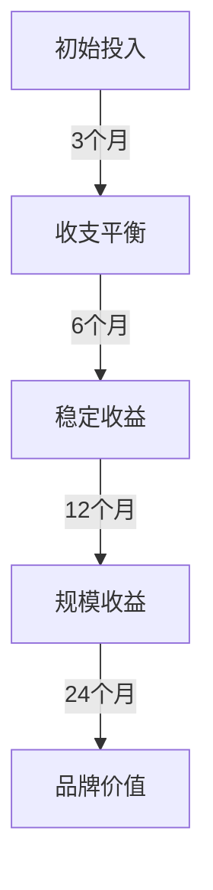
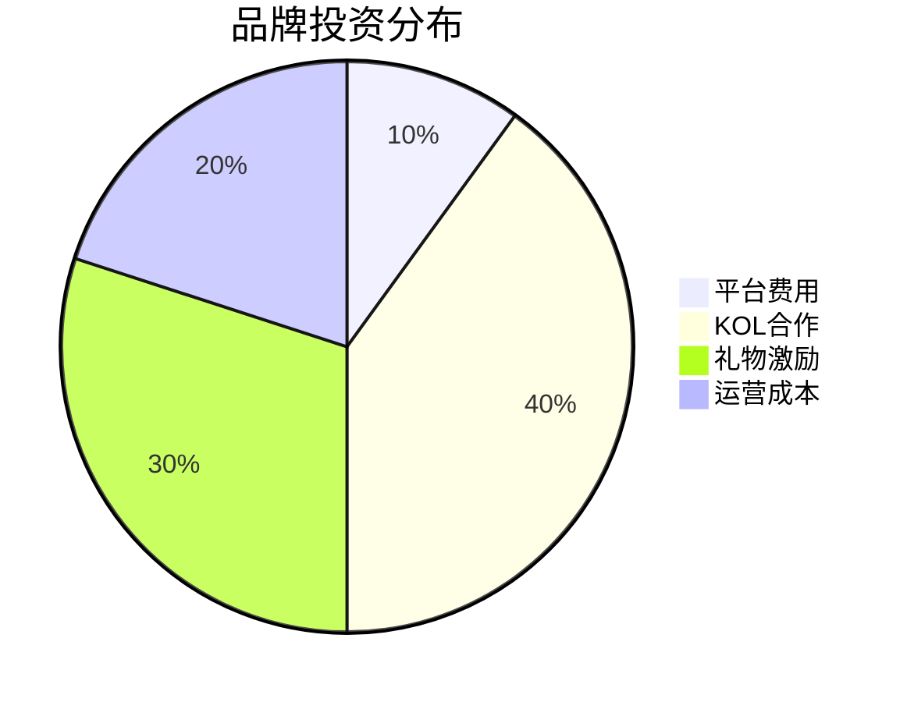
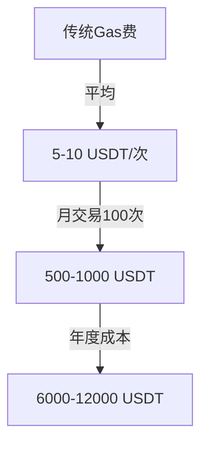
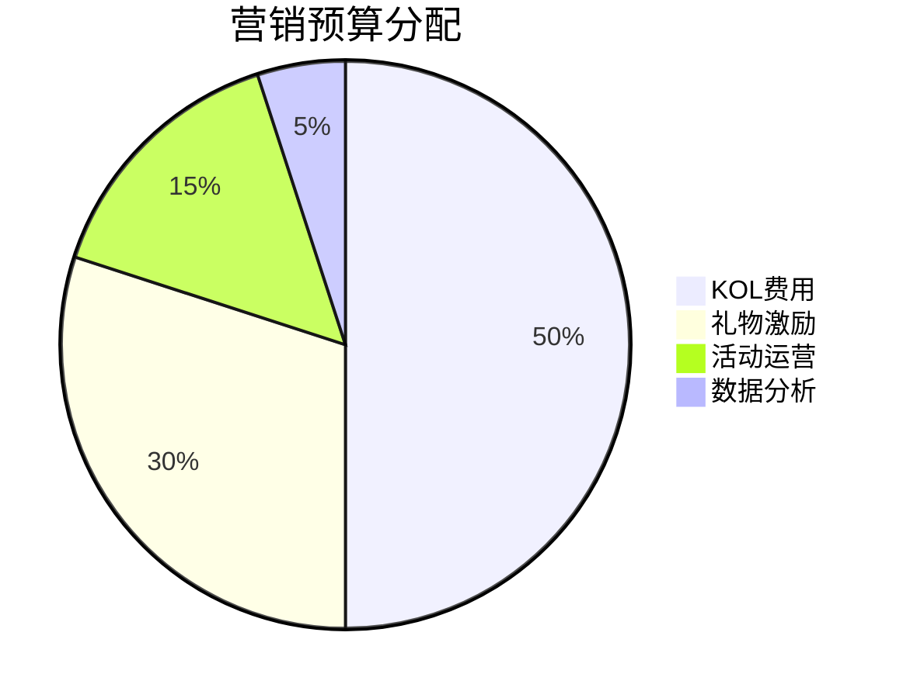
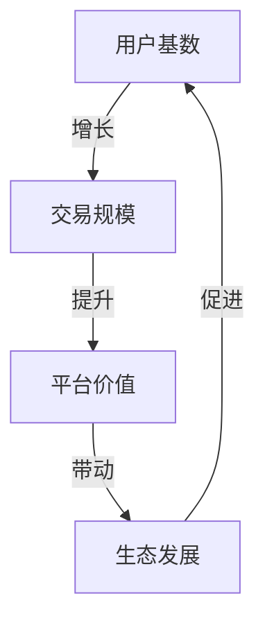
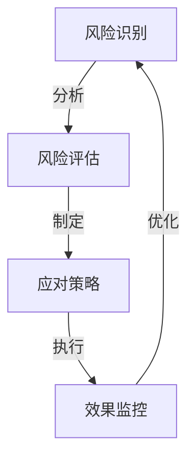
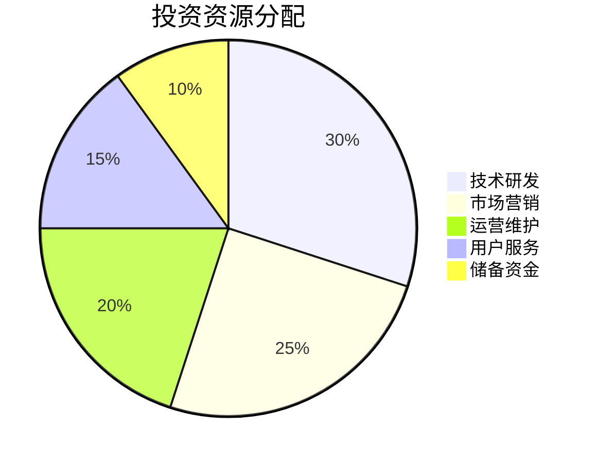

# 投资回报分析报告

## 一、用户分类ROI分析

### 1. 内容创作者
#### 投资成本分析
1. **初始投入**
   - 设备投资：3000-8000 USDT
   - 学习培训：1000-3000 USDT
   - 平台使用：500-1000 USDT

2. **运营成本**
   - 内容制作：20-30小时/周
   - 设备维护：200 USDT/月
   - 推广费用：500-1000 USDT/月

#### 收益预测

1. **短期收益（1-6个月）**
   - 礼物收入：1000-3000 USDT/月
   - 广告合作：2000-5000 USDT/月
   - 总收入：3000-8000 USDT/月
   - 投资回报率：50-100%

2. **中期收益（7-12个月）**
   - 礼物收入：3000-6000 USDT/月
   - 广告合作：5000-10000 USDT/月
   - 总收入：8000-16000 USDT/月
   - 投资回报率：150-300%

3. **长期收益（12个月以上）**
   - 礼物收入：6000-12000 USDT/月
   - 广告合作：10000-20000 USDT/月
   - IP价值：50000+ USDT
   - 投资回报率：500%+

### 2. 品牌账户
#### 投资结构

#### 收益分析
1. **直接收益**
   - 销售增长：200-300%
   - 品牌曝光：100万+/月
   - 用户获取成本降低：40-60%
   - ROI：300-500%

2. **间接收益**
   - 品牌知名度提升
   - 用户忠诚度增加
   - 市场份额扩大
   - 长期品牌价值

## 二、平台功能ROI分析

### 1. 零Gas费用系统
#### 成本节省

#### 效益分析
1. **直接节省**
   - 每次交易节省：5-10 USDT
   - 月度节省：500-1000 USDT
   - 年度节省：6000-12000 USDT

2. **间接效益**
   - 用户体验提升
   - 交易频率增加
   - 平台活跃度提高

### 2. 批量处理系统
#### 效率提升
1. **时间节省**
   - 单次处理：5分钟
   - 批量处理：10分钟/100笔
   - 效率提升：95%

2. **成本节省**
   - 人力成本：-60%
   - 运营成本：-40%
   - 总体节省：50%+

## 三、营销活动ROI分析

### 1. KOL营销活动
#### 投资结构

#### 收益分析
1. **短期收益**
   - 销售增长：200-300%
   - 用户增长：50-100%
   - ROI：300-400%

2. **长期收益**
   - 品牌价值：+200%
   - 市场份额：+30%
   - 用户留存：50%+

### 2. 社区运营活动
#### 投资分析
1. **资源投入**
   - 运营人员：2-3人
   - 活动预算：3000 USDT/月
   - 礼物激励：2000 USDT/月

2. **收益预测**
   - 社区活跃度：+200%
   - 用户留存：+100%
   - 转化率：+50%
   - ROI：200-300%

## 四、长期价值分析

### 1. 平台价值
#### 增长预测

#### 价值评估
1. **用户资产**
   - 活跃用户：100万+
   - 人均价值：100 USDT
   - 总用户价值：1亿 USDT+

2. **平台资产**
   - 技术价值
   - 数据价值
   - 品牌价值
   - 生态价值

### 2. 生态价值
#### 价值构成
1. **直接价值**
   - 交易费用
   - 服务收入
   - 广告收入

2. **间接价值**
   - 数据价值
   - 网络效应
   - 创新机会

## 五、风险收益分析

### 1. 风险因素
#### 市场风险
1. **竞争风险**
   - 新平台进入
   - 功能模仿
   - 价格竞争

2. **政策风险**
   - 监管变化
   - 合规要求
   - 运营限制

#### 应对策略

### 2. 收益保障
#### 保障措施
1. **技术保障**
   - 系统稳定性
   - 安全性保障
   - 性能优化

2. **运营保障**
   - 服务质量
   - 用户体验
   - 问题响应

## 六、投资建议

### 1. 投资策略
#### 分阶段投资
1. **初始阶段**
   - 最小可行投资
   - 快速验证
   - 灵活调整

2. **成长阶段**
   - 扩大投资
   - 市场扩张
   - 功能完善

3. **成熟阶段**
   - 稳定投资
   - 效益优化
   - 价值提升

#### 资源分配

### 2. 效益最大化
#### 优化建议
1. **成本控制**
   - 精准投放
   - 效率提升
   - 资源优化

2. **收益提升**
   - 用户增长
   - 变现优化
   - 价值创新
