# 投资回报分析报告

## 摘要

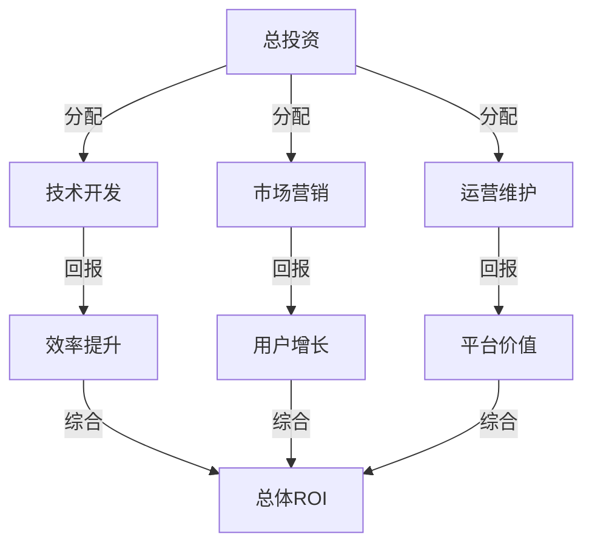

### 投资回报预测
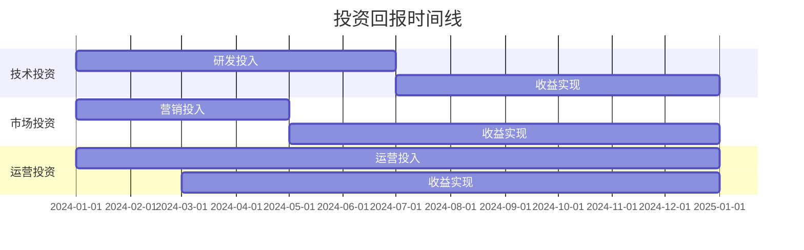

## 一、用户分类ROI分析

### 1. 内容创作者
#### 投资成本分析
1. **初始投入**
   - 设备投资：3000-8000 USDT
   - 学习培训：1000-3000 USDT
   - 平台使用：500-1000 USDT

2. **运营成本**
   ```mermaid
   pie title 月度运营成本分布
       "内容制作" : 50
       "设备维护" : 10
       "推广费用" : 30
       "其他成本" : 10
   ```
   - 内容制作：20-30小时/周
   - 设备维护：200 USDT/月
   - 推广费用：500-1000 USDT/月

#### 收益预测
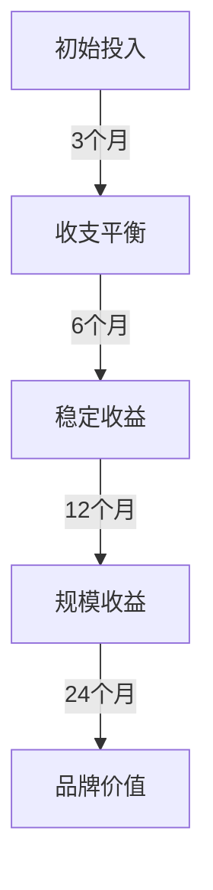

1. **短期收益（1-6个月）**
   ```mermaid
   pie title 月度收入构成
       "礼物收入" : 30
       "广告合作" : 50
       "增值服务" : 20
   ```
   - 礼物收入：1000-3000 USDT/月
   - 广告合作：2000-5000 USDT/月
   - 总收入：3000-8000 USDT/月
   - ROI：50-100%

2. **中期收益（7-12个月）**
   ```mermaid
   bar
       title 收入增长趋势
       x-axis [1月, 2月, 3月, 4月, 5月, 6月]
       y-axis "收入(USDT)" 0 --> 16000
       bar "礼物收入" [3000, 3500, 4000, 4500, 5000, 6000]
       bar "广告收入" [5000, 6000, 7000, 8000, 9000, 10000]
   ```
   - 礼物收入：3000-6000 USDT/月
   - 广告合作：5000-10000 USDT/月
   - 总收入：8000-16000 USDT/月
   - ROI：150-300%

3. **长期收益（12个月以上）**
   ```mermaid
   graph LR
    A[收入来源] --> B[礼物收入]
    A --> C[广告合作]
    A --> D[IP变现]
    B --> E[6000-12000]
    C --> F[10000-20000]
    D --> G[50000+]
   ```
   - 礼物收入：6000-12000 USDT/月
   - 广告合作：10000-20000 USDT/月
   - IP价值：50000+ USDT
   - ROI：500%+

### 2. 品牌账户
#### 投资结构
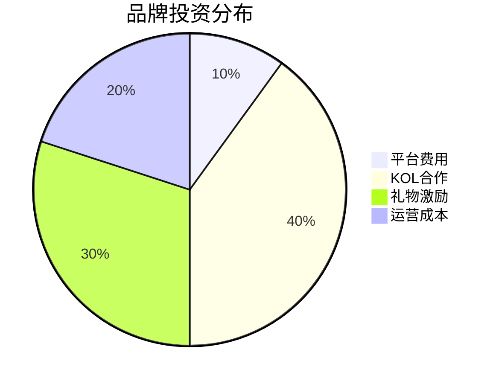

#### 收益分析
1. **直接收益**
   ```mermaid
   quadrantChart
       title 品牌投资效果
       x-axis 投资规模 --> 大
       y-axis 回报率 --> 高
       quadrant-1 高投入高回报
       quadrant-2 低投入高回报
       quadrant-3 低投入低回报
       quadrant-4 高投入低回报
       "KOL合作": [0.8, 0.9]
       "礼物激励": [0.6, 0.8]
       "平台费用": [0.3, 0.4]
       "运营成本": [0.5, 0.6]
   ```
   - 销售增长：200-300%
   - 品牌曝光：100万+/月
   - 用户获取成本降低：40-60%
   - ROI：300-500%

## 二、平台功能ROI分析

### 1. 零Gas费用系统
#### 成本节省
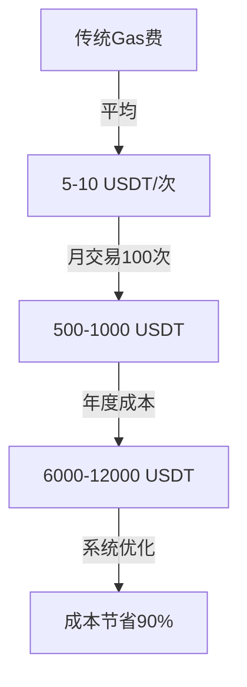

#### 效益分析
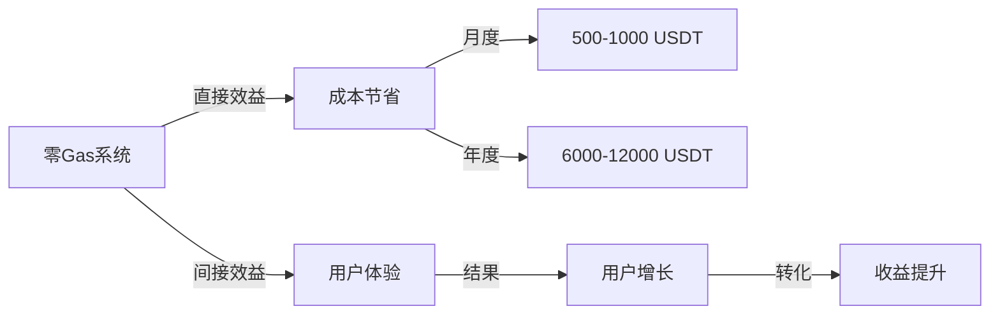

### 2. 批量处理系统
#### 效率提升
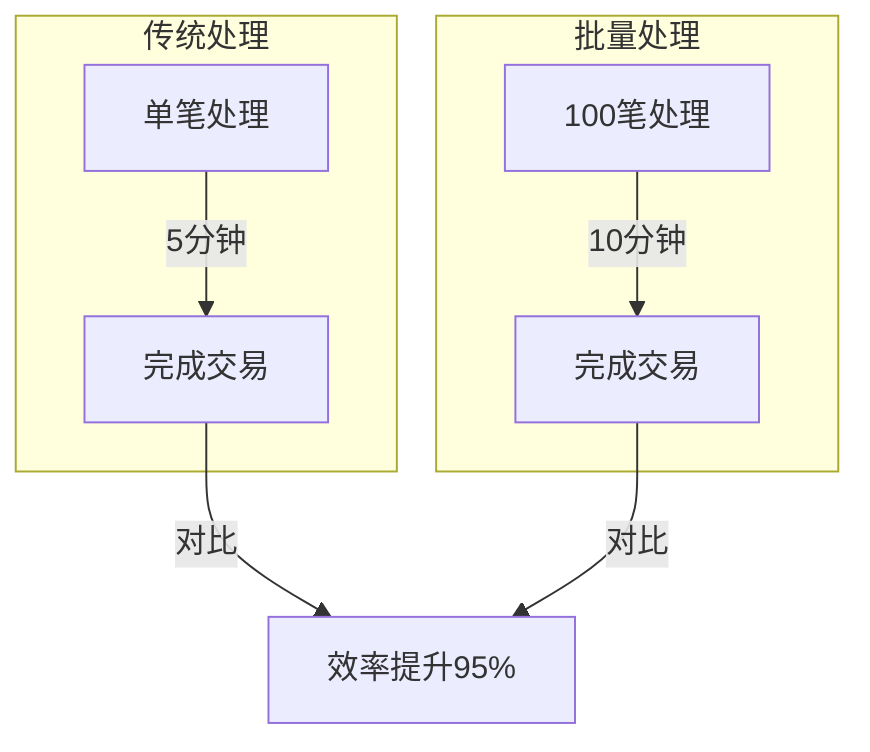

## 三、营销活动ROI分析

### 1. KOL营销活动
```mermaid
xychart-beta
    title "KOL营销效果分析"
    x-axis [1月, 2月, 3月, 4月, 5月, 6月]
    y-axis "增长率(%)" 0 --> 500
    line "用户增长" [50, 100, 150, 200, 250, 300]
    line "销售增长" [100, 200, 300, 350, 400, 450]
```

### 2. 社区运营活动
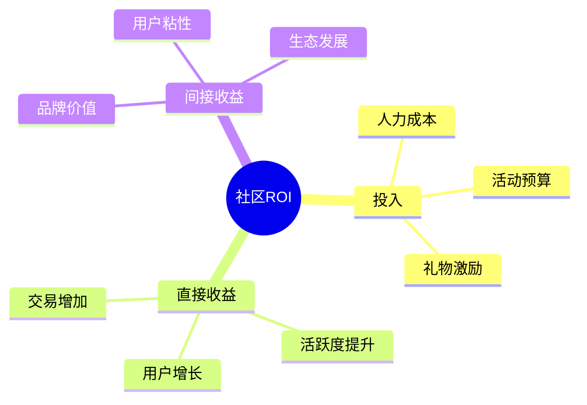

## 四、长期价值分析

### 1. 平台价值
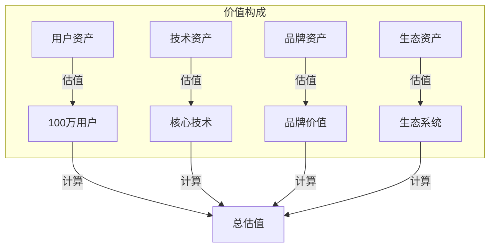

## 五、风险收益分析

### 1. 风险因素
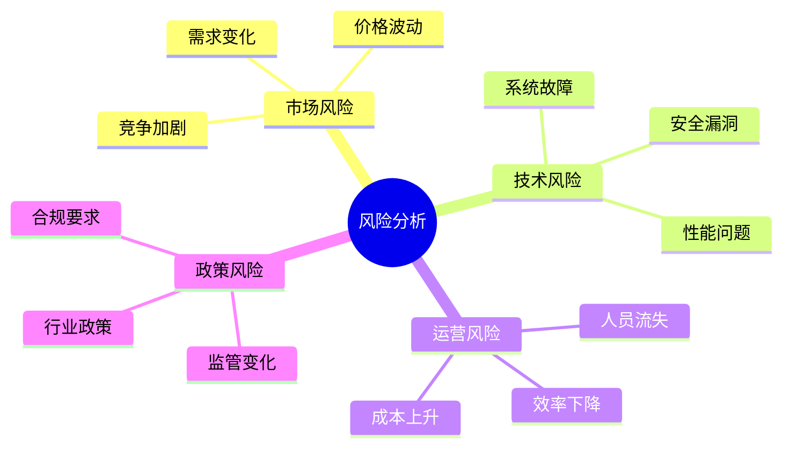

### 2. 收益保障
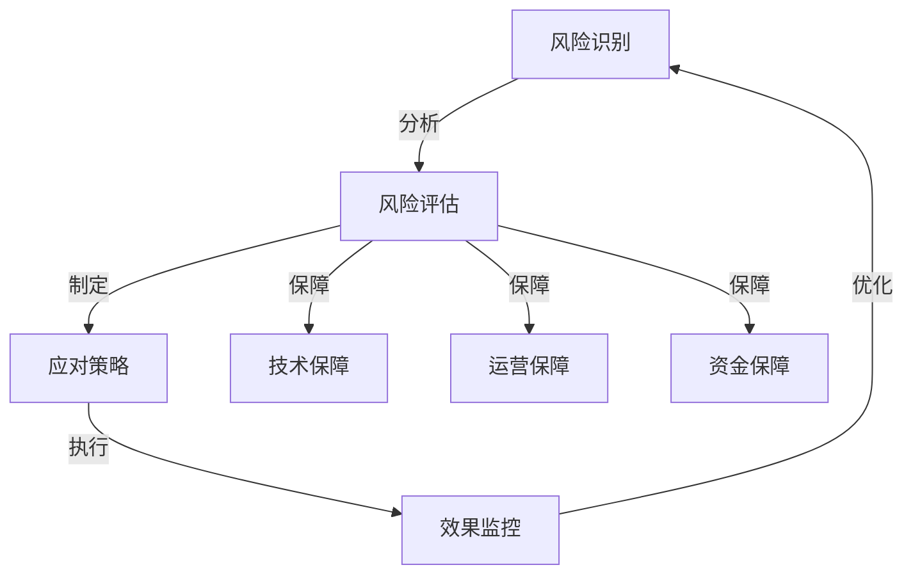

## 六、投资建议

### 1. 投资策略
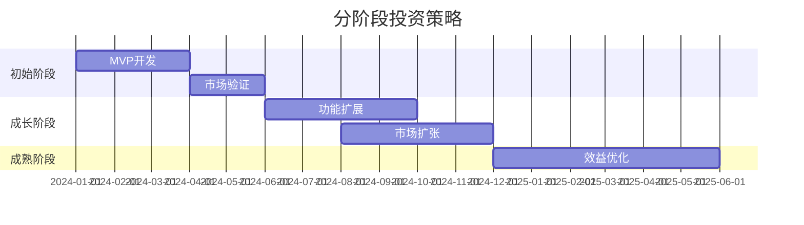

### 2. 资源分配
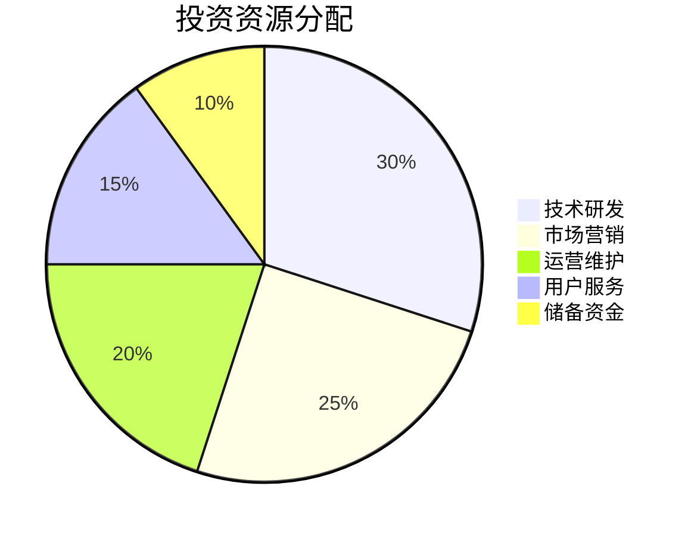

### 3. 效益最大化
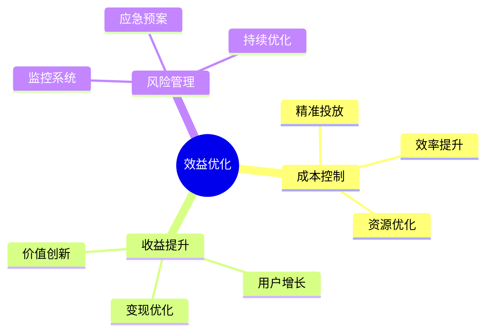
