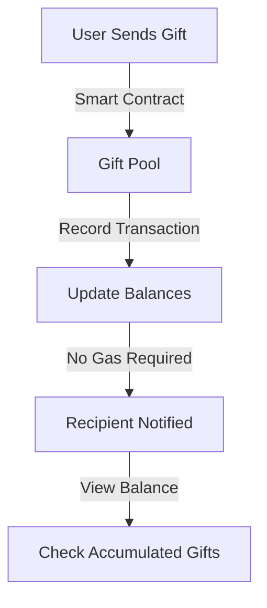

# Social Interaction Mechanism

## Zero-Gas Gift System on X Platform

### System Overview
The MEMEFANS Zero-Gas Gift System revolutionizes social interactions on X by enabling gasless gift accumulation and batch withdrawals. This innovative approach significantly reduces transaction costs while maintaining the spontaneity and engagement of real-time gifting.

### Core Features

#### 1. Gasless Gift Reception
- **Instant Recognition**: Gifts are instantly recognized and recorded in the smart contract
- **Zero-Gas Accumulation**: Recipients can accumulate gifts without paying gas fees
- **Real-time Balance Updates**: Users can check their gift balance anytime without cost
- **Automated Recording**: All gift transactions are automatically recorded on-chain

#### 2. Gift Pool Architecture
- **Unified Storage**: All gifts are stored in a secure, unified pool
- **Smart Contract Management**: Automated handling of gift deposits and withdrawals
- **Balance Tracking**: Real-time tracking of individual user balances
- **Transaction History**: Comprehensive record of all gift transactions

#### 3. Batch Processing System
- **Optimized Withdrawals**: Users can withdraw multiple gifts in a single transaction
- **Gas Cost Reduction**: Significant reduction in overall gas costs through batching
- **Flexible Timing**: Users choose when to withdraw based on gas prices
- **Transaction Bundling**: Smart bundling of multiple gift claims

### User Experience Design

#### 1. Gift Sending Process

#### 2. Gift Collection Workflow
- **Accumulation Phase**
  * Gifts automatically added to user's balance
  * Real-time balance updates
  * Transaction history tracking
  * Notification system

- **Withdrawal Phase**
  * User-initiated withdrawal
  * Batch processing optimization
  * Gas cost estimation
  * Transaction confirmation

#### 3. Interactive Features
- **Balance Dashboard**
  * Real-time gift balance display
  * Transaction history view
  * Analytics and statistics
  * Withdrawal planning tools

### Data Analytics and Metrics

#### 1. User Engagement Metrics
- **Activity Indicators**
  * Gift frequency
  * Transaction volume
  * User interaction rate
  * Platform engagement

- **Performance Metrics**
  * Average gift value
  * Batch size analytics
  * Gas savings statistics
  * User retention rates

#### 2. System Performance
- **Transaction Analytics**
  * Processing speed
  * Success rates
  * Error frequency
  * Gas optimization effectiveness

- **Network Statistics**
  * Peak usage periods
  * Network load
  * Response times
  * System stability

### Incentive Mechanisms

#### 1. User Rewards
- **Activity-Based Incentives**
  * Regular gifting rewards
  * Volume-based bonuses
  * Engagement multipliers
  * Special event rewards

- **Loyalty Programs**
  * Long-term user benefits
  * Tier-based privileges
  * Community rewards
  * Special features access

#### 2. Community Building
- **Social Features**
  * User rankings
  * Achievement system
  * Community challenges
  * Social interaction rewards

- **Engagement Tools**
  * Community events
  * Interactive campaigns
  * User competitions
  * Collaborative activities

### Implementation Guidelines

#### 1. Technical Integration
- **Platform Requirements**
  * API integration specifications
  * Security protocols
  * Performance standards
  * Data handling requirements

- **System Architecture**
  * Component interaction
  * Data flow design
  * Security measures
  * Scalability considerations

#### 2. User Guidelines
- **Getting Started**
  * Account setup
  * Feature introduction
  * Basic operations
  * Safety guidelines

- **Advanced Features**
  * Batch processing
  * Analytics tools
  * Custom settings
  * Advanced functions

### Future Enhancements

#### 1. Planned Improvements
- **Feature Expansion**
  * Additional gift types
  * Enhanced analytics
  * Advanced batch processing
  * Improved user interface

- **Technical Upgrades**
  * Performance optimization
  * Security enhancements
  * Scalability improvements
  * New integration options

#### 2. Community Feedback
- **User Suggestions**
  * Feature requests
  * Improvement ideas
  * Bug reports
  * User experience feedback

- **Implementation Timeline**
  * Short-term updates
  * Medium-term improvements
  * Long-term developments
  * Continuous optimization
