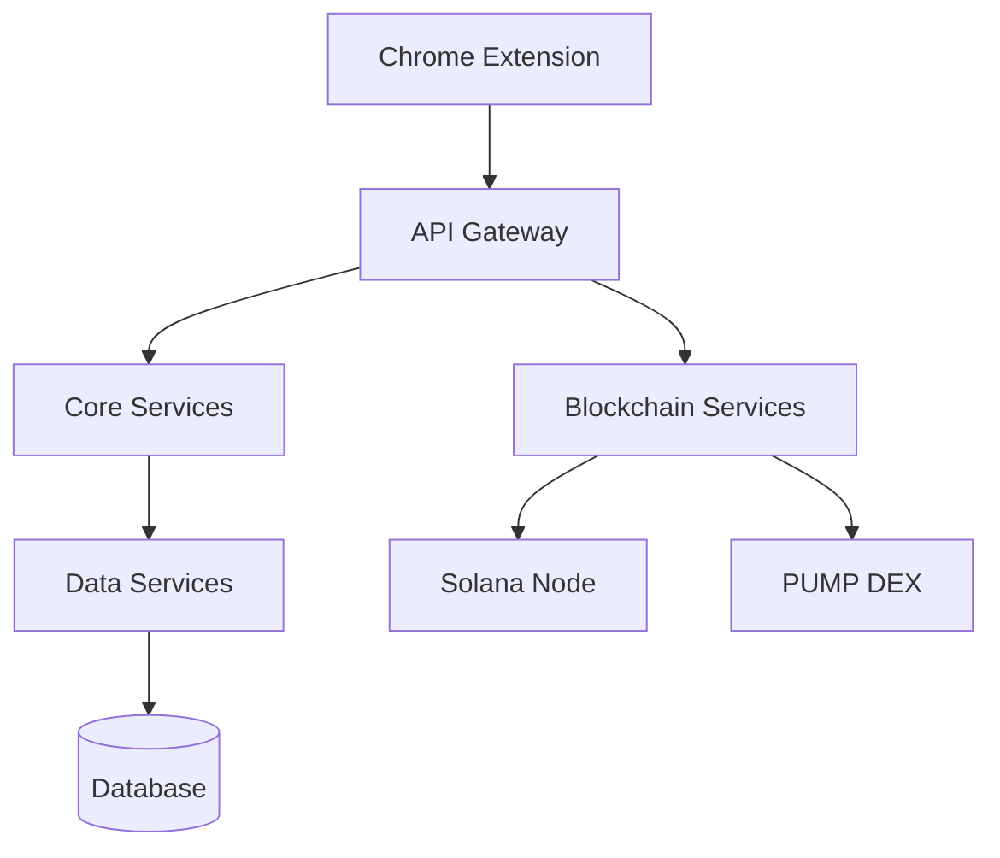

# Technical Architecture

## System Overview

MEMEFANS is built on a modular, scalable microservices architecture based on the Solana blockchain. The system consists of the following core components:

## Core Components

### 1. Chrome Extension
- **Function**: User interface and interaction layer
- **Tech Stack**:
  - React.js + TypeScript
  - Web3.js
  - Chrome Extension API
- **Features**:
  - Lightweight design (< 5MB)
  - Quick startup (< 2s)
  - Offline support

### 2. API Gateway
- **Function**: Request routing and load balancing
- **Implementation**:
  - Node.js + Express
  - Redis caching
  - JWT authentication
- **Performance**:
  - Average response time < 100ms
  - Concurrent processing > 10000 QPS

### 3. Core Services
- **Main Modules**:
  - User management
  - Token distribution
  - Reward calculation
  - Data analytics
- **Technical Features**:
  - Microservices architecture
  - Event-driven
  - Asynchronous processing

### 4. Blockchain Services
- **Functions**:
  - Smart contract interaction
  - Transaction management
  - Wallet integration
- **Performance**:
  - Transaction confirmation < 1s
  - Gas fee optimization > 50%

## Security Mechanisms

### 1. Multi-layer Security
- **Application Security**
  - HTTPS/TLS 1.3
  - API signature verification
  - Rate limiting
  
- **Data Security**
  - End-to-end encryption
  - Data masking
  - Regular backups

- **Blockchain Security**
  - Multi-signature
  - Transaction monitoring
  - Smart contract audits

### 2. Risk Control
- Transaction amount limits
- Anomaly detection
- Automated risk strategies

## Scalability Design

### 1. Horizontal Scaling
- Stateless service design
- Auto-scaling
- Distributed caching

### 2. Vertical Scaling
- Performance optimization
- Resource isolation
- Multi-level caching

### 3. Cross-chain Support
- Cross-chain bridge interface
- Multi-chain asset management
- Unified authentication

## Performance Metrics

### 1. System Performance
- **API Response Time**
  - P95 < 200ms
  - P99 < 500ms
  
- **Concurrent Processing**
  - Single node > 5000 TPS
  - Cluster > 50000 TPS

### 2. Blockchain Performance
- **Transaction Speed**
  - Confirmation time < 1s
  - Throughput > 50000 TPS
  
- **Cost Efficiency**
  - Average Gas < 0.00001 SOL
  - Batch optimization > 40%

## Monitoring and Operations

### 1. System Monitoring
- Performance metrics
- Error log analysis
- Resource usage monitoring

### 2. Alert System
- Multi-level alert strategy
- Auto-recovery mechanism
- Manual intervention channel

### 3. DevOps Automation
- CI/CD pipeline
- Automated testing
- Disaster recovery

[Continue to Token Economics →](token-economics.md)
