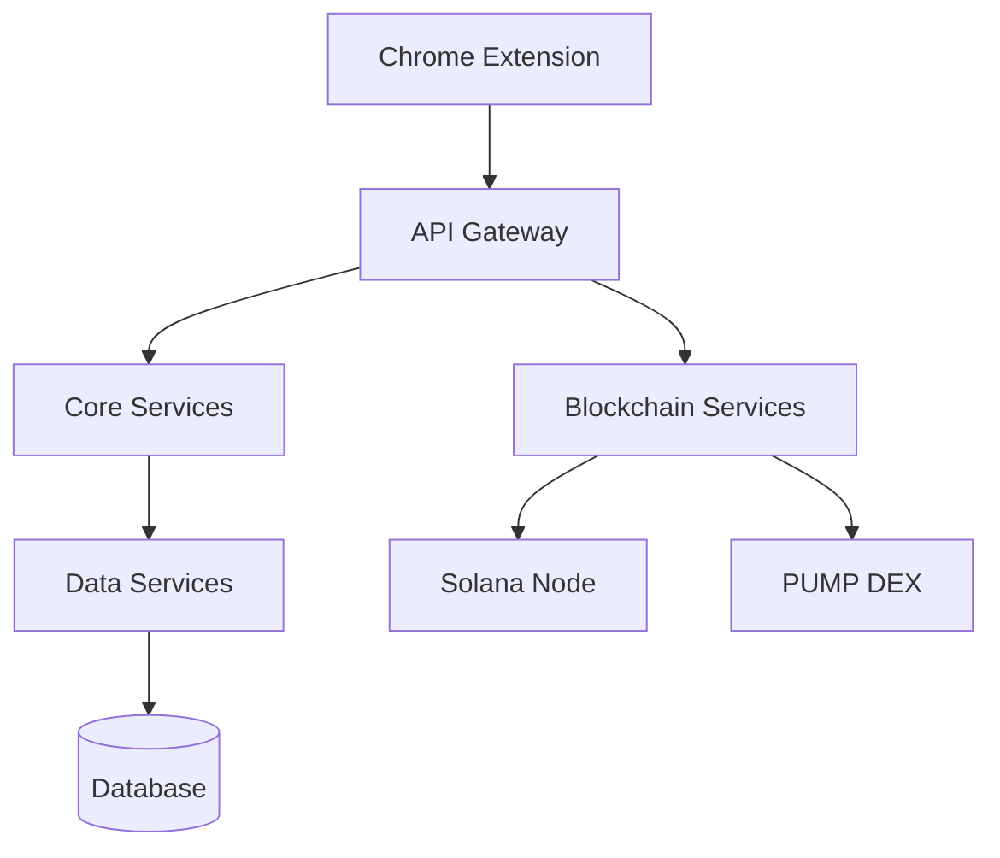
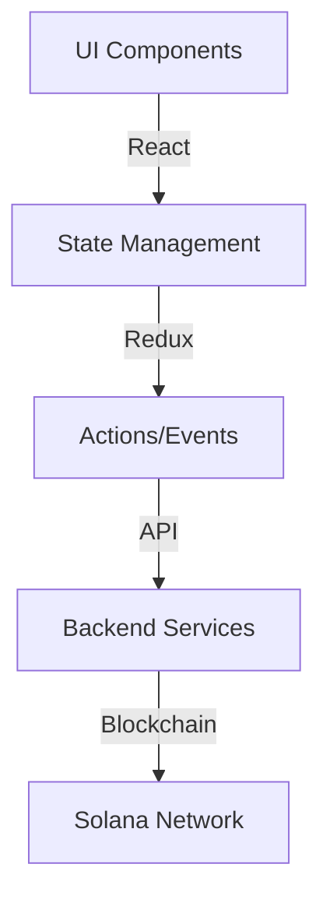
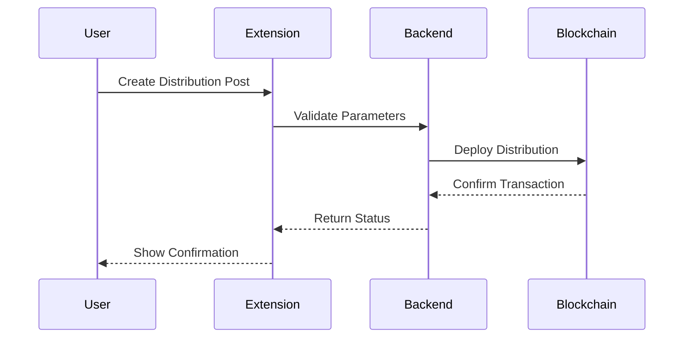
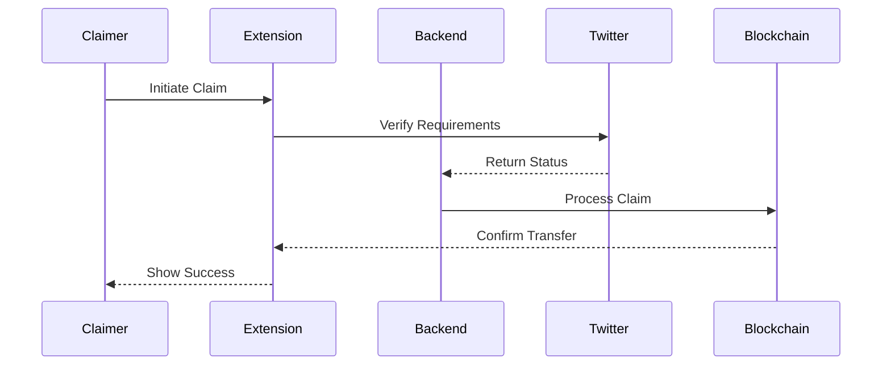

# Technical Architecture

## System Overview

MEMEFANS is built on a modular, scalable microservices architecture based on the Solana blockchain. The system consists of the following core components:



## Core Components

### 1. Chrome Extension
- **Function**: User interface and interaction layer
- **Tech Stack**:
  - React.js + TypeScript
  - Web3.js
  - Chrome Extension API
- **Features**:
  - Lightweight design (< 5MB)
  - Quick startup (< 2s)
  - Offline support
  - Local data storage
  - Real-time updates
- **Security**:
  - Wallet encryption
  - Private key management
  - Transaction signing
  - Access controls

### 2. API Gateway
- **Function**: Request routing and load balancing
- **Implementation**:
  - Node.js + Express
  - Redis caching
  - JWT authentication
  - MongoDB for data persistence
- **Performance**:
  - Average response time < 100ms
  - Concurrent processing > 10000 QPS
- **Integration**:
  - Twitter API integration
  - Authentication services
  - Data synchronization
  - Event tracking

### 3. Core Services
- **Main Modules**:
  - User management
  - Token distribution
  - Reward calculation
  - Data analytics
- **Technical Features**:
  - Microservices architecture
  - Event-driven
  - Asynchronous processing
  - Queue management
  - Error recovery

### 4. Blockchain Services
- **Functions**:
  - Smart contract interaction
  - Transaction management
  - Wallet integration
  - Batch processing system
- **Performance**:
  - Transaction confirmation < 1s
  - Gas fee optimization > 50%
  - Queue-based batch operations
  - State management optimization

## Security Mechanisms

### 1. Multi-layer Security
- **Application Security**
  - HTTPS/TLS 1.3
  - API signature verification
  - Rate limiting
  
- **Data Security**
  - End-to-end encryption
  - Data masking
  - Regular backups

- **Blockchain Security**
  - Multi-signature
  - Transaction monitoring
  - Smart contract audits

### 2. Risk Control
- Transaction amount limits
- Anomaly detection
- Automated risk strategies

## Scalability Design

### 1. Horizontal Scaling
- Stateless service design
- Auto-scaling
- Distributed caching

### 2. Vertical Scaling
- Performance optimization
- Resource isolation
- Multi-level caching

### 3. Cross-chain Support
- Cross-chain bridge interface
- Multi-chain asset management
- Unified authentication

## Performance Metrics

### 1. System Performance
- **API Response Time**
  - P95 < 200ms
  - P99 < 500ms
  
- **Concurrent Processing**
  - Single node > 5000 TPS
  - Cluster > 50000 TPS

### 2. Blockchain Performance
- **Transaction Speed**
  - Confirmation time < 1s
  - Throughput > 50000 TPS
  
- **Cost Efficiency**
  - Average Gas < 0.00001 SOL
  - Batch optimization > 40%

## Performance Optimization

### 1. Transaction Processing
- **Batch Operations**:
  - Smart grouping of transactions
  - Parallel processing
  - Priority queuing
- **Gas Optimization**:
  - Dynamic fee adjustment
  - Batch transaction bundling
  - Cost-effective execution paths
- **Error Handling**:
  - Automatic retry mechanism
  - Fallback strategies
  - Transaction monitoring

### 2. Data Management
- **Caching Strategy**:
  - Multi-level caching
  - Cache invalidation rules
  - Distributed cache system
- **State Management**:
  - Optimistic updates
  - State synchronization
  - Conflict resolution
- **Backup Systems**:
  - Real-time replication
  - Point-in-time recovery
  - Geographic redundancy

## Monitoring and Operations

### 1. System Monitoring
- Performance metrics
- Error log analysis
- Resource usage monitoring

### 2. Alert System
- Multi-level alert strategy
- Auto-recovery mechanism
- Manual intervention channel

### 3. DevOps Automation
- CI/CD pipeline
- Automated testing
- Disaster recovery

## Technical Implementation

### Chrome Extension Architecture

#### Frontend Architecture


1. **UI Framework**
   - React.js for component management
   - TailwindCSS for styling
   - Material UI components
   - Responsive design

2. **State Management**
   - Redux for global state
   - Local storage for cache
   - Web3 wallet state
   - Real-time updates

3. **Wallet Integration**
   - Phantom Wallet support
   - Solflare integration
   - Multi-wallet compatibility
   - Transaction signing

### Backend Services

1. **API Architecture**
   ```typescript
   interface DistributionService {
     createDistribution(params: {
       amount: number;
       requirements: Requirements;
       duration: number;
     }): Promise<Distribution>;

     verifyRequirements(params: {
       userId: string;
       distributionId: string;
     }): Promise<boolean>;

     claimTokens(params: {
       userId: string;
       distributionId: string;
       wallet: string;
     }): Promise<Transaction>;
   }
   ```

2. **Data Storage**
   - Distribution metadata
   - User claims history
   - Requirements tracking
   - Analytics data

3. **Performance Optimization**
   - Redis caching
   - Queue management
   - Rate limiting
   - Load balancing

### Smart Contract Architecture

#### Core Contracts
```solidity
interface IDistribution {
    function createDistribution(
        uint256 amount,
        uint256 recipients,
        bytes32 requirements
    ) external;

    function claimTokens(
        bytes32 distributionId,
        bytes memory proof
    ) external;

    function verifyRequirements(
        bytes32 distributionId,
        address claimer
    ) external view returns (bool);
}
```

#### Security Features
1. **Access Control**
   - Multi-signature requirements
   - Role-based permissions
   - Time locks
   - Emergency pause

2. **Transaction Safety**
   - Reentrancy protection
   - Integer overflow checks
   - Gas optimization
   - Fail-safe mechanisms

### Integration Flow

#### Post Creation


#### Token Claiming


### Performance Considerations

#### Optimization Strategies
1. **Transaction Batching**
   - Bulk processing
   - Gas optimization
   - Cost reduction
   - Efficiency improvement

2. **Caching Strategy**
   - Distribution data
   - User verification
   - Requirements status
   - Transaction history

3. **Error Handling**
   - Automatic retry
   - Failure recovery
   - User notification
   - Status tracking

[Continue to Token Economics →](token-economics.md)
