# Technical Implementation Details

## System Architecture Overview

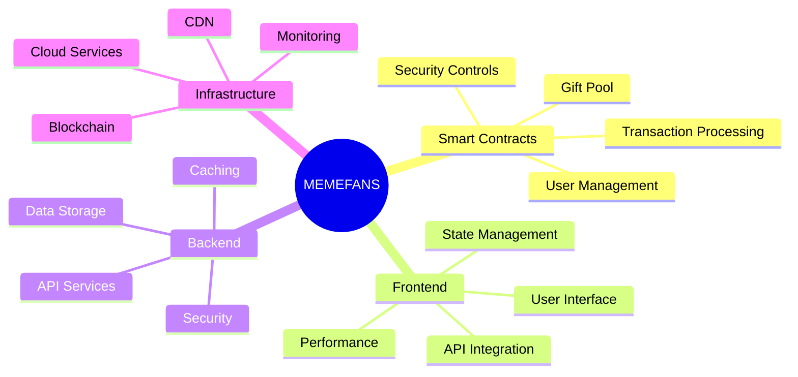

## Smart Contract Architecture

### Contract System Overview

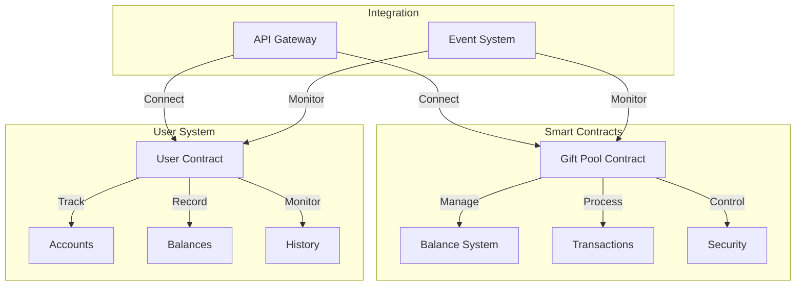

### Contract Interactions

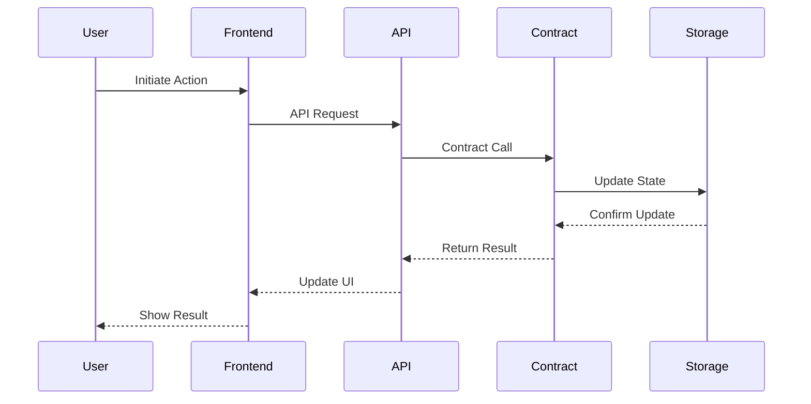

## Frontend Architecture

### Component Structure

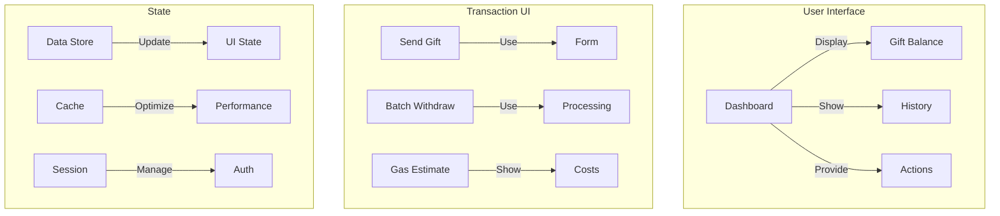

### Data Flow

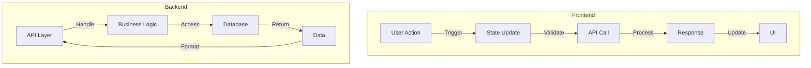

## Backend Services

### API Architecture

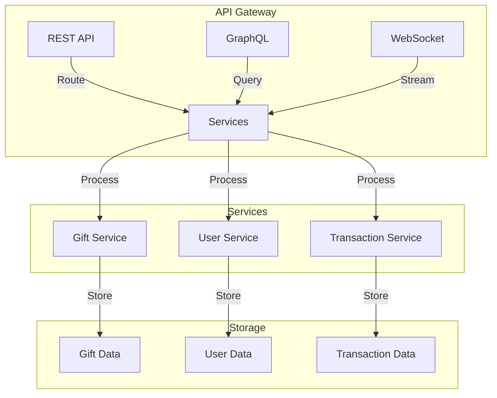

### Service Integration

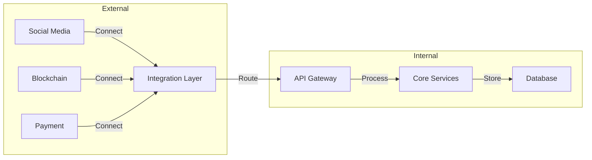

## Performance Optimization

### Smart Contract Optimization

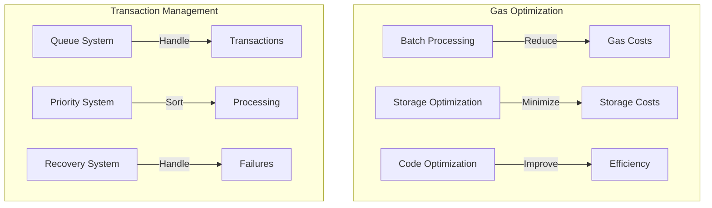

### Frontend Performance

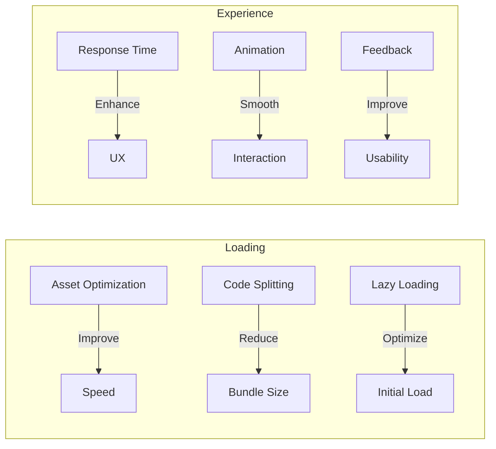

## Security Implementation

### Security Architecture

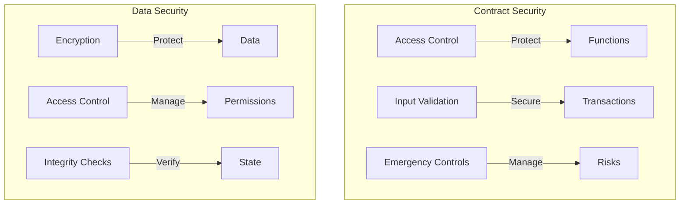

### Security Monitoring

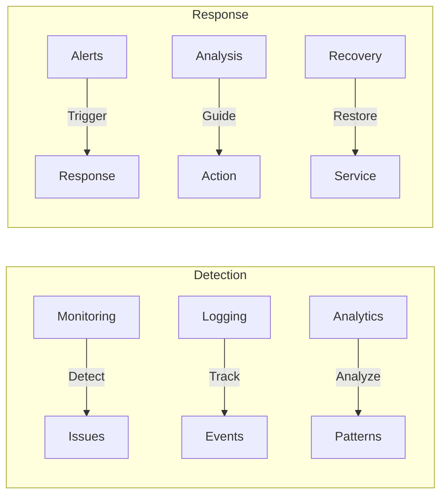

## Testing Framework

### Test Structure

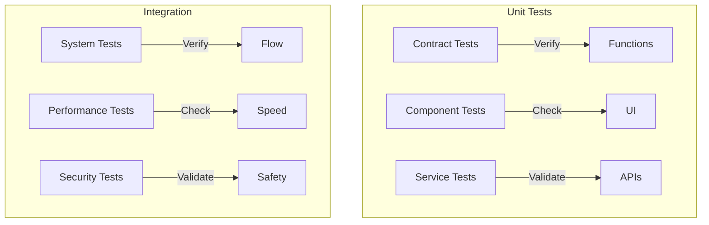

### Test Flow

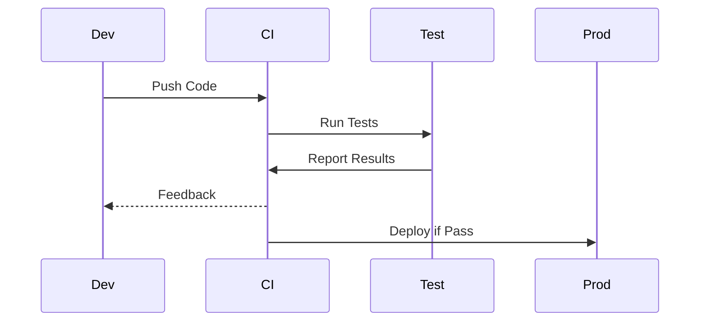

## Deployment Strategy

### Deployment Flow

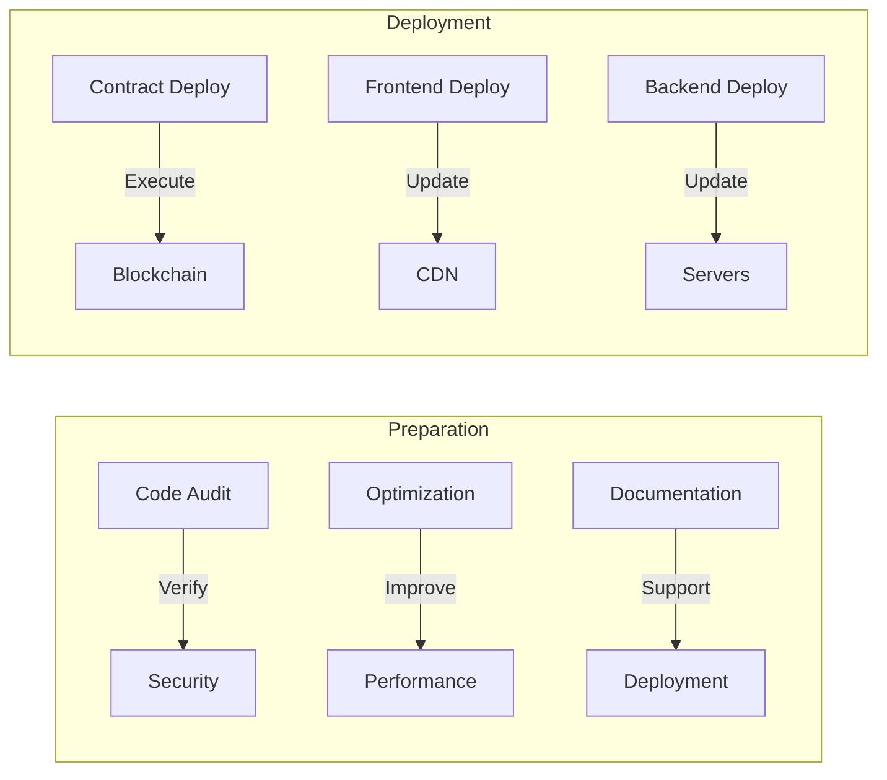

### Monitoring System

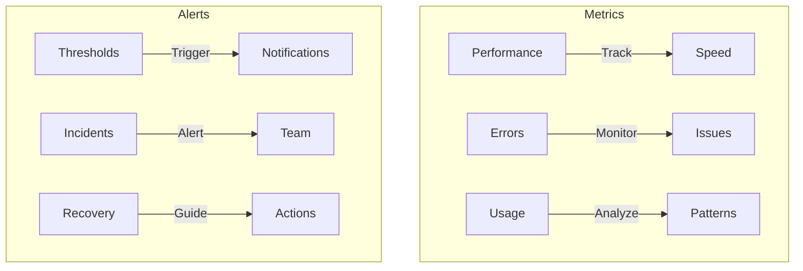

## Maintenance Procedures

### Regular Maintenance

#### 1. System Updates
- **Security patches**
  * Monitor for vulnerabilities
  * Apply patches promptly
  * Verify patch effectiveness

- **Performance updates**
  * Monitor system performance
  * Optimize code and resources
  * Verify performance improvements

- **Feature updates**
  * Plan and prioritize features
  * Develop and test features
  * Deploy features to production

- **Bug fixes**
  * Identify and prioritize bugs
  * Develop and test fixes
  * Deploy fixes to production

#### 2. Monitoring
- **Performance tracking**
  * Monitor system performance metrics
  * Analyze performance data
  * Identify performance bottlenecks

- **Error logging**
  * Log system errors
  * Analyze error logs
  * Identify error patterns

- **Usage analytics**
  * Monitor system usage metrics
  * Analyze usage data
  * Identify usage patterns

- **Security monitoring**
  * Monitor system security metrics
  * Analyze security data
  * Identify security threats

### Emergency Procedures

#### 1. Incident Response
- **Issue detection**
  * Monitor system logs and metrics
  * Identify potential incidents
  * Verify incident severity

- **Quick response**
  * Activate incident response team
  * Assess incident impact
  * Develop incident response plan

- **Recovery process**
  * Execute incident response plan
  * Restore system functionality
  * Verify system stability

- **Post-mortem analysis**
  * Analyze incident cause and impact
  * Identify areas for improvement
  * Develop incident prevention plan

#### 2. System Recovery
- **Backup systems**
  * Develop backup strategy
  * Implement backup systems
  * Verify backup effectiveness

- **Data recovery**
  * Develop data recovery plan
  * Implement data recovery systems
  * Verify data recovery effectiveness

- **Service restoration**
  * Develop service restoration plan
  * Implement service restoration systems
  * Verify service restoration effectiveness

- **Communication plan**
  * Develop communication plan
  * Implement communication systems
  * Verify communication effectiveness
