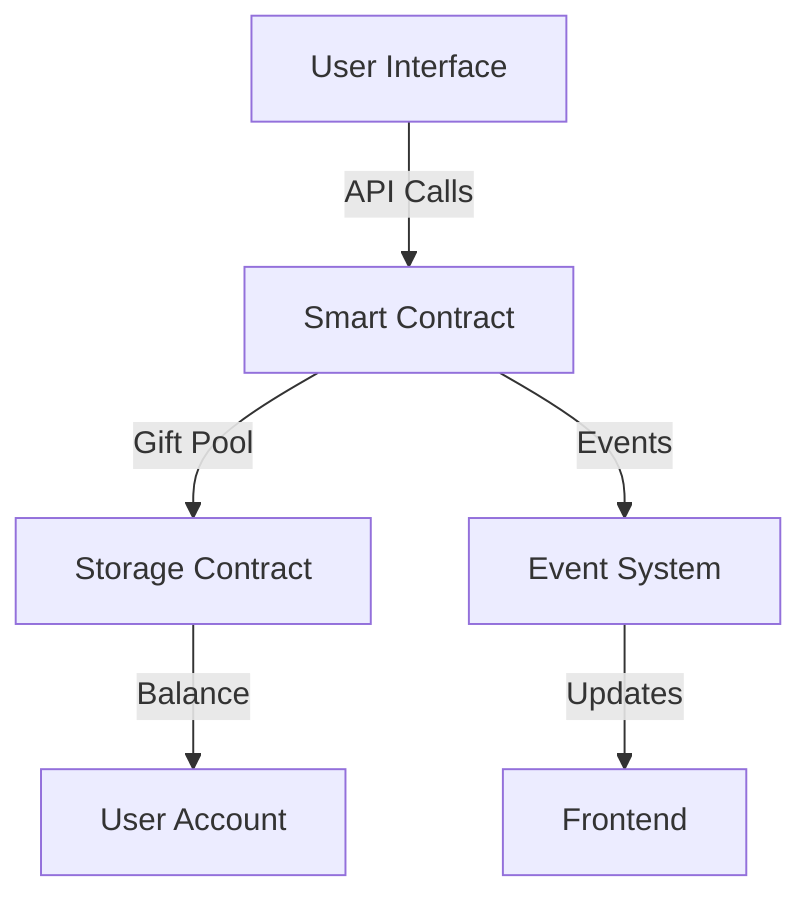

# Technical Implementation Details

## Smart Contract Architecture

### Contract System Overview

#### 1. Core Components
- **Gift Pool Contract**
  * Central storage for all gifts
  * Balance management system
  * Transaction processing logic
  * Security controls

- **User Management**
  * Account tracking
  * Balance records
  * Transaction history
  * Access controls

#### 2. Contract Interactions

### Frontend Architecture

#### 1. User Interface Components
- **Main Dashboard**
  * Gift balance display
  * Transaction history
  * Action buttons
  * Status notifications

- **Transaction Interface**
  * Send gift form
  * Batch withdrawal
  * Gas estimation
  * Confirmation dialogs

#### 2. State Management
- **Data Flow**
  * Real-time updates
  * Cache management
  * State synchronization
  * Error handling

- **User Session**
  * Authentication
  * Authorization
  * Session management
  * Security measures

### Backend Services

#### 1. API Services
- **Endpoints**
  * Gift management
  * User operations
  * Transaction processing
  * Data queries

- **Service Architecture**
  * RESTful design
  * GraphQL integration
  * WebSocket support
  * Rate limiting

#### 2. Data Management
- **Storage Systems**
  * Transaction records
  * User data
  * System logs
  * Analytics data

- **Caching Strategy**
  * Performance optimization
  * Data availability
  * Cache invalidation
  * Consistency management

### Performance Optimization

#### 1. Smart Contract Optimization
- **Gas Efficiency**
  * Batch processing
  * Storage optimization
  * Computation efficiency
  * Code optimization

- **Transaction Management**
  * Queue system
  * Priority handling
  * Failure recovery
  * Load balancing

#### 2. Frontend Optimization
- **Loading Speed**
  * Asset optimization
  * Code splitting
  * Lazy loading
  * Cache strategy

- **User Experience**
  * Response time
  * Animation smoothness
  * Error handling
  * Feedback system

### Security Implementation

#### 1. Contract Security
- **Access Control**
  * Permission system
  * Role management
  * Function restrictions
  * Emergency controls

- **Transaction Security**
  * Input validation
  * Output verification
  * State consistency
  * Reentrancy protection

#### 2. Data Security
- **Privacy Protection**
  * Data encryption
  * Access control
  * Secure storage
  * Data integrity

- **Network Security**
  * API security
  * DDoS protection
  * SSL/TLS
  * Rate limiting

### Testing Framework

#### 1. Unit Testing
- **Contract Tests**
  * Function testing
  * State validation
  * Error handling
  * Edge cases

- **Component Tests**
  * UI components
  * API endpoints
  * Integration points
  * Error scenarios

#### 2. Integration Testing
- **System Tests**
  * End-to-end flows
  * Performance testing
  * Load testing
  * Security testing

- **User Acceptance**
  * Feature validation
  * UX testing
  * Performance validation
  * Security verification

### Deployment Strategy

#### 1. Contract Deployment
- **Preparation**
  * Code audit
  * Gas optimization
  * Security verification
  * Documentation

- **Deployment Process**
  * Network selection
  * Parameter setting
  * Version control
  * Monitoring setup

#### 2. Application Deployment
- **Frontend Deployment**
  * Build optimization
  * CDN configuration
  * Cache strategy
  * Error tracking

- **Backend Deployment**
  * Server setup
  * Database configuration
  * API deployment
  * Monitoring system

### Maintenance Procedures

#### 1. Regular Maintenance
- **System Updates**
  * Security patches
  * Performance updates
  * Feature updates
  * Bug fixes

- **Monitoring**
  * Performance tracking
  * Error logging
  * Usage analytics
  * Security monitoring

#### 2. Emergency Procedures
- **Incident Response**
  * Issue detection
  * Quick response
  * Recovery process
  * Post-mortem analysis

- **System Recovery**
  * Backup systems
  * Data recovery
  * Service restoration
  * Communication plan
