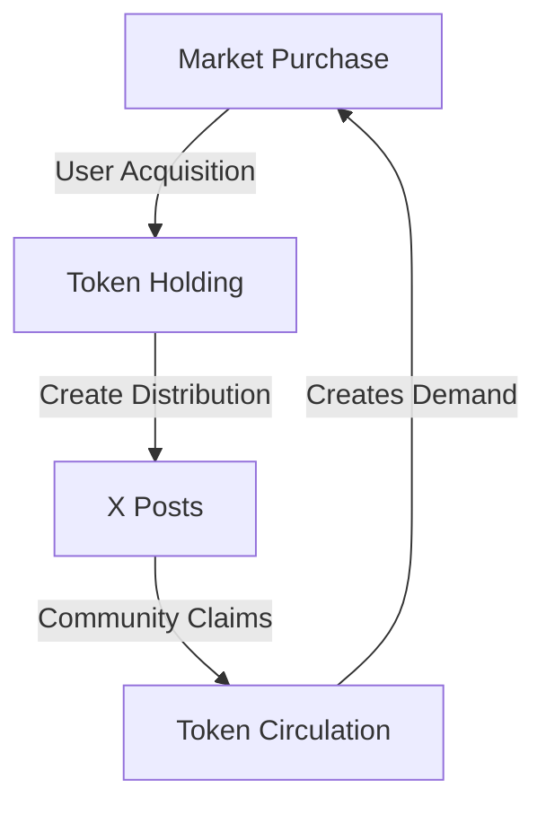

# Token Economics

## Token Overview

<div class="mermaid">
mindmap
    root((FANS Token))
        Distribution
            Community Driven
            PUMP Launch
            Zero Gas Model
        Features
            Social Integration
            Chrome Extension
            Automated Distribution
        Economics
            Fixed Supply
            Burn Mechanism
            Market Driven
        Security
            Rate Limiting
            Anti-bot
            Transaction Verification
</div>

The FANS token is the core of the FANS ecosystem, adopting a community-driven distribution model via X posts.

### FANS Token
- **Name**: FANS Token
- **Symbol**: FANS
- **Blockchain**: Solana
- **Standard**: SPL Token
- **Total Supply**: 1,000,000,000 FANS
- **Initial Distribution**: Launch from PUMP

### Token Distribution

<div class="mermaid">
pie title Initial Token Distribution
    "Community Pool" : 60
    "Liquidity Pool" : 20
    "Development" : 10
    "Marketing" : 10
</div>

- **Initial Allocation**: 100% via PUMP Launch
- **Supply Policy**: Fixed supply, no additional minting
- **Token Contract**: To be deployed on Solana
- **Burning Mechanism**: May be implemented based on community governance

### Key Features
- Open Market Purchase
- Community-Driven Distribution
- Chrome Extension Integration
- X (Twitter) Platform Integration

## Distribution Mechanism

<div class="mermaid">
graph TD
    A[User] -->|Post on X| B[Chrome Extension]
    B -->|Detect Post| C[Distribution Logic]
    C -->|Verify| D[Smart Contract]
    D -->|Execute| E[Token Transfer]
    E -->|Notify| F[Success]
    
    subgraph Security
        G[Rate Limit]
        H[Anti-bot]
        I[Verification]
    end
    
    C --> Security
</div>

### Chrome Extension Features
1. **Token Distribution**
   - Any user can distribute FANS tokens via X posts
   - Flexible distribution rules
   - Custom requirements setting
   - No-requirement airdrops supported

2. **Distribution Methods**
   ```mermaid
   graph TD
       A[X Post Creation] -->|Set Distribution| B[Distribution Rules]
       B -->|Option 1| C[No Requirements]
       B -->|Option 2| D[Custom Requirements]
       C -->|Direct Claim| E[Token Distribution]
       D -->|Verify & Claim| E
   ```

3. **Distribution Rules Options**
   - **No Requirements**
     * Direct claiming
     * First-come-first-served
     * Open to all
     * Instant distribution

   - **Custom Requirements**
     * Like requirement
     * Retweet requirement
     * Follow requirement
     * Comment requirement
     * Multiple requirements combination

### Value Drivers
- Platform Usage & Growth
- Network Effects
- Utility Expansion
- Market Demand
- PUMP Trading Volume

## Incentive Structure

### User Incentives
- Engagement Rewards
- Staking Benefits
- Governance Rights
- Special Features
- PUMP Trading Incentives

### Creator Incentives
- Content Rewards
- Fan Engagement
- Revenue Sharing
- Growth Bonuses
- Community Building Rewards

## Chrome Extension Functions

### For Distributors
1. **Post Creation**
   ```typescript
   interface DistributionPost {
     amount: number;        // Amount of FANS to distribute
     recipients: number;    // Number of recipients
     requirements: {
       likes?: boolean;     // Require likes
       retweets?: boolean;  // Require retweets
       follows?: boolean;   // Require follows
       comments?: boolean;  // Require comments
     };
     duration?: number;     // Distribution duration
   }
   ```

2. **Distribution Management**
   - Real-time tracking
   - Distribution status
   - Recipient list
   - Requirements verification

### For Recipients
1. **Token Claiming**
   - One-click claim
   - Requirements check
   - Instant receipt
   - Transaction verification

2. **Wallet Integration**
   - Solana wallet connection
   - Balance checking
   - Transaction history
   - Auto-receipt

## Token Utility

### Platform Functions
1. **Distribution Creation**
   - Create distribution posts
   - Set custom rules
   - Monitor progress
   - Engage community

2. **Community Engagement**
   - Participate in distributions
   - Complete tasks
   - Earn tokens
   - Build community

3. **Social Features**
   - Token-enabled posts
   - Community rewards
   - Social engagement
   - Viral distribution

## Economic Model

### Value Creation
1. **Community Activity**
   - Distribution creation
   - Task completion
   - Social engagement
   - Organic growth

2. **Market Dynamics**
   - Open market trading
   - Natural price discovery
   - Community-driven value
   - Organic demand

### Token Flow


## Technical Integration

### Chrome Extension
1. **Core Features**
   - Wallet connection
   - Post creation
   - Distribution management
   - Requirement verification

2. **User Interface**
   ```
   ┌─────────────────────────────┐
   │ FANS Distribution Creator   │
   ├─────────────────────────────┤
   │ Amount: ___ FANS           │
   │ Recipients: ___            │
   │ Requirements:              │
   │ □ Likes                    │
   │ □ Retweets                 │
   │ □ Follows                  │
   │ □ Comments                 │
   ├─────────────────────────────┤
   │ Duration: ___ hours        │
   │ [Create Distribution]      │
   └─────────────────────────────┘
   ```

### Security Features
1. **Transaction Security**
   - Secure wallet integration
   - Transaction verification
   - Rate limiting
   - Anti-bot measures

2. **Distribution Safety**
   - Requirement verification
   - Double-claim prevention
   - Transaction monitoring
   - Error handling

## Future Development

### Planned Features
1. **Enhanced Distribution**
   - Advanced rule sets
   - Custom conditions
   - Time-based distribution
   - Multi-token support

2. **Community Tools**
   - Distribution analytics
   - Engagement metrics
   - Community rankings
   - Success tracking

[Continue to Business Model →](business-model.md)
