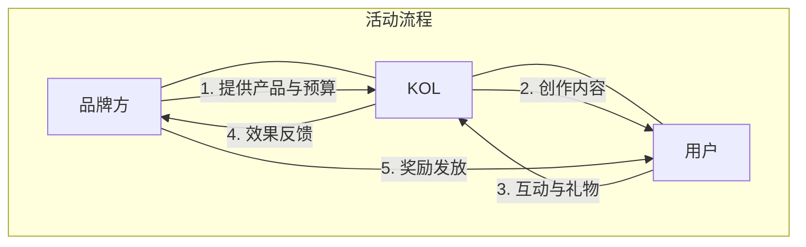

# 用例详细说明

## 粉丝增长目标
- 粉丝增长: 10万到30万
- 月收益目标: 8000 USDT
- 内容频率: 每天1-2条

## 二、品牌营销场景

### 1. 新品发布活动

活动设计

### 投资回报分析

- 营销预算: 50,000 USDT
- KOL合作: 10位
- 用户触达: 100万+
- 互动转化: 5%
- 销售转化: 1%
- 预期收入: 200,000 USDT
- ROI: 300%

### 2. 长期品牌建设

策略规划

1. KOL矩阵建设
2. 内容策略制定
3. 社区运营计划
4. 效果评估体系
