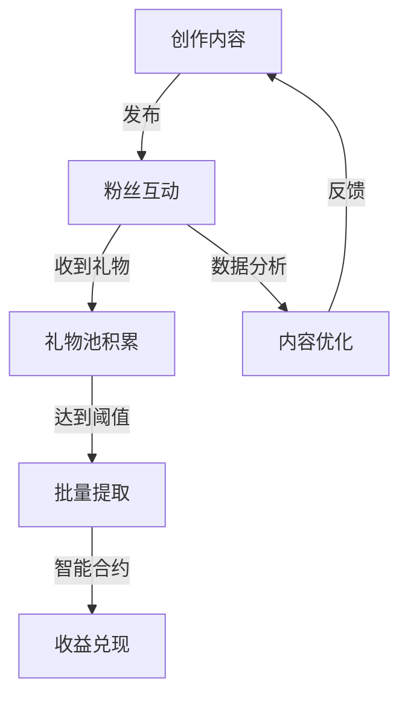
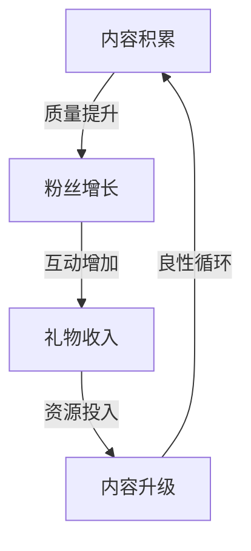
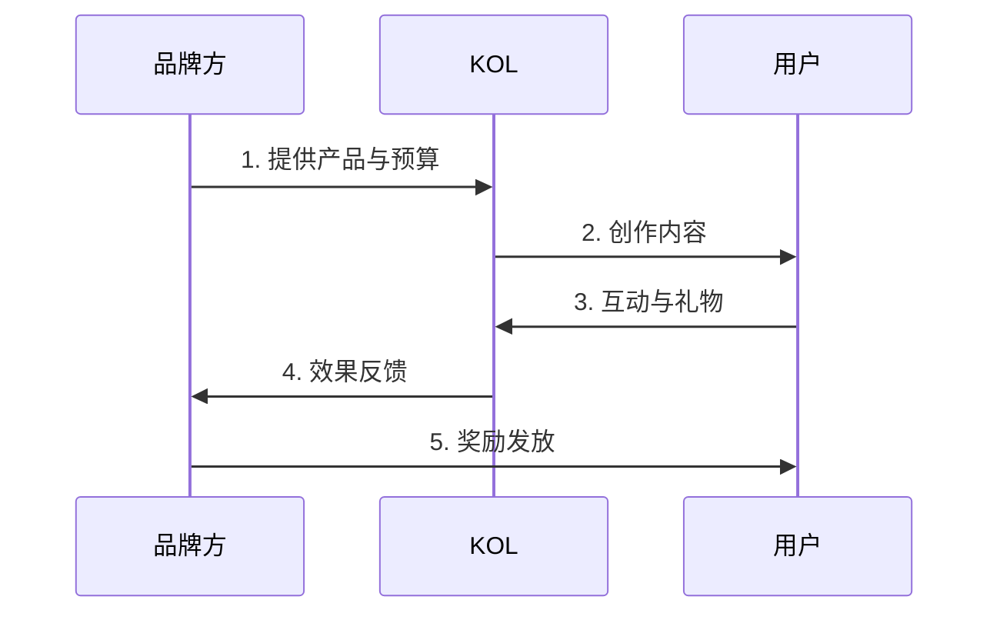
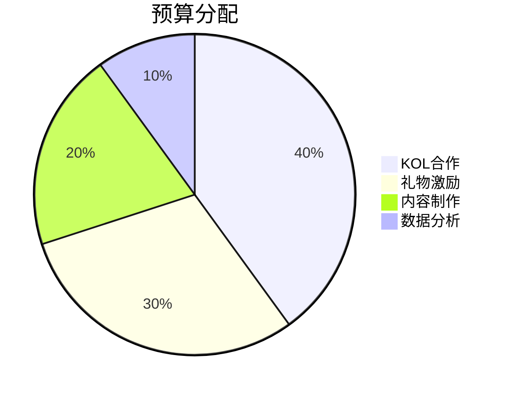
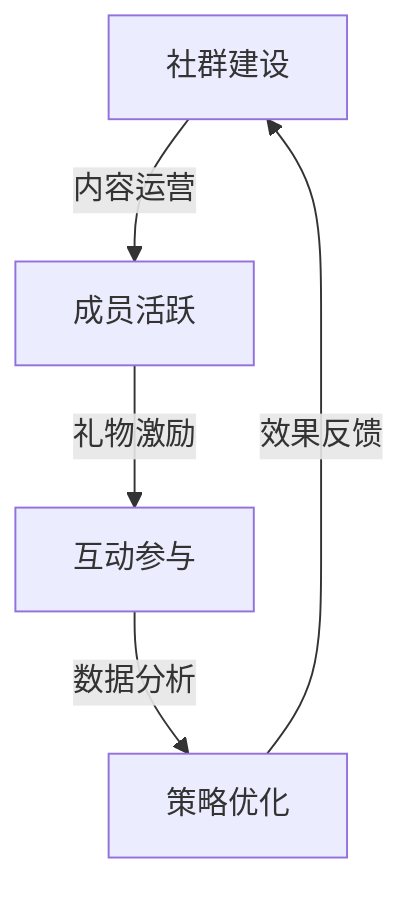
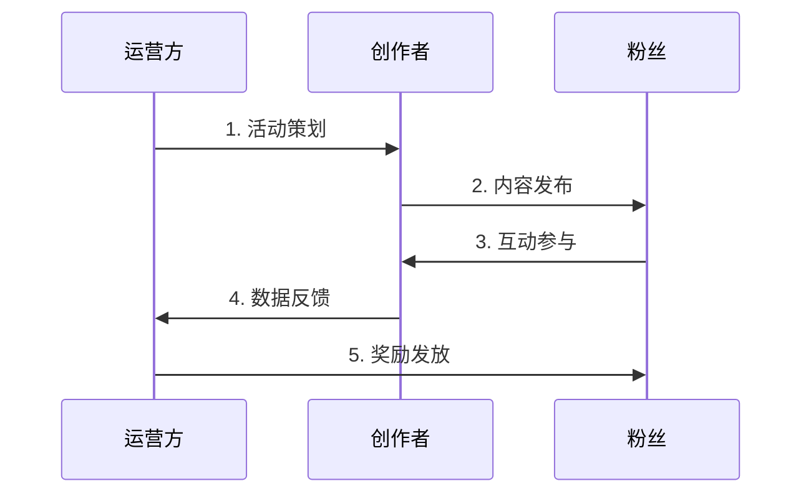
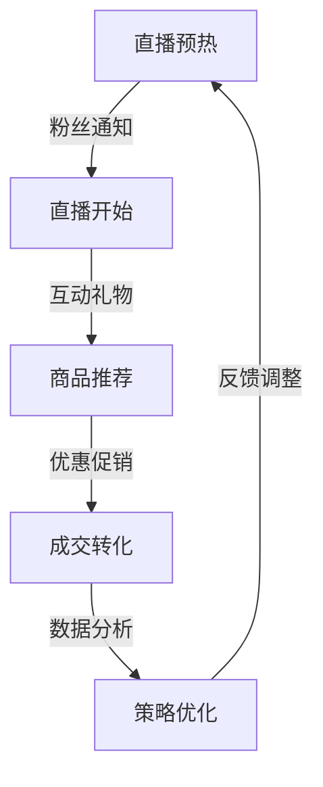
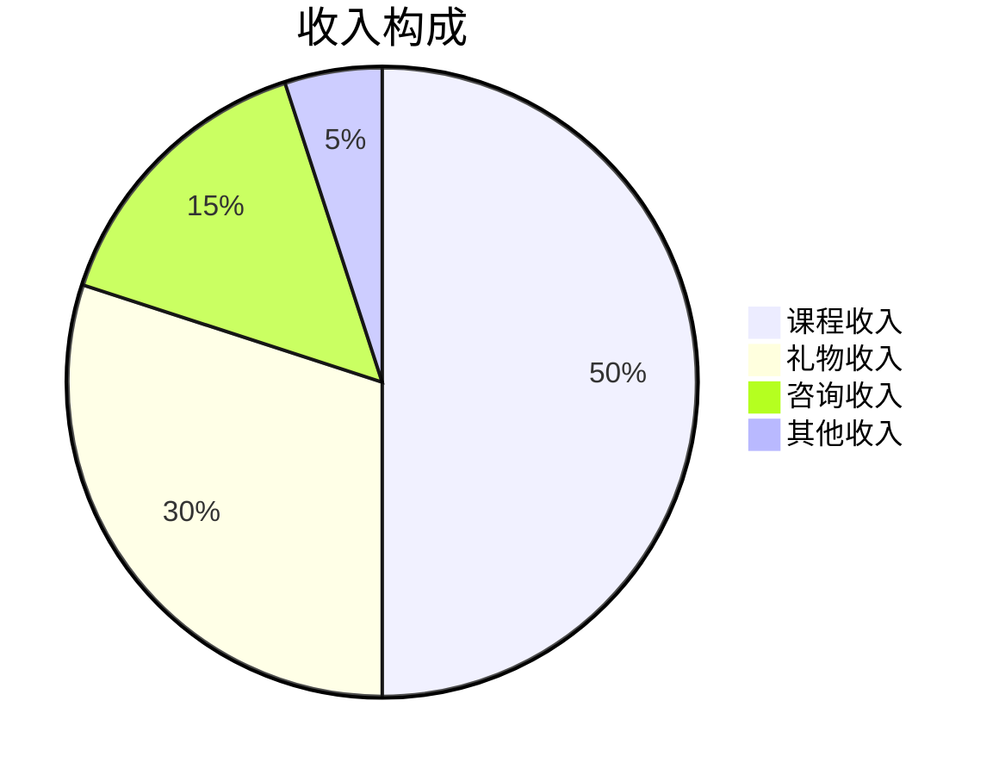
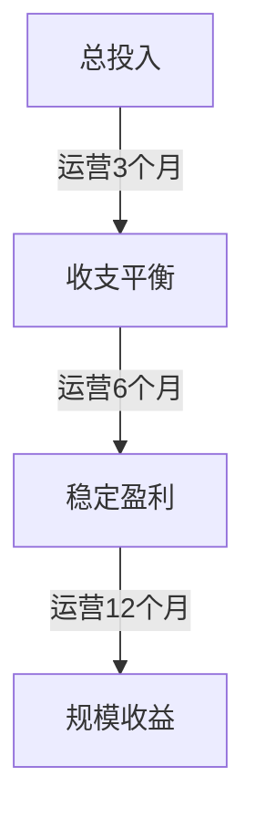

# 详细应用场景分析

## 一、内容创作者变现场景

### 1. 专业博主日常运营
#### 场景描述
小红是一位拥有50万粉丝的财经博主，每天发布3-5条高质量内容。

#### 详细流程

#### 收益分析
- 日均互动：1000-2000次
- 礼物转化率：3-5%
- 月均收益：5000-8000 USDT
- 年化收益：60,000-96,000 USDT

#### 优化建议
1. 内容发布时间优化
2. 互动话题策划
3. 礼物活动设计
4. 粉丝运营策略

### 2. 新兴创作者成长
#### 场景描述
小明是一位粉丝量1万的科技评测博主，正在寻求增长。

#### 增长路径

#### 阶段目标
1. 第一阶段（1-3个月）
   - 粉丝增长：1万到3万
   - 月收益目标：1000 USDT
   - 内容频率：每周3-5条

2. 第二阶段（4-6个月）
   - 粉丝增长：3万到10万
   - 月收益目标：3000 USDT
   - 内容频率：每周5-7条

3. 第三阶段（7-12个月）
   - 粉丝增长：10万到30万
   - 月收益目标：8000 USDT
   - 内容频率：每天1-2条

## 二、品牌营销场景

### 1. 新品发布活动
#### 活动设计

#### 投资回报分析
- 营销预算：50,000 USDT
- KOL合作：10位
- 用户触达：100万+
- 互动转化：5%
- 销售转化：1%
- 预期收入：200,000 USDT
- ROI：300%

### 2. 长期品牌建设
#### 策略规划
1. KOL矩阵建设
2. 内容策略制定
3. 社区运营计划
4. 效果评估体系

#### 资源投入

## 三、社区运营场景

### 1. 粉丝社群运营
#### 运营框架

#### 具体措施
1. 每日话题讨论
2. 周常互动活动
3. 月度礼物活动
4. 季度线下聚会

#### 效果评估
- 社群活跃度：80%+
- 成员留存率：60%+
- 互动转化率：30%+
- 社群收入：人均50 USDT/月

### 2. 活动策划执行
#### 活动流程

## 四、创新应用场景

### 1. 直播带货模式
#### 运营模式

#### 收益预测
- 直播场次：每周3场
- 场均时长：2小时
- 观看人数：1000-3000
- 礼物收入：500-1000 USDT/场
- 商品佣金：1000-2000 USDT/场
- 月均收入：6000-12000 USDT

### 2. 教育培训变现
#### 课程体系
1. 入门课程（免费）
2. 进阶课程（礼物解锁）
3. 高级课程（付费+礼物）
4. 私教课程（高额礼物）

#### 收益模型

## 五、ROI详细分析

### 1. 创作者投资回报
#### 投入成本
1. 设备投入：5000 USDT
2. 时间成本：每日4-6小时
3. 运营成本：2000 USDT/月
4. 推广成本：1000 USDT/月

#### 收益预测

- 3个月目标：月收入覆盖成本
- 6个月目标：月收入3000-5000 USDT
- 12个月目标：月收入8000-12000 USDT
- 预期ROI：200-300%

### 2. 品牌方投资回报
#### 投入分析
1. 平台使用费：1000 USDT/月
2. KOL合作费：3000-5000 USDT/KOL
3. 礼物激励：2000 USDT/活动
4. 运营成本：3000 USDT/月

#### 收益预测
- 品牌曝光：100万+/月
- 互动量：10万+/月
- 转化率：3-5%
- 客单价：100 USDT
- 月均收入：30万-50万 USDT
- 预期ROI：500-800%

## 六、用户故事

### 1. 创作者成功故事
"我是一名科技评测博主，通过MEMEFANS平台，我的月收入从最初的几百美元增长到现在的上万美元。平台的零gas费用和批量提现功能极大地提升了我的运营效率。" - 科技评测博主 @TechReview

### 2. 品牌营销案例
"我们是一家新锐科技品牌，通过MEMEFANS平台的KOL矩阵，一次营销活动触达了超过100万用户，销售额提升了300%。" - XX科技CMO

### 3. 社区运营案例
"作为社区运营者，MEMEFANS的礼物系统让我能够更好地激励社区成员参与互动，社区活跃度提升了200%。" - 社区运营总监
