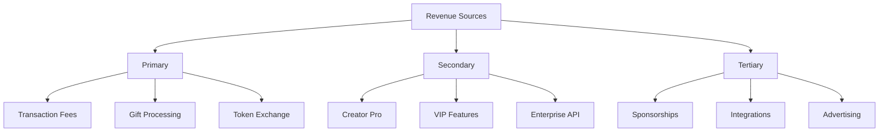
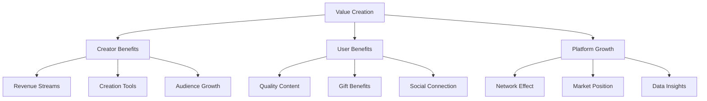
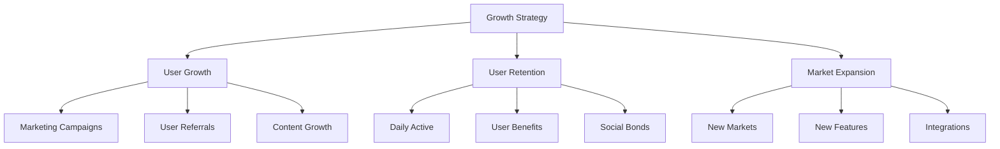
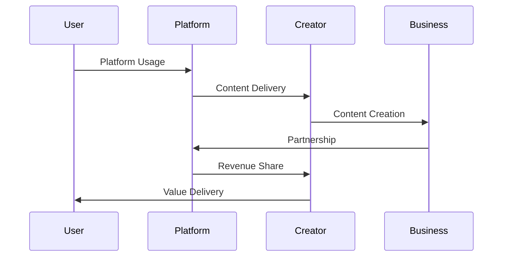
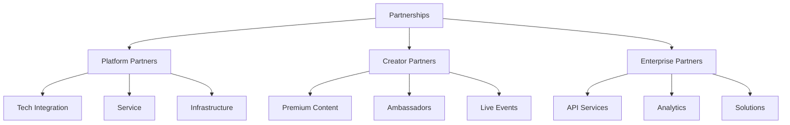
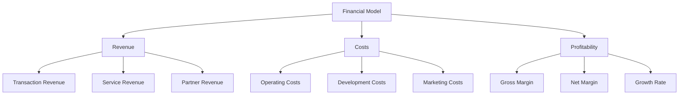

# Business Model

## Revenue Streams Overview



## Value Proposition



## Growth Strategy



## Monetization Model



## Partnership Framework



## Financial Projections



## Market Expansion Strategy

<div class="mermaid">
graph TD
    A[Market Expansion] -->|Geographic| B[Regional Growth]
    A -->|Product| C[Feature Expansion]
    A -->|Business| D[Business Lines]
    
    subgraph Regional
    B -->|Current| E[Core Markets]
    B -->|Next| F[Growth Markets]
    B -->|Future| G[New Markets]
    end
    
    subgraph Product Lines
    C -->|Core| H[Basic Features]
    C -->|Premium| I[Pro Features]
    C -->|Enterprise| J[Business Solutions]
    end
    
    subgraph Business Development
    D -->|Vertical| K[Industry Focus]
    D -->|Horizontal| L[Market Width]
    D -->|Integration| M[Partnerships]
    end
    
    style A fill:#0000FF,color:#FFFFFF
    style B fill:#FFFF00,color:#000000
    style C fill:#90EE90,color:#000000
    style D fill:#DDA0DD,color:#000000
    style E fill:#FFB6C1,color:#000000
    style F fill:#FFA07A,color:#000000
    style G fill:#20B2AA,color:#000000
    style H fill:#BA55D3,color:#000000
    style I fill:#4682B4,color:#FFFFFF
    style J fill:#FF6347,color:#000000
    style K fill:#32CD32,color:#000000
    style L fill:#FF69B4,color:#000000
    style M fill:#DEB887,color:#000000
</div>

## Revenue Streams

### 1. Transaction Fees
- **Basic Operations**
  - Token creation: 1% fee
  - Distribution: 0.1% fee
  - Trading: 0.05% fee
  - Minimum fee: 0.001 SOL

- **Premium Features**
  - Bulk operations: 0.5% fee
  - Custom rules: 0.2% fee
  - API access: Based on usage

### 2. Subscription Services
- **Tier Structure**
  ```
  ┌─────────────────┬───────────┬────────────┬────────────┐
  │     Feature     │   Basic   │    Pro     │ Enterprise │
  ├─────────────────┼───────────┼────────────┼────────────┤
  │ Monthly Fee     │   Free    │   $49.99   │  Custom    │
  │ Distribution    │ Limited   │ Unlimited  │ Unlimited  │
  │ Analytics       │ Basic     │ Advanced   │ Custom     │
  │ Support         │ Community │ Priority   │ Dedicated  │
  │ API Access      │    No     │    Yes     │ Enhanced   │
  │ Custom Rules    │    No     │    Yes     │    Yes     │
  └─────────────────┴───────────┴────────────┴────────────┘
  ```

### 3. Partnership Revenue
- Platform integration fees
- White-label solutions
- Referral programs
- Strategic partnerships

### 4. Additional Services
- Custom development
- Consulting services
- Training programs
- Marketing services

## Cost Structure

### 1. Operational Costs
- **Infrastructure**
  - Cloud services: $5,000/month
  - CDN: $1,000/month
  - Security: $2,000/month
  - Monitoring: $500/month

- **Personnel**
  - Development team
  - Support staff
  - Marketing team
  - Management

### 2. Marketing Expenses
- **Digital Marketing**
  - Social media: 20%
  - Content creation: 15%
  - SEO/SEM: 25%
  - Influencer partnerships: 40%

- **Traditional Marketing**
  - Events: 40%
  - PR: 30%
  - Brand building: 30%

### 3. Development Costs
- **Ongoing Development**
  - Feature updates
  - Platform maintenance
  - Security upgrades
  - Performance optimization

- **New Development**
  - Research & Development
  - New features
  - Integration development
  - Testing & QA

## Growth Strategy

### 1. Market Expansion
- **Geographic Expansion**
  - Phase 1: North America
  - Phase 2: Europe
  - Phase 3: Asia
  - Phase 4: Global

- **User Segment Expansion**
  - Individual creators
  - Small businesses
  - Enterprises
  - Institutions

### 2. Product Development
- **Feature Roadmap**
  - Q1: Core features
  - Q2: Advanced analytics
  - Q3: Enterprise solutions
  - Q4: Mobile platform

- **Integration Plans**
  - Social platforms
  - Payment systems
  - Analytics tools
  - Enterprise systems

### 3. Partnership Strategy
- **Platform Partnerships**
  - Social media platforms
  - Content platforms
  - Payment providers
  - Analytics providers

- **Strategic Alliances**
  - Technology partners
  - Marketing partners
  - Distribution partners
  - Service providers

## Financial Projections

### 1. Revenue Projections
```
Year 1:
- Users: 100,000
- Revenue: $2M
- Growth: 100% QoQ

Year 2:
- Users: 500,000
- Revenue: $10M
- Growth: 50% QoQ

Year 3:
- Users: 2,000,000
- Revenue: $50M
- Growth: 30% QoQ
```

### 2. Cost Projections
```
Year 1:
- Operating Costs: $1.5M
- Marketing: $500K
- Development: $1M

Year 2:
- Operating Costs: $5M
- Marketing: $2M
- Development: $3M

Year 3:
- Operating Costs: $15M
- Marketing: $10M
- Development: $8M
```

### 3. Profitability Analysis
- **Break-even Analysis**
  - Expected: Month 18
  - Best case: Month 15
  - Worst case: Month 24

- **Margin Projections**
  - Gross margin: 70%
  - Operating margin: 30%
  - Net margin: 20%

## Risk Analysis

### 1. Market Risks
- Competition
- Market adoption
- Regulatory changes
- Technology shifts

### 2. Operational Risks
- Technical failures
- Security breaches
- Scalability issues
- Resource constraints

### 3. Financial Risks
- Revenue fluctuations
- Cost overruns
- Currency risks
- Market volatility

## Success Metrics

### 1. Key Performance Indicators
- User growth rate
- Revenue per user
- Customer acquisition cost
- Lifetime value
- Churn rate

### 2. Business Objectives
- Market share
- Revenue growth
- Profitability
- User satisfaction

### 3. Long-term Goals
- Industry leadership
- Global presence
- Innovation leadership
- Sustainable growth

[Continue to Risk Analysis →](risk-analysis.md)
