# Community and Ecosystem Development

## Ecosystem Overview

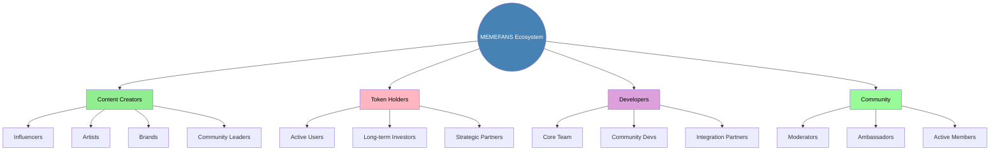

## Community Structure

### 1. Governance Framework
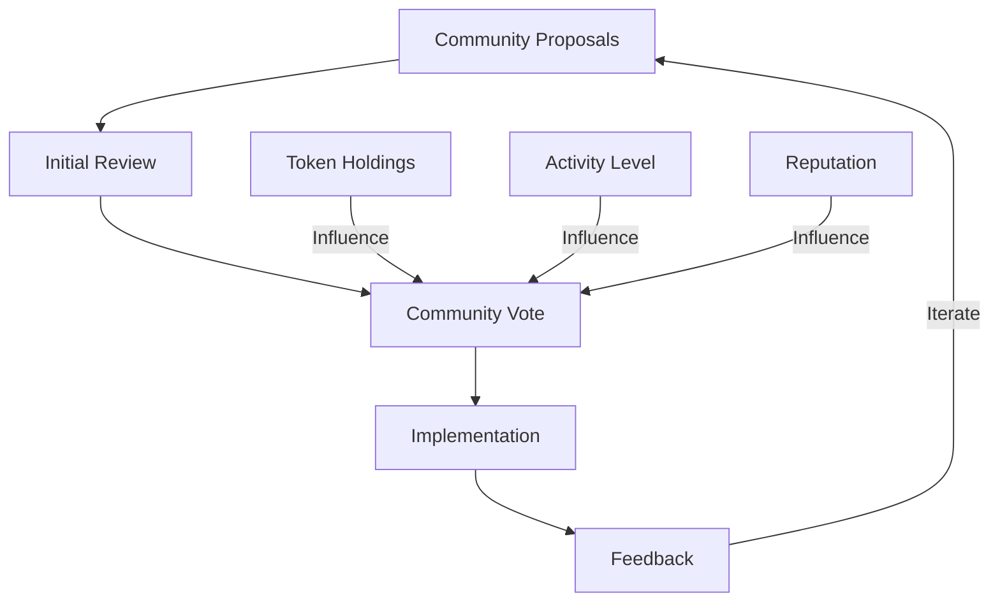

### 2. Engagement Flow
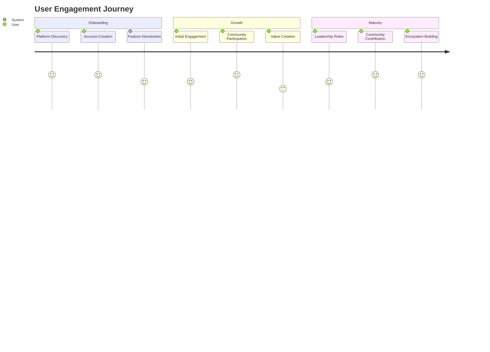

## Community Programs

### 1. Reward System
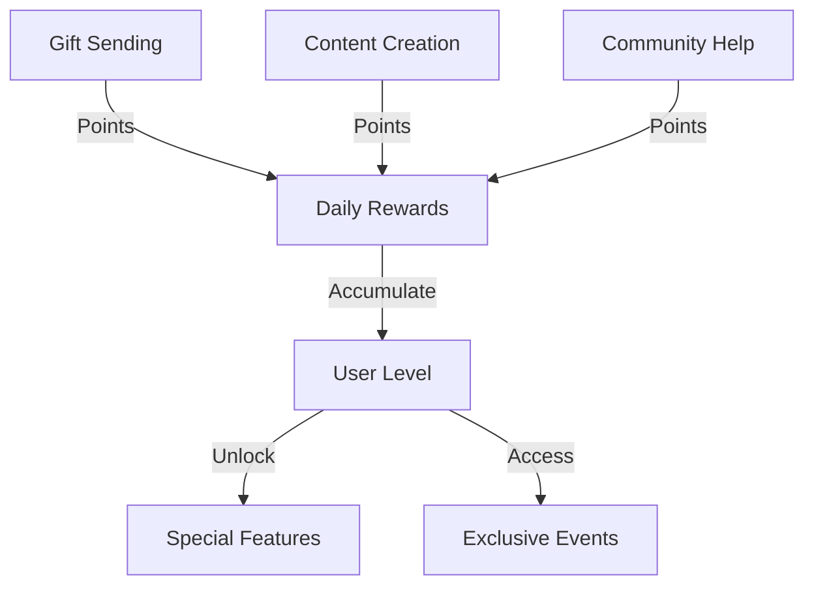

### 2. Event Calendar
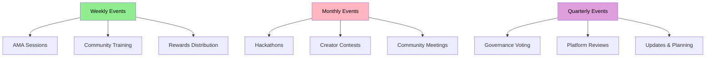

## Educational Hub

### 1. Learning Path
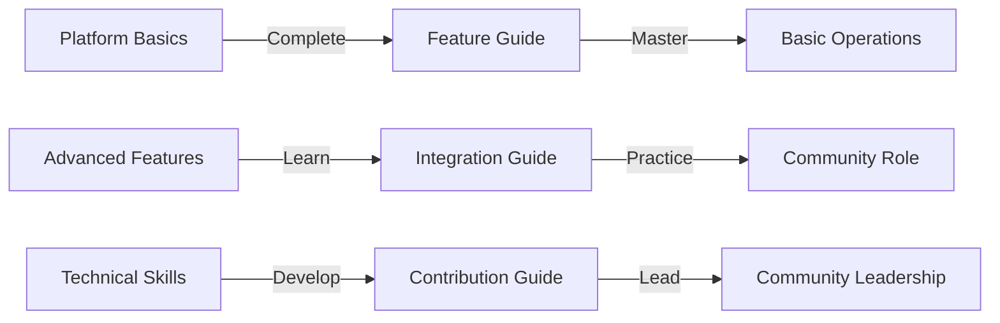

### 2. Resource Structure
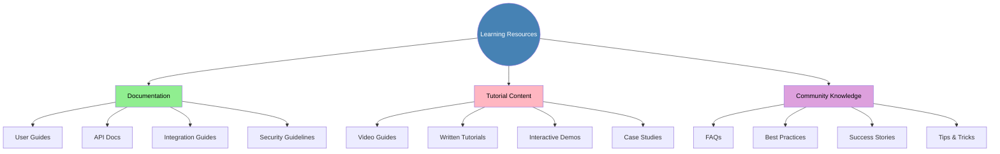

## Communication Framework

### 1. Channel Structure
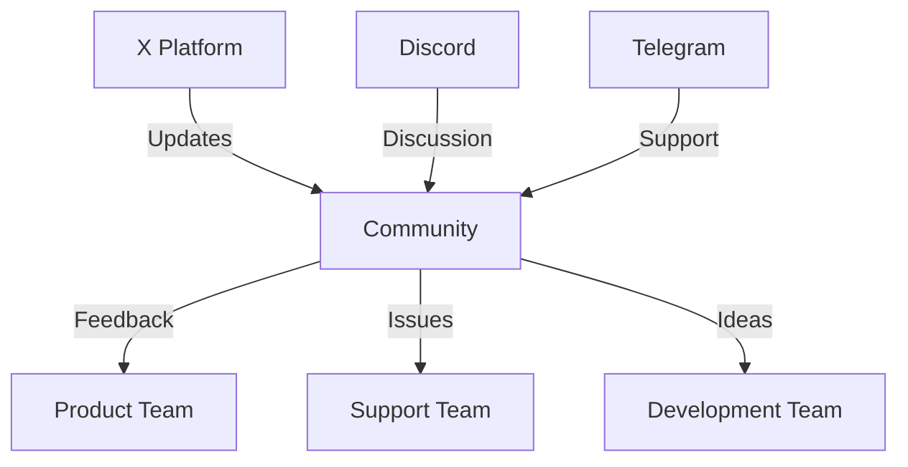

### 2. Information Flow
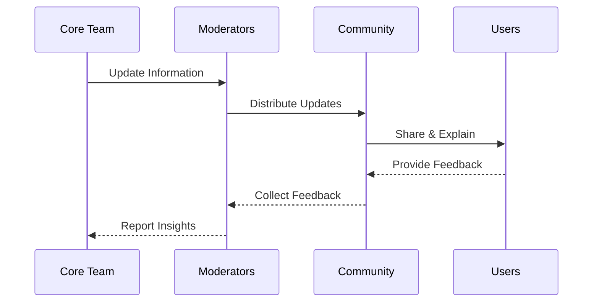

## Growth Strategy

### 1. User Journey
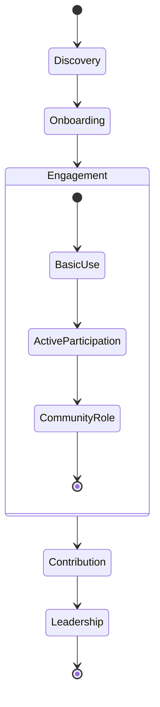

### 2. Growth Metrics
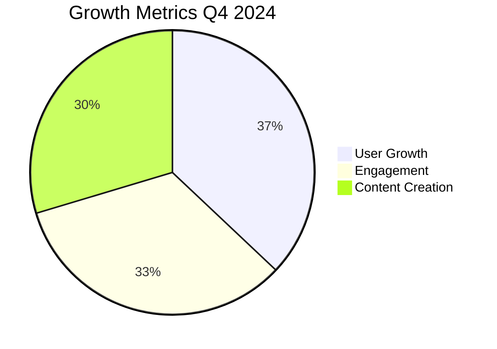

## Partnership Ecosystem

### 1. Partnership Network
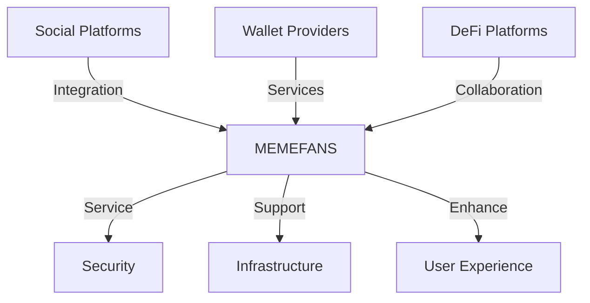

### 2. Value Flow
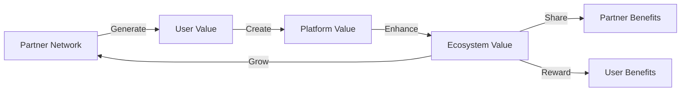

## Innovation Pipeline

### 1. Development Process
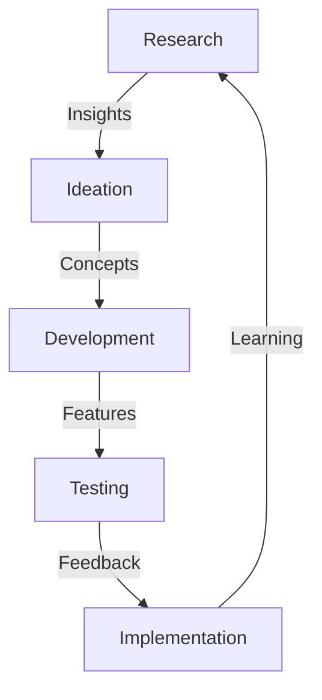

### 2. Feature Timeline
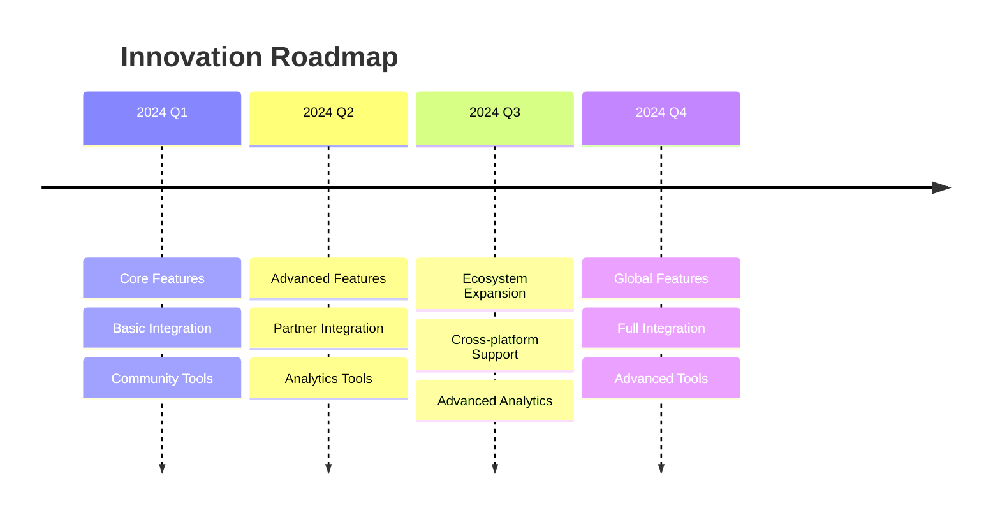

## Sustainability Model

### 1. Value Creation
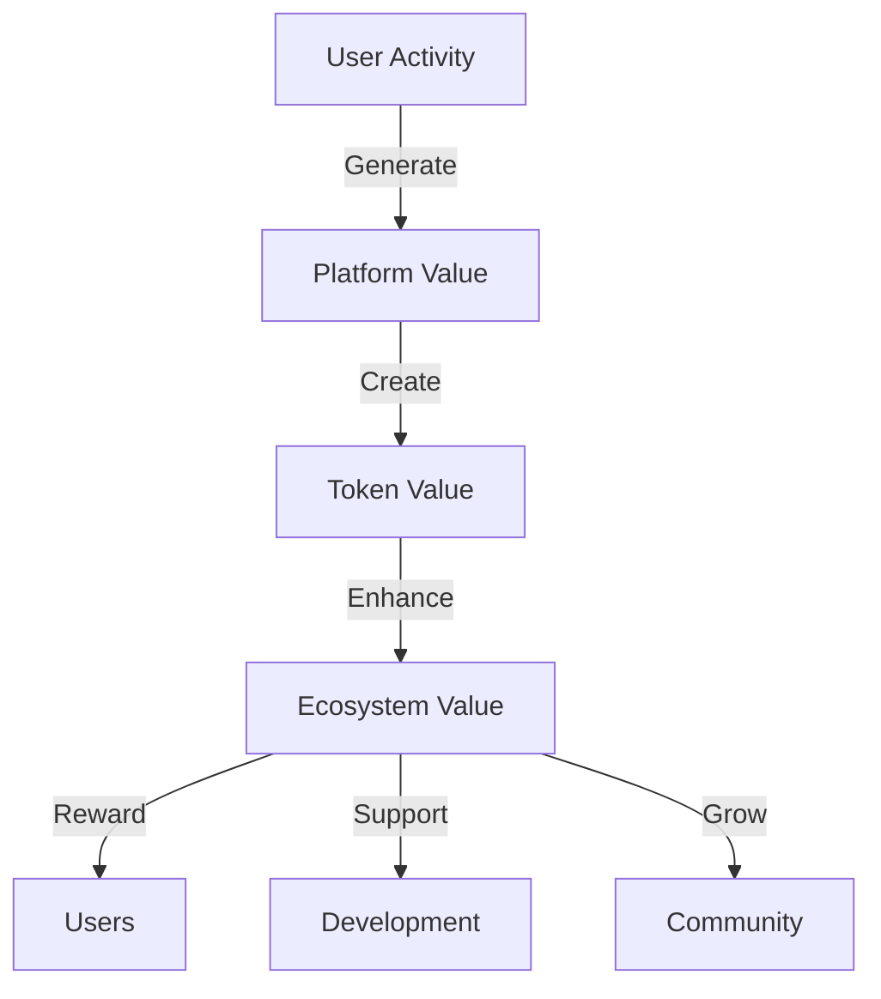

### 2. Resource Allocation
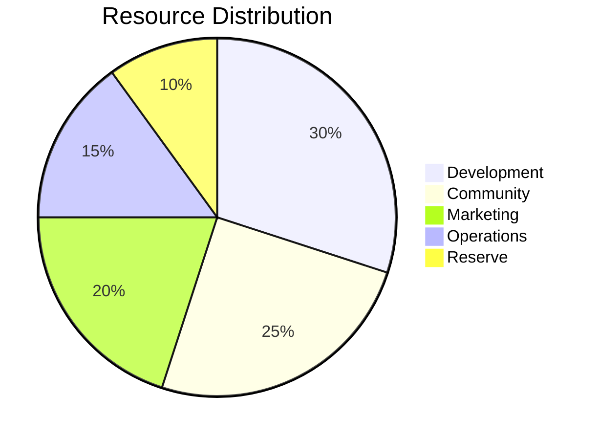

## Social Interaction Features

### Zero-Gas Gift System

#### System Overview
The MEMEFANS Zero-Gas Gift System revolutionizes social interactions on X by enabling gasless gift accumulation and batch withdrawals. This innovative approach significantly reduces transaction costs while maintaining the spontaneity and engagement of real-time gifting.

#### Core Features

1. **Gasless Gift Reception**
   - Instant Recognition: Gifts are instantly recognized and recorded in the smart contract
   - Zero-Gas Accumulation: Recipients can accumulate gifts without paying gas fees
   - Real-time Balance Updates: Users can check their gift balance anytime without cost
   - Automated Recording: All gift transactions are automatically recorded on-chain

2. **Gift Pool Architecture**
   - Unified Storage: All gifts are stored in a secure, unified pool
   - Smart Contract Management: Automated handling of gift deposits and withdrawals
   - Balance Tracking: Real-time tracking of individual user balances
   - Transaction History: Comprehensive record of all gift transactions

3. **Batch Processing System**
   - Optimized Withdrawals: Users can withdraw multiple gifts in a single transaction
   - Gas Cost Reduction: Significant reduction in overall gas costs through batching
   - Flexible Timing: Users choose when to withdraw based on gas prices
   - Transaction Bundling: Smart bundling of multiple gift claims

#### User Experience Design

1. **Gift Sending Process**
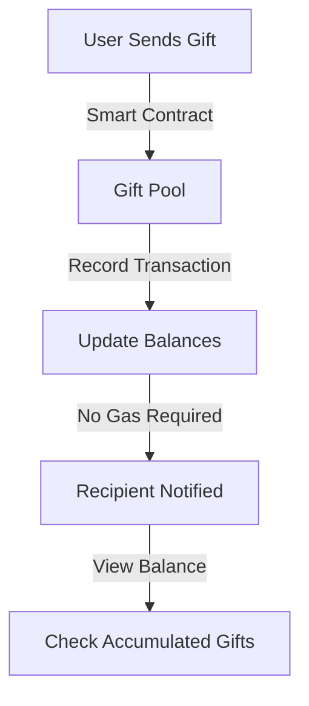

2. **Gift Collection Workflow**
   - **Accumulation Phase**
     * Gifts automatically added to user's balance
     * Real-time balance updates
     * Transaction history tracking
     * Notification system

   - **Withdrawal Phase**
     * User-initiated withdrawal
     * Batch processing optimization
     * Gas cost estimation
     * Transaction confirmation
