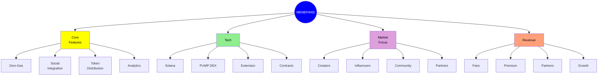
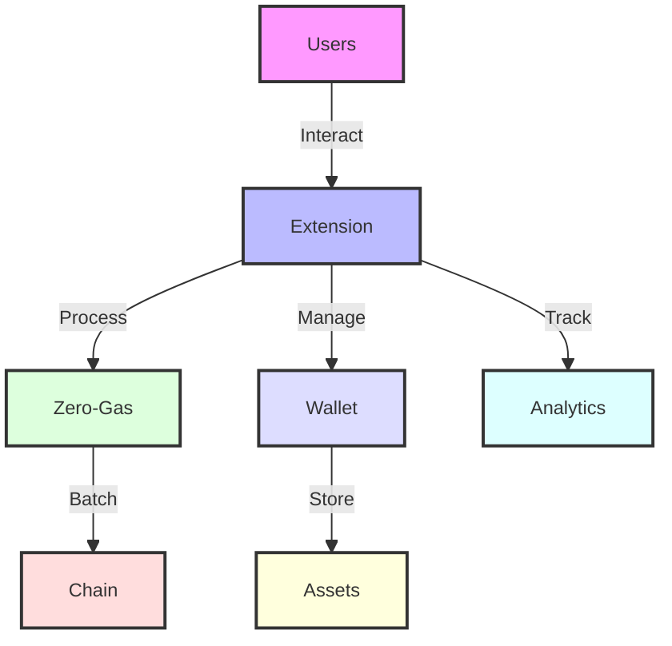
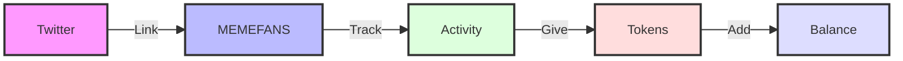

# MEMEFANS: The Future of Social Token Distribution

## Project Overview

MEMEFANS is a revolutionary social token distribution platform that seamlessly integrates with Twitter to enable content creators and their communities to engage in meaningful token-based interactions. Our platform leverages blockchain technology to create a transparent, efficient, and user-friendly ecosystem for social token distribution.

## Platform Overview

## System Architecture

## Key Features

### Zero-Gas Model

```mermaid
%%{
  init: {
    'theme': 'default',
    'themeVariables': { 
      'fontSize': '12px',
      'fontFamily': 'arial',
      'nodeSpacing': 20,
      'rankSpacing': 20
    },
    'flowchart': {
      'diagramPadding': 4,
      'htmlLabels': true,
      'curve': 'basis'
    }
  }
}%%
graph LR
    A[Action] -->|Trigger| B[Queue]
    B -->|Process| C[Batch]
    C -->|Submit| D[Chain]
    D -->|Update| E[Balance]
    style A fill:#f9f,stroke:#333,stroke-width:2px
    style B fill:#bbf,stroke:#333,stroke-width:2px
    style C fill:#dfd,stroke:#333,stroke-width:2px
    style D fill:#fdd,stroke:#333,stroke-width:2px
    style E fill:#ddf,stroke:#333,stroke-width:2px
```

* Innovative batch processing system
* Efficient token collection mechanism
* Cost-effective distribution strategy

### Social Integration

* Seamless social media integration
* Automated engagement tracking
* Real-time token distribution

## Market Focus

### Target Audience
- Content Creators
- Social Media Influencers
- Community Managers
- Brand Partners

### Revenue Streams
- Transaction Fees
- Premium Features
- Partnership Revenue
- Token Value Growth

## Token Launch Highlights

### Fair Launch Commitment
- **100% Market Distribution**
  - No private sale rounds
  - No institutional investors
  - No early investor allocations
  - Pure market-driven pricing

### Launch Strategy
- **Community-First Approach**
  - Transparent distribution
  - Equal access for all participants
  - No pre-mining
  - Fair starting price

### Token Utility
- **Platform Access**
  - Zero-gas transactions
  - Premium features
  - Governance rights
  - Community rewards

### Token Economics
- **Sustainable Model**
  - Deflationary mechanism
  - Staking rewards
  - Liquidity incentives
  - Community treasury

