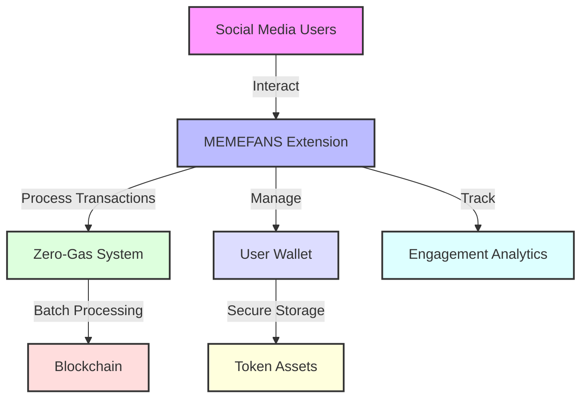
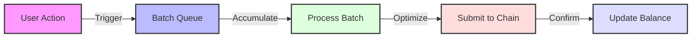
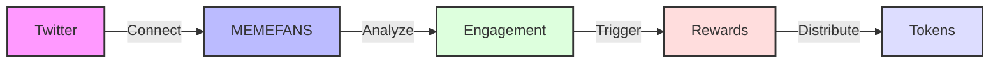
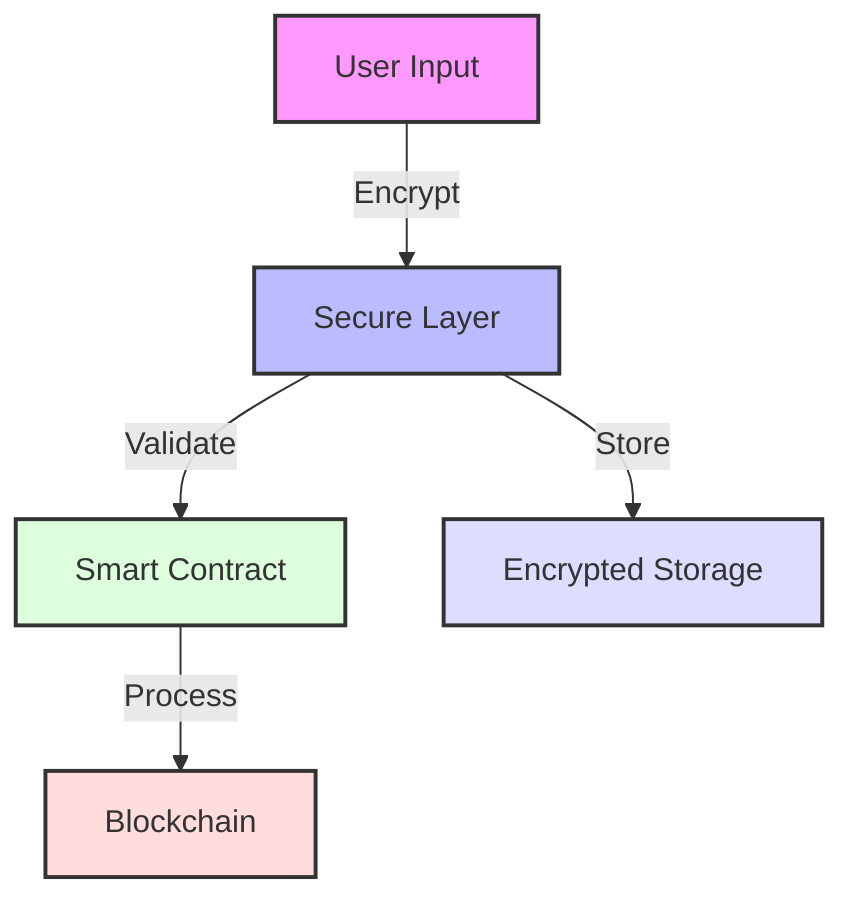
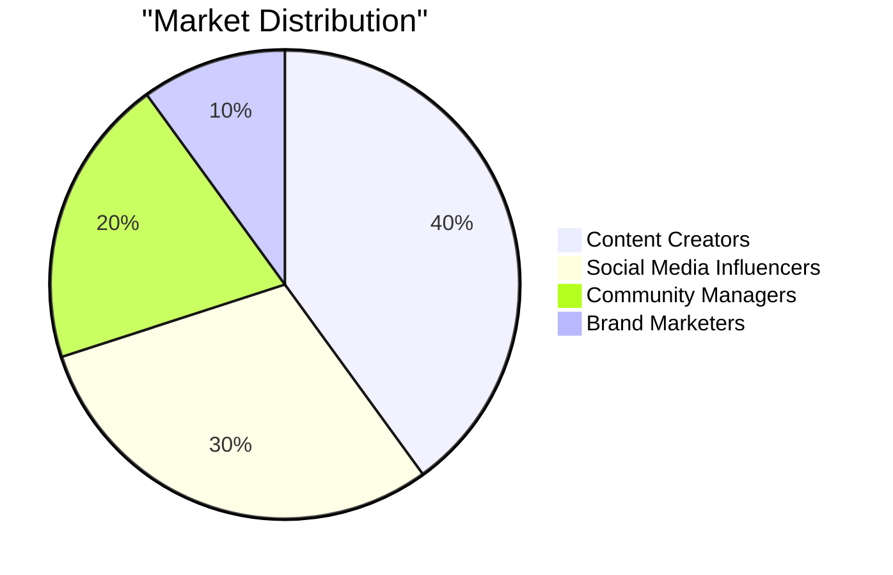
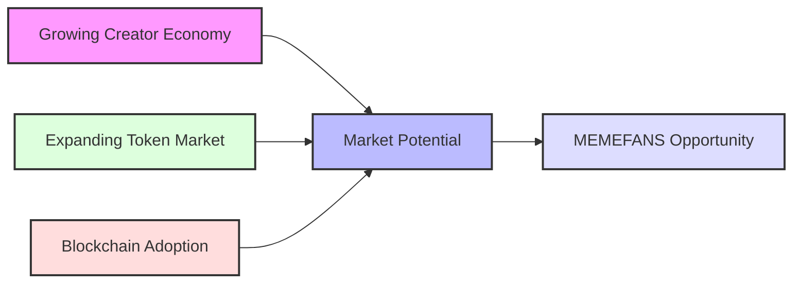
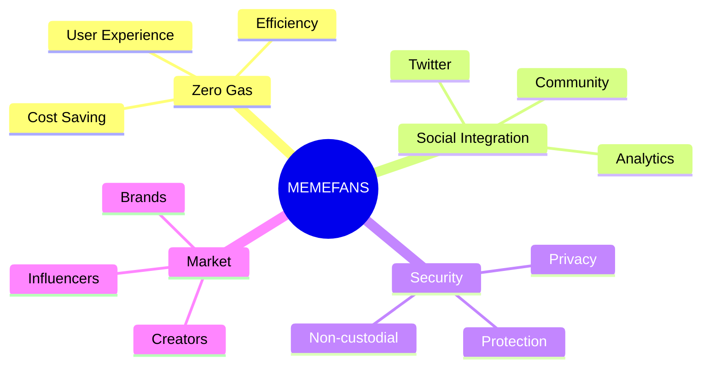

# Executive Summary

## Project Overview

MEMEFANS is a revolutionary social token distribution platform that seamlessly integrates with Twitter to enable content creators and their communities to engage in meaningful token-based interactions. Our platform leverages blockchain technology to create a transparent, efficient, and user-friendly ecosystem for social token distribution.

### System Architecture

## Key Features

### Zero-Gas Model

* Innovative batch processing system
* Efficient token collection mechanism
* Cost-effective distribution strategy

### Social Integration

* Seamless Twitter integration
* One-click gift interactions
* Automated engagement tracking

### Security

* Non-custodial wallet system
* Secure transaction processing
* Privacy-focused design

## Market Opportunity

### Target Market

* Content creators
* Social media influencers
* Community managers
* Brand marketers

### Market Size

* Growing creator economy
* Expanding social token market
* Increasing blockchain adoption

## Value Proposition

## Technical Innovation

### Architecture
- Chrome extension-based platform
- Solana blockchain integration
- Efficient smart contract system

### Performance
- High transaction throughput
- Low latency operations
- Scalable infrastructure

## Business Model

### Revenue Streams
- Transaction fees
- Premium features
- Partnership programs

### Growth Strategy
- Community-driven expansion
- Strategic partnerships
- Market penetration plan

## Roadmap

### Phase 1: Launch
- Platform release
- Core feature deployment
- Initial user acquisition

### Phase 2: Growth
- Feature expansion
- Market penetration
- Community building

### Phase 3: Scale
- Global expansion
- Advanced features
- Ecosystem development
