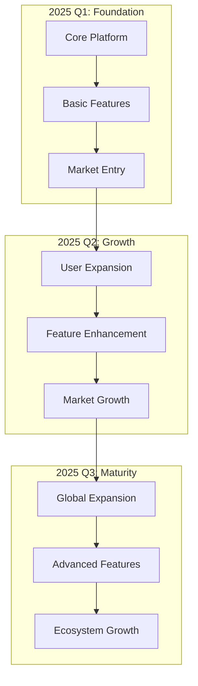
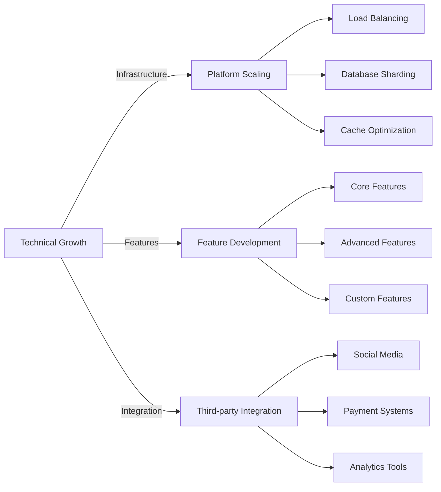
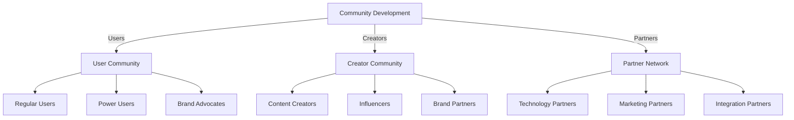
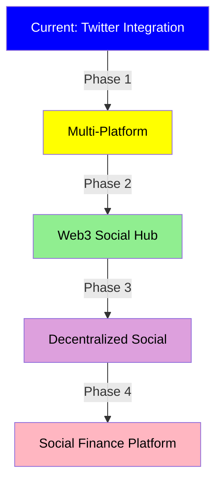
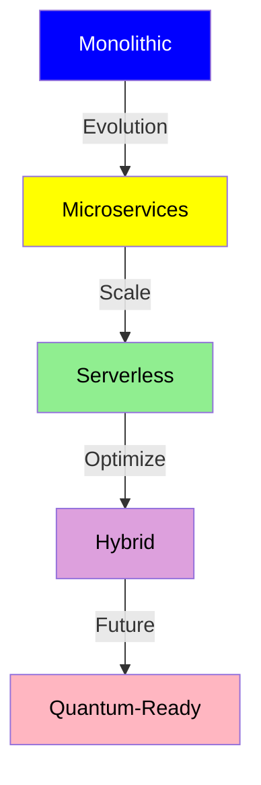
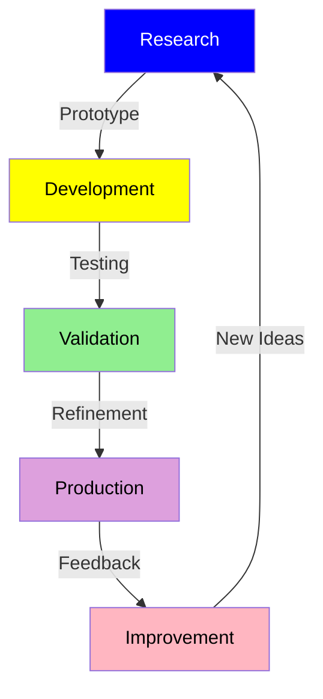
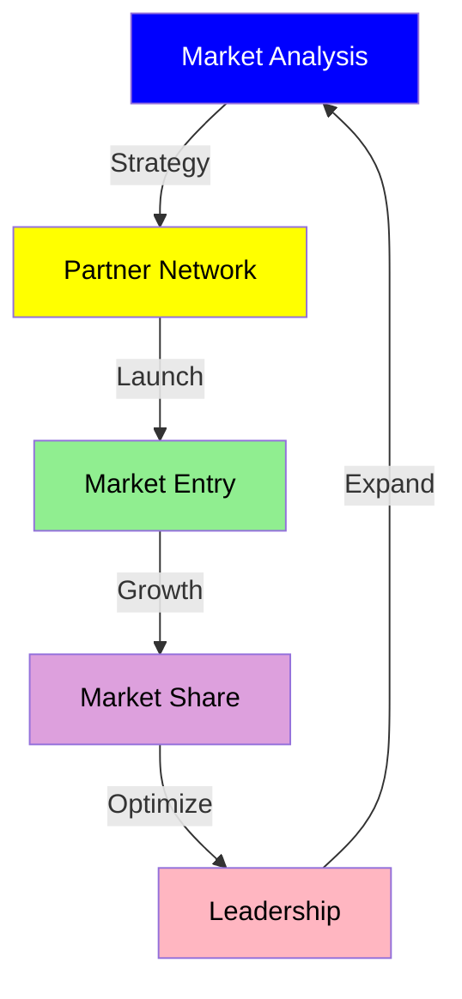

# Future Development

## Development Roadmap



## Technical Evolution



## Community Growth



## Phase 1: Foundation (2025 Q1)

### Core Platform Development
- Infrastructure setup
- Basic feature implementation
- Security framework
- Performance optimization

### Basic Features
- Zero-gas transaction system
- Social media integration
- Basic wallet functionality
- User authentication

### Market Entry
- Beta testing program
- Initial user onboarding
- Community building
- Marketing initiatives

## Phase 2: Growth (2025 Q2)

### User Expansion
- User acquisition campaigns
- Referral programs
- Community events
- User education

### Feature Enhancement
- Advanced trading features
- Analytics dashboard
- Additional integrations
- Performance upgrades

### Market Growth
- Strategic partnerships
- Marketing campaigns
- Brand collaborations
- Market expansion

## Phase 3: Maturity (2025 Q3)

### Global Expansion
- International markets
- Localization
- Regional partnerships
- Global compliance

### Advanced Features
- AI recommendations
- Advanced analytics
- Custom integrations
- Enhanced security

### Ecosystem Growth
- Developer tools
- Partner ecosystem
- API marketplace
- Community governance

## Development Overview

MEMEFANS project adopts a three-phase development strategy, focusing on platform launch, growth, and global expansion. Each phase is carefully planned to ensure sustainable development and community growth.

## Key Milestones

### Phase 1: Foundation (2025 Q1)
- Platform launch and infrastructure setup
- Core feature deployment
- Initial user acquisition and testing

### Phase 2: Growth (2025 Q2)
- Feature expansion and enhancement
- Market penetration strategy
- Community building plans

### Phase 3: Maturity (2025 Q3)
- Global market expansion
- Advanced feature launch
- Ecosystem development

## Future Innovations

### Interface Enhancement
- Mobile First Design
- Voice Commands
- Gesture Control
- AR Integration

### AI Integration
- Smart Recommendations
- Fraud Detection
- Content Moderation
- Trading Automation

### Blockchain Evolution
- Cross-chain Support
- Layer 2 Solutions
- New Token Standards
- Protocol Upgrades

## Vision & Strategy

### 1. Long-term Vision


### 2. Strategic Goals
- **Market Leadership**
  - 50% market share
  - Industry standard
  - Innovation leader
  - Global presence

- **Technology Excellence**
  - Advanced features
  - Superior performance
  - Best security
  - Perfect UX

### 3. Success Metrics
```typescript
interface SuccessMetrics {
  // User metrics
  users: {
    totalUsers: number;
    activeUsers: number;
    retention: number;
    satisfaction: number;
  };

  // Financial metrics
  financial: {
    revenue: number;
    growth: number;
    profitability: number;
    efficiency: number;
  };

  // Platform metrics
  platform: {
    uptime: number;
    performance: number;
    security: number;
    scalability: number;
  };
}
```

## Development Roadmap

### Phase 1: Foundation (2025 Q1-Q2)
- Chrome Extension MVP Launch
- Basic Distribution Features
- Wallet Integration
- Twitter API Integration

### Phase 2: Enhancement (2025 Q3-Q4)
1. **Advanced Features**
   - Multi-condition Requirements
   - Automated Verification
   - Analytics Dashboard
   - Batch Distribution

2. **User Experience**
   - UI/UX Improvements
   - Mobile Optimization
   - Multi-language Support
   - Help Center

### Phase 3: Ecosystem Growth (2026 Q1-Q2)
1. **Platform Expansion**
   - Additional Social Platforms
   - Developer API
   - SDK Release
   - Community Tools

2. **Integration & Partnerships**
   - Strategic Partnerships
   - Cross-platform Integration
   - Developer Community
   - Marketing Collaborations

### Phase 4: Global Expansion (2026 Q3-Q4)
1. **Market Expansion**
   - Regional Adaptation
   - Local Communities
   - Global Events
   - Regional Partners

2. **Advanced Features**
   - AI-powered Distribution
   - Predictive Analytics
   - Advanced Security
   - Cross-chain Support

## Innovation Focus

### Technical Innovation
1. **Blockchain Integration**
   - Cross-chain Support
   - Layer 2 Solutions
   - Gas Optimization
   - Smart Contract Updates

2. **AI & Machine Learning**
   - Fraud Detection
   - User Behavior Analysis
   - Smart Distribution
   - Risk Management

### User Experience
1. **Interface Enhancement**
   - Mobile First Design
   - Voice Commands
   - Gesture Control
   - AR Integration

2. **Social Features**
   - Community Forums
   - Social Discovery
   - Collaboration Tools
   - Content Creation

## Community Development

### Developer Ecosystem
1. **Developer Tools**
   - API Documentation
   - SDK Libraries
   - Code Examples
   - Testing Tools

2. **Developer Support**
   - Technical Support
   - Resource Center
   - Developer Forum
   - Bug Bounty Program

### Community Initiatives
1. **Education**
   - Tutorial Series
   - Documentation
   - Use Case Studies
   - Best Practices

2. **Engagement**
   - Community Events
   - Hackathons
   - Rewards Program
   - Ambassador Program

## Security Enhancements

### Security Measures
1. **Platform Security**
   - Regular Audits
   - Penetration Testing
   - Security Updates
   - Monitoring Systems

2. **User Security**
   - 2FA Enhancement
   - Fraud Prevention
   - Privacy Controls
   - Security Education

## Research & Development

### Future Technologies
1. **Emerging Tech**
   - Web3 Integration
   - IoT Compatibility
   - 5G Optimization
   - Edge Computing

2. **Innovation Areas**
   - Privacy Solutions
   - Scaling Solutions
   - User Interface
   - Social Integration

### Market Research
1. **User Studies**
   - Behavior Analysis
   - Need Assessment
   - Feedback Collection
   - Usage Patterns

2. **Market Analysis**
   - Trend Analysis
   - Competitor Research
   - Market Opportunities
   - Growth Strategies

## Technical Evolution

### 1. Architecture


### 2. Technology Stack
- **Current Stack**
  - Solana blockchain
  - Node.js backend
  - React frontend
  - Cloud infrastructure

- **Future Stack**
  - Multi-chain support
  - Advanced AI/ML
  - Edge computing
  - Quantum-resistant

### 3. Performance Goals
```typescript
interface PerformanceTargets {
  // Response times
  latency: {
    p50: '50ms';
    p95: '100ms';
    p99: '200ms';
  };

  // Scalability
  scale: {
    users: '100M+';
    transactions: '1M/s';
    storage: 'Petabyte';
  };

  // Reliability
  reliability: {
    uptime: '99.999%';
    dataLoss: '0%';
    recovery: '< 1min';
  };
}
```

## Feature Pipeline

### 1. Near-term Features
- **2025 Q1-Q2**
  - Enhanced analytics
  - Advanced automation
  - Improved security
  - Better UX

- **2025 Q3-Q4**
  - Multi-platform support
  - Advanced token features
  - Enhanced privacy
  - Developer tools

### 2. Mid-term Features
- **2026 Q1-Q2**
  - AI integration
  - Predictive analytics
  - Custom solutions
  - Advanced security

### 3. Long-term Features
- **2026+**
  - Quantum computing
  - Advanced AI
  - New paradigms
  - Future tech

## Research & Innovation

### 1. Research Areas
- **Blockchain Technology**
  - Scalability solutions
  - Privacy features
  - Cross-chain integration
  - New consensus mechanisms

- **Artificial Intelligence**
  - Natural language processing
  - Predictive analytics
  - Automated trading
  - Risk management

### 2. Innovation Projects


### 3. Partnerships
- Academic institutions
- Research labs
- Industry partners
- Technology providers

## Community Growth

### 1. Developer Ecosystem
- **Tools & Resources**
  - SDK development
  - Documentation
  - Sample code
  - Testing tools

- **Support Programs**
  - Technical support
  - Training programs
  - Certification
  - Grants program

### 2. User Community
- **Engagement Programs**
  - User groups
  - Events & meetups
  - Educational content
  - Support forums

- **Feedback Systems**
  - Feature requests
  - Bug reports
  - User surveys
  - Beta testing

### 3. Partnership Network
- **Types of Partners**
  - Technology partners
  - Integration partners
  - Service providers
  - Resellers

- **Partnership Benefits**
  - Technical support
  - Marketing support
  - Revenue sharing
  - Joint development

## Market Expansion

### 1. Geographic Expansion
- **Phase 1: Core Markets**
  - North America
  - Western Europe
  - Advanced Asia

- **Phase 2: Growth Markets**
  - Eastern Europe
  - Latin America
  - Southeast Asia

### 2. Market Segments
- **Current Focus**
  - Content creators
  - Social influencers
  - Online communities
  - Digital artists

- **Future Segments**
  - Enterprise users
  - Government sector
  - Educational institutions
  - Non-profit organizations

### 3. Go-to-Market Strategy


## Sustainability

### 1. Economic Sustainability
- **Revenue Streams**
  - Transaction fees
  - Premium features
  - Enterprise solutions
  - Partnership revenue

- **Cost Management**
  - Efficient operations
  - Automated processes
  - Resource optimization
  - Smart scaling

### 2. Environmental Impact
- **Green Initiatives**
  - Energy efficiency
  - Carbon neutrality
  - Sustainable practices
  - Environmental policy

### 3. Social Impact
- **Community Benefits**
  - Job creation
  - Skill development
  - Economic empowerment
  - Social inclusion

## Risk Management

### 1. Technical Risks
- **Identification**
  - Security threats
  - Performance issues
  - Scalability challenges
  - Technical debt

- **Mitigation**
  - Regular audits
  - Continuous testing
  - Backup systems
  - Contingency plans

### 2. Market Risks
- **Analysis**
  - Competition
  - Market changes
  - Regulatory issues
  - Economic factors

- **Management**
  - Diversification
  - Adaptation strategy
  - Risk monitoring
  - Quick response

### 3. Future Challenges
- **Preparation**
  - Technology changes
  - Market evolution
  - User needs
  - Regulatory landscape

- **Response**
  - Innovation focus
  - Adaptable strategy
  - Strong partnerships
  - Continuous learning

[Back to Home](README.md)
