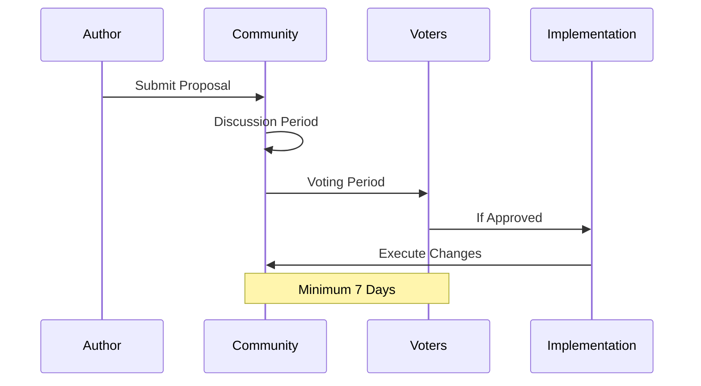
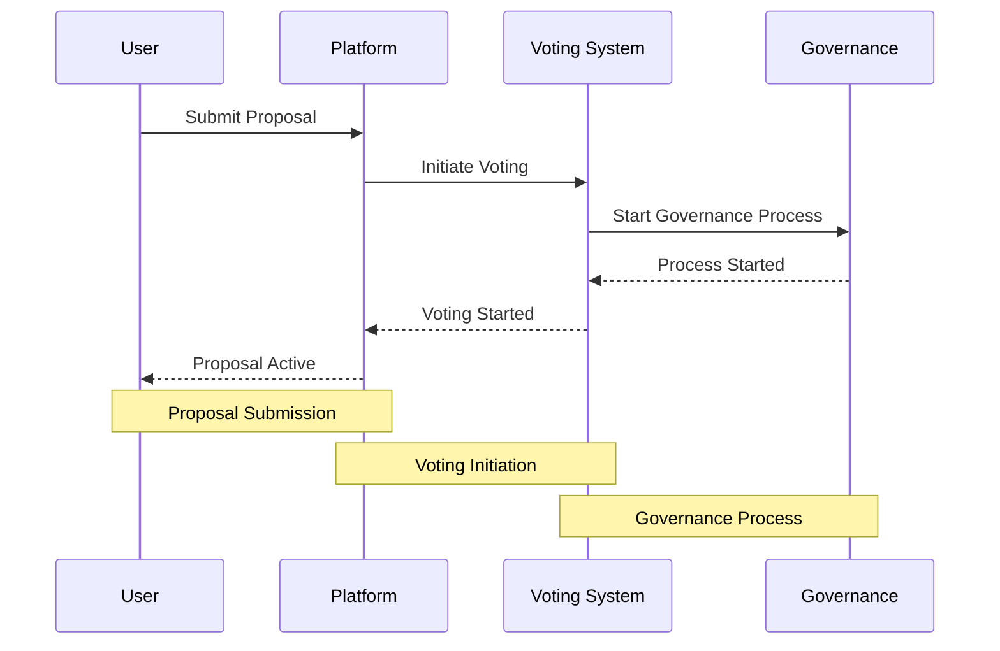
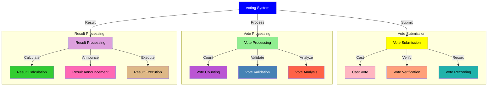
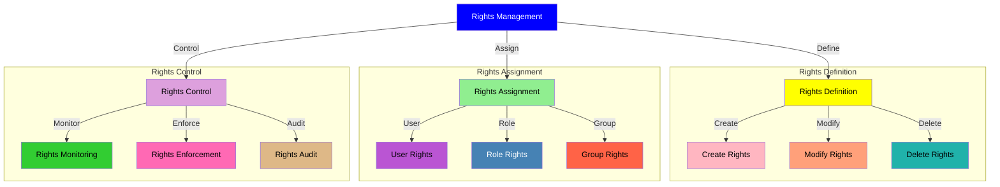
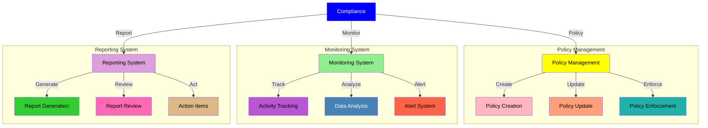

# Community Governance

## DAO Structure

### 1. Governance Framework
- **Decision Making Process**


- **Voting Power**
  - 1 FANS = 1 base vote
  - Multipliers based on:
    * Holding duration (up to 2.5x)
    * Active participation (up to 1.5x)
    * Community contribution (up to 2x)

### 2. Proposal System

#### Proposal Types
1. **Core Protocol Changes**
   - Smart contract upgrades
   - Economic parameter adjustments
   - Security implementations
   - Major feature additions

2. **Treasury Management**
   - Fund allocation
   - Investment decisions
   - Revenue distribution
   - Emergency reserves

3. **Community Initiatives**
   - Marketing campaigns
   - Partnership proposals
   - Event organization
   - Education programs

#### Proposal Process


## Governance

## Governance Framework


## Proposal Process Flow



## Voting System Flow



## Rights Management Flow



## Compliance Flow



## Voting Mechanism

### 1. Vote Types
- **Single Choice**
  - Yes/No decisions
  - Simple majority
  - Quorum: 30%

- **Multiple Choice**
  - Ranked voting
  - Weighted preferences
  - Quorum: 40%

- **Quadratic Voting**
  - Complex decisions
  - Cost increases quadratically
  - Prevents whale dominance

### 2. Vote Weight Calculation
```typescript
interface VoteWeight {
  baseWeight: number;  // 1 FANS = 1 base weight
  holdingMultiplier: number;  // 1.0 to 2.5x
  participationMultiplier: number;  // 1.0 to 1.5x
  contributionMultiplier: number;  // 1.0 to 2.0x
  
  calculateFinalWeight(): number {
    return baseWeight * 
           holdingMultiplier * 
           participationMultiplier * 
           contributionMultiplier;
  }
}
```

### 3. Vote Security
- Multi-sig verification
- Smart contract automation
- Anti-manipulation checks
- Vote delegation system

## Treasury Management

### 1. Fund Allocation
- **Development Fund**: 40%
  - Core development
  - Security audits
  - Infrastructure
  - Testing & QA

- **Community Fund**: 30%
  - Rewards & incentives
  - Events & marketing
  - Education & content
  - Grants program

- **Reserve Fund**: 20%
  - Emergency use
  - Market operations
  - Strategic investments
  - Risk management

- **Operations Fund**: 10%
  - Daily operations
  - Team expenses
  - Legal & compliance
  - Administrative costs

### 2. Investment Strategy
- **Risk Categories**
  - Low risk: 60%
  - Medium risk: 30%
  - High risk: 10%

- **Asset Types**
  - Stablecoins
  - Protocol tokens
  - Yield farming
  - Strategic investments

### 3. Reporting & Transparency
- Monthly financial reports
- Quarterly audits
- Real-time dashboard
- Public transaction logs

## Community Roles

### 1. Core Contributors
- **Responsibilities**
  - Protocol development
  - Technical decisions
  - Security maintenance
  - Documentation

- **Requirements**
  - Technical expertise
  - Active participation
  - Community trust
  - Long-term commitment

### 2. Community Moderators
- **Duties**
  - Forum moderation
  - Proposal review
  - Community support
  - Content curation

- **Selection Process**
  - Community nomination
  - Background check
  - Trial period
  - Performance review

### 3. Working Groups
- **Types**
  - Development
  - Marketing
  - Operations
  - Community

- **Structure**
  - Group leader
  - Core members
  - Contributors
  - Advisors

## Incentive Systems

### 1. Participation Rewards
- **Voting Rewards**
  - Regular participation
  - Proposal creation
  - Discussion contribution
  - Technical review

- **Community Work**
  - Content creation
  - Code contribution
  - Bug reporting
  - Community support

### 2. Achievement System
- **Levels**
  ```mermaid
  graph LR
    A[Newcomer] --> B[Active Participant]
    B --> C[Regular Contributor]
    C --> D[Core Member]
    D --> E[Guardian]
  ```

- **Benefits**
  - Increased vote weight
  - Special badges
  - Priority access
  - Additional rewards

### 3. Reputation System
- **Metrics**
  - Participation history
  - Contribution quality
  - Community feedback
  - Achievement points

- **Impact**
  - Role eligibility
  - Vote weight
  - Reward multipliers
  - Special privileges

## Future Governance Evolution

### 1. Phase 1: Foundation
- Basic voting system
- Simple proposals
- Core team oversight
- Community feedback

### 2. Phase 2: Expansion
- Advanced voting mechanisms
- Working groups
- Delegation system
- Multiple proposal types

### 3. Phase 3: Maturity
- Full decentralization
- Complex governance
- Automated execution
- Cross-chain governance

[Continue to Integration Guide →](integration-guide.md)
