# Market Analysis

## Current State of Social Token Market

### Market Overview
- Global social token market cap: $500M+ (2023)
- YoY growth rate: 245%
- Active projects: 150+
- Total users: 2M+

### Key Market Trends
1. **Creator Economy Boom**
   - Individual creator revenue: $10B+ annually
   - Platform revenue share: 30-50%
   - Growing demand for creator monetization
   - Shift towards direct fan engagement

2. **Social Token Adoption**
   - Rising interest from mainstream creators
   - Integration with major platforms
   - Increasing institutional investment
   - Growing retail participation

3. **Technology Evolution**
   - Move towards Layer 2 solutions
   - Cross-chain compatibility
   - Enhanced user experience
   - Mobile-first approach

## Competitive Analysis

### Market Landscape

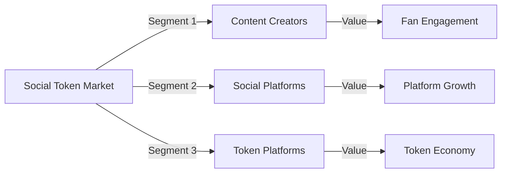

### Market Share Distribution
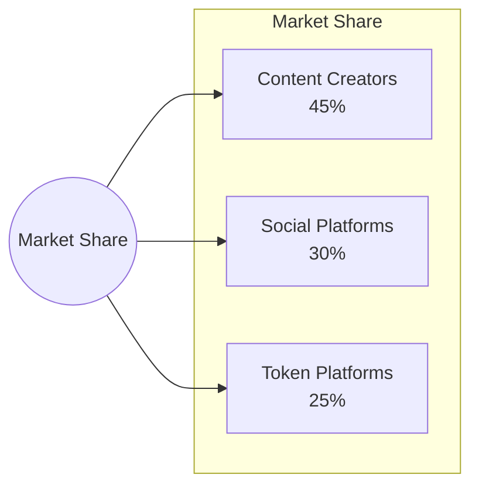

### Industry Trends
- Web3 Social Integration: 40% YoY growth
- Creator Economy: $104B market size
- Token Adoption: 25% annual increase
- Platform Evolution: Moving towards decentralization

### Competitive Landscape

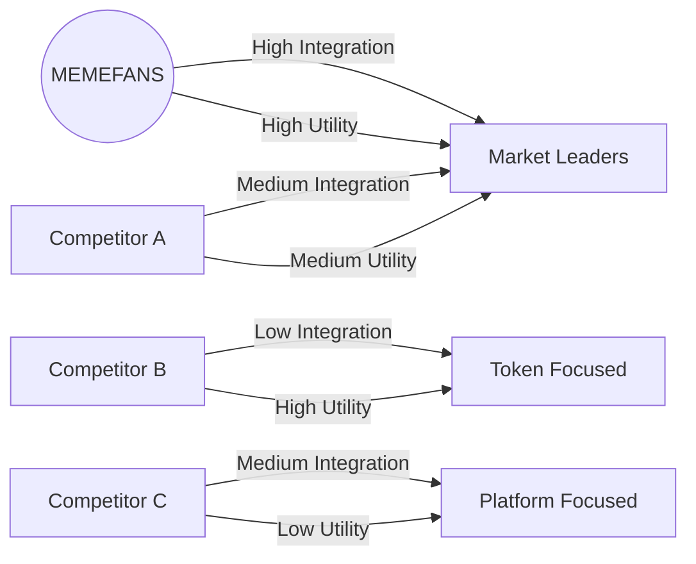

### Feature Comparison
| Feature            | MEMEFANS | Competitor A | Competitor B |
|-------------------|----------|--------------|--------------|
| Platform Integration| High    | Medium      | Low         |
| Token Utility      | High     | Medium      | High        |
| Cost Efficiency    | High     | Medium      | Low         |
| User Experience    | Advanced | Basic       | Medium      |
| Market Coverage    | Growing  | Established | Limited     |

### Direct Competitors

1. **Roll**
   - Strengths:
     * Established brand
     * Strong partnerships
     * Multi-chain support
   - Weaknesses:
     * High fees
     * Complex user interface
     * Limited distribution options

2. **Rally**
   - Strengths:
     * Large creator base
     * Robust infrastructure
     * Good market presence
   - Weaknesses:
     * Centralized approach
     * Platform dependency
     * Limited scalability

3. **Bitclout**
   - Strengths:
     * Novel approach
     * Strong community
     * First-mover advantage
   - Weaknesses:
     * Technical issues
     * Poor user experience
     * Limited functionality

4. **Friend.tech**
   - **Overview**
     * Leading project in Base ecosystem
     * Pioneer in social tokens
     * Centralized operation
   
   - **Strengths**
     * First-mover advantage
     * Established user base
     * Simple user experience
   
   - **Weaknesses**
     * Centralization risks
     * Limited functionality
     * Closed ecosystem

5. **Stars Arena**
   - **Overview**
     * Avalanche-based social platform
     * Copy of Friend.tech model
   
   - **Strengths**
     * Lower gas fees
     * Cross-chain potential
   
   - **Weaknesses**
     * Security concerns
     * Limited innovation
     * Platform stability issues

6. **Post.tech**
   - **Overview**
     * Newer entrant in social tokens
     * Focus on content monetization
   
   - **Strengths**
     * Strong content focus
     * Active developer community
   
   - **Weaknesses**
     * Limited market presence
     * Early stage platform
     * Smaller user base

### Indirect Competitors
1. Traditional fan clubs
2. Patreon and subscription models
3. NFT platforms
4. Social media tipping systems

### Competitive Advantages

1. **MEMEFANS Unique Value Proposition**
   - Zero-gas model for better user experience
   - Cross-platform integration capabilities
   - Advanced security measures
   - Community-driven governance
   - Transparent tokenomics

2. **Technical Superiority**
   - Solana blockchain efficiency
   - Scalable architecture
   - Enhanced security features
   - User-friendly interface

## Market Strategy

### Market Landscape

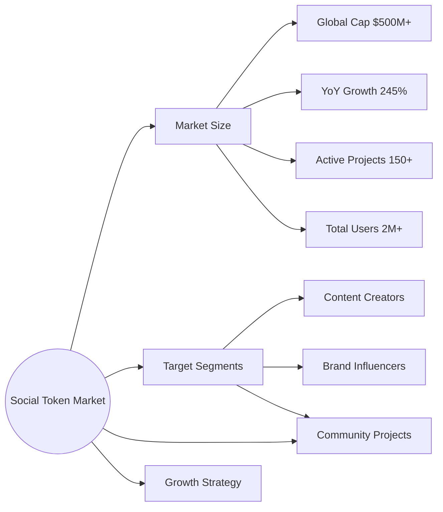

### Market Flow

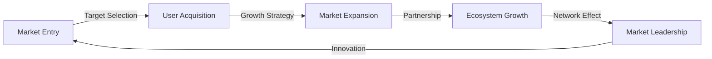

### Growth Metrics
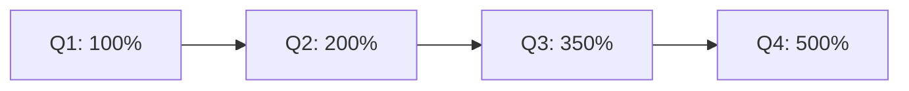

### Strategic Focus Areas
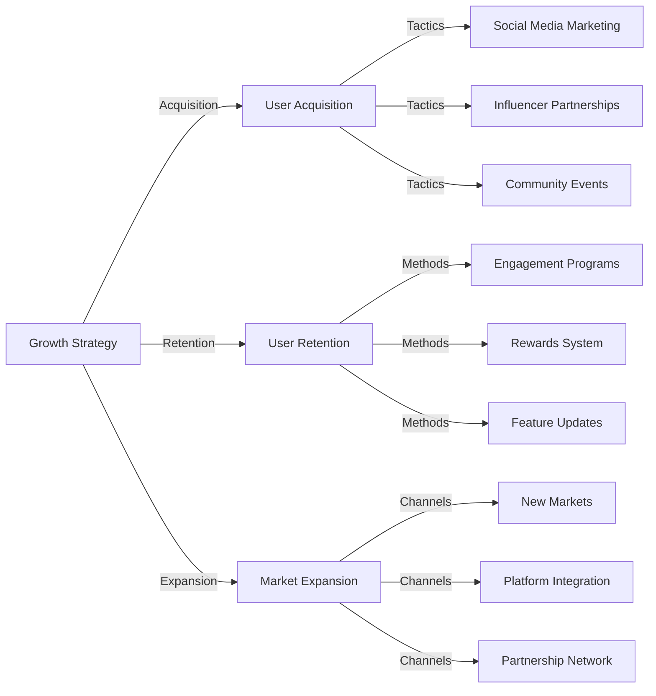

## Market Opportunities

1. **Emerging Markets**
   - Developing economies
   - Creator-focused platforms
   - Web3 social networks

2. **Integration Potential**
   - Social media platforms
   - Content creation tools
   - NFT marketplaces
   - DeFi protocols

3. **Future Growth Areas**
   - Mobile-first approach
   - AI integration
   - Cross-chain expansion
   - DAO governance

## Risk Assessment

1. **Market Risks**
   - Regulatory changes
   - Competition intensity
   - Market volatility
   - User adoption rate

2. **Mitigation Strategies**
   - Regulatory compliance
   - Continuous innovation
   - Community engagement
   - Security audits

## Market Pain Points

### Creator Challenges
1. **Monetization Issues**
   - High platform fees
   - Limited revenue streams
   - Payment delays
   - Geographic restrictions

2. **Engagement Barriers**
   - Limited fan interaction tools
   - Poor retention mechanisms
   - Lack of incentive systems
   - Platform dependency

3. **Technical Complexity**
   - Difficult setup process
   - Complex token management
   - Poor integration options
   - Limited scalability

### Fan Challenges
1. **Access Issues**
   - High entry barriers
   - Limited participation options
   - Geographic restrictions
   - Payment difficulties

2. **Value Capture**
   - Limited benefits
   - No ownership rights
   - Poor reward systems
   - Lack of liquidity

## Our Solution

### Unique Value Proposition
1. **Seamless Integration**
   - One-click token creation
   - Automatic distribution
   - Platform-agnostic approach
   - Mobile-friendly design

2. **Enhanced Features**
   - Advanced analytics
   - Customizable rewards
   - Flexible distribution
   - Community governance

3. **Economic Benefits**
   - Lower fees
   - Instant settlements
   - Multiple revenue streams
   - Fair value distribution

## Token Launch Strategy

### Fair Launch Model
- **FANS Token Distribution**
  - 100% Market Distribution
  - No private sale rounds
  - No institutional investors
  - No early investor allocations
  - Pure market-driven pricing

### Community First Approach
- **Equal Opportunity**
  - All participants start equal
  - No privileged access
  - No price advantages
  - Fair market competition

### Launch Mechanism
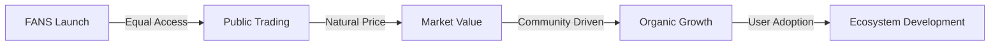

### Launch Benefits
1. **完全公平**
   - 所有参与者平等
   - 没有价格优势
   - 没有份额优势
   - 市场决定价值

2. **社区驱动**
   - 真正的去中心化
   - 社区自主发展
   - 有机价格发现
   - 自然需求增长

3. **长期可持续**
   - 健康的代币经济
   - 自然的价格形成
   - 稳定的生态发展
   - 可持续的增长模式

## Market Analysis Flowchart

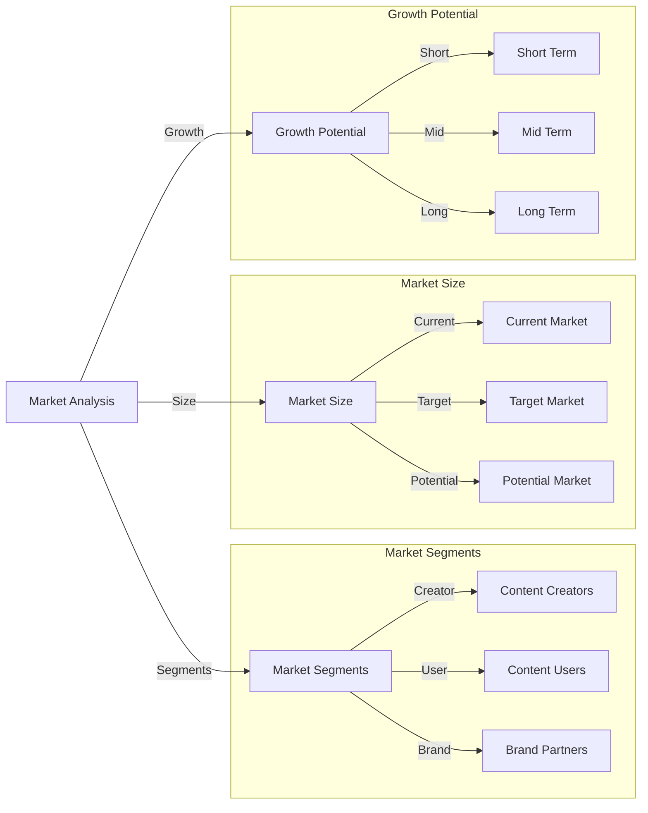

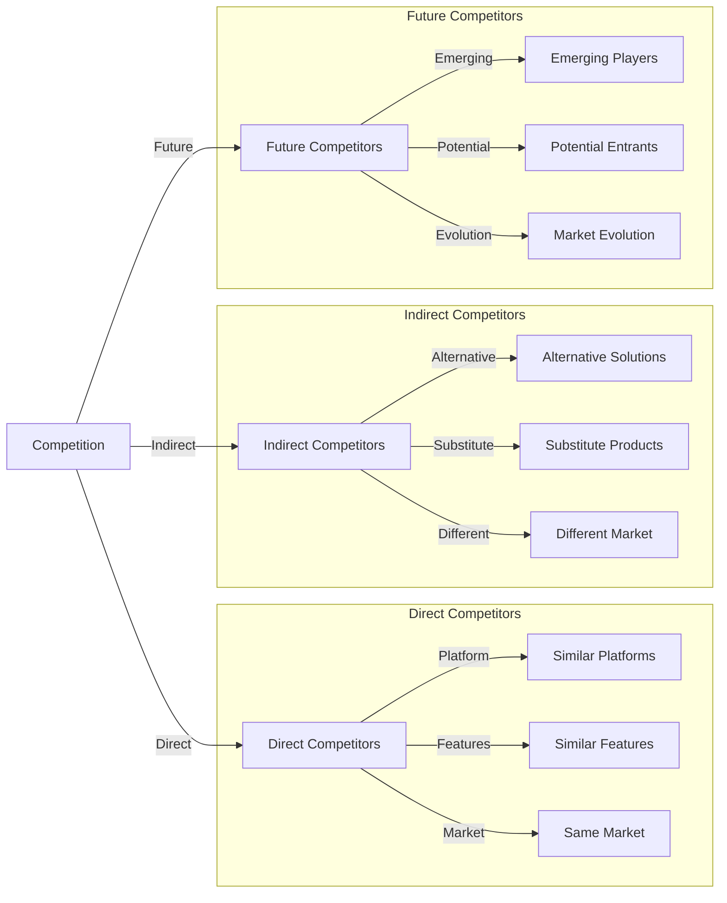

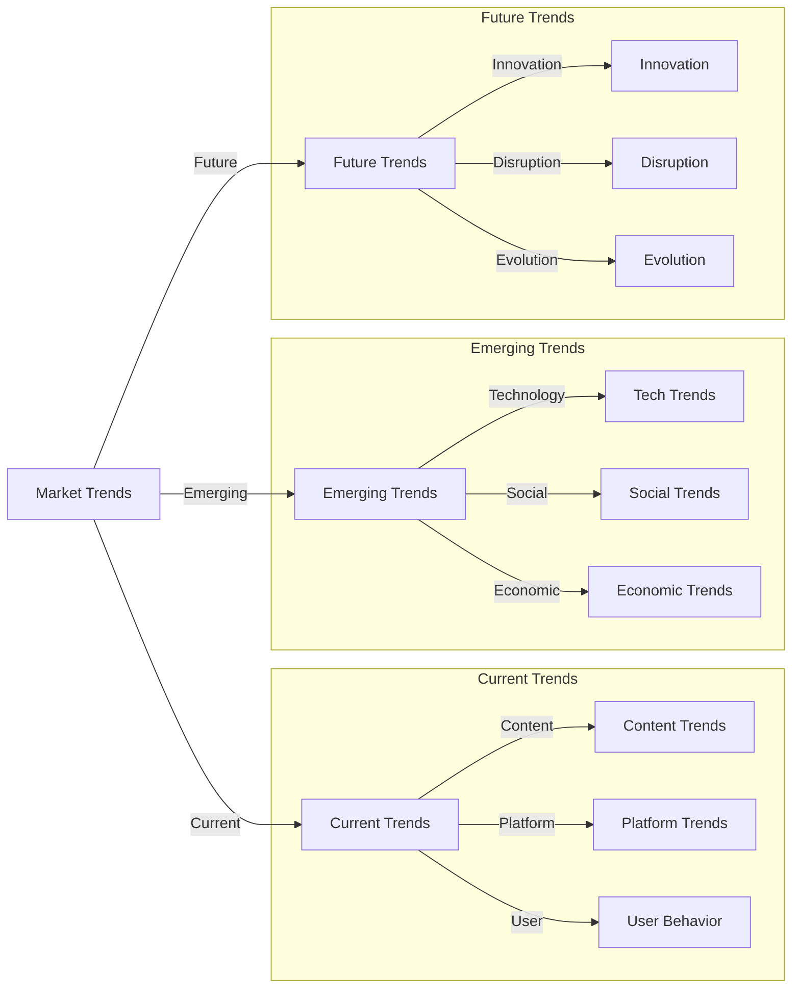

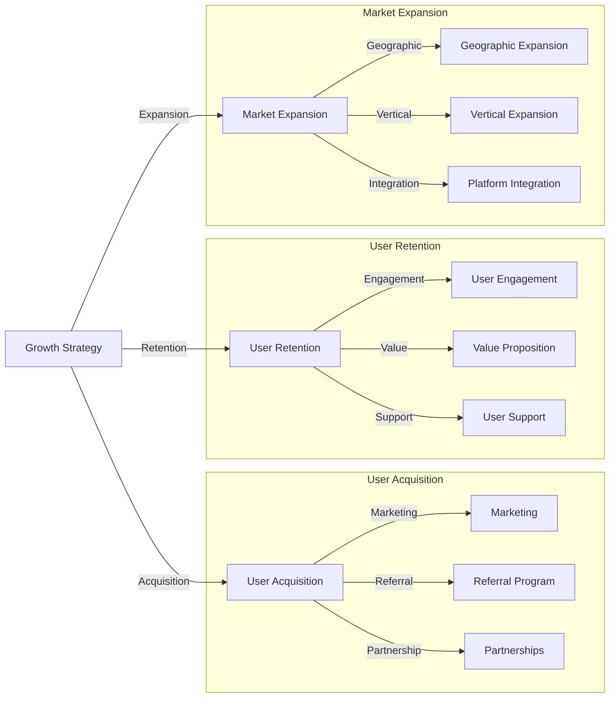

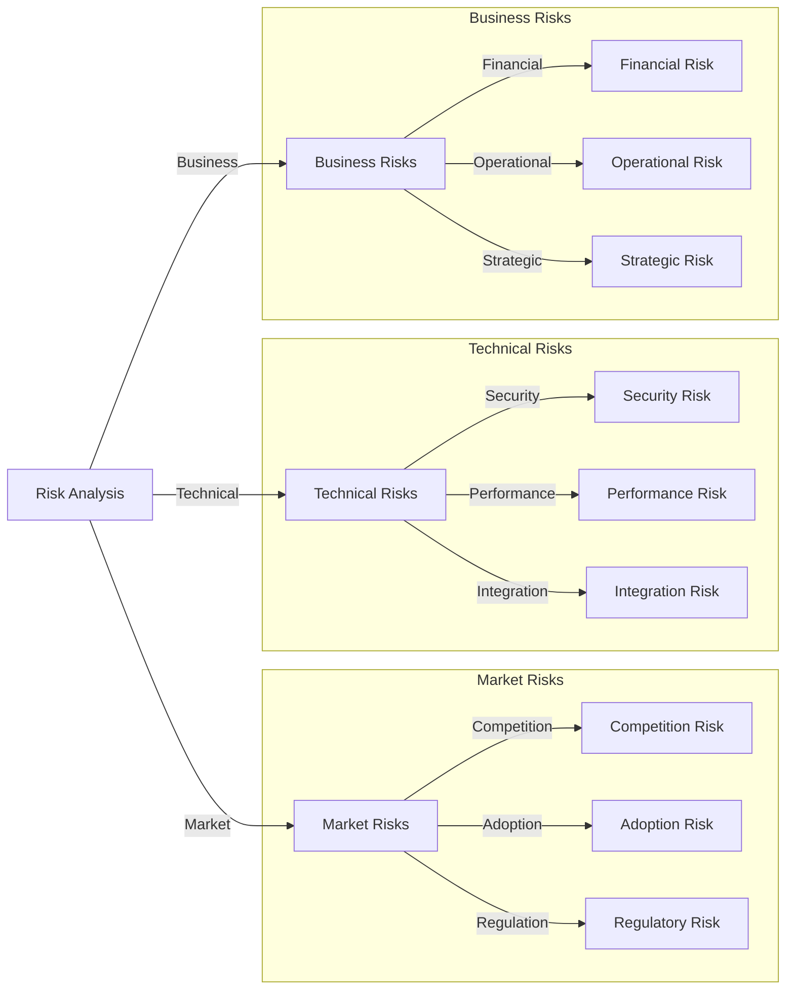

[Continue to Product Features →](product-features.md)
