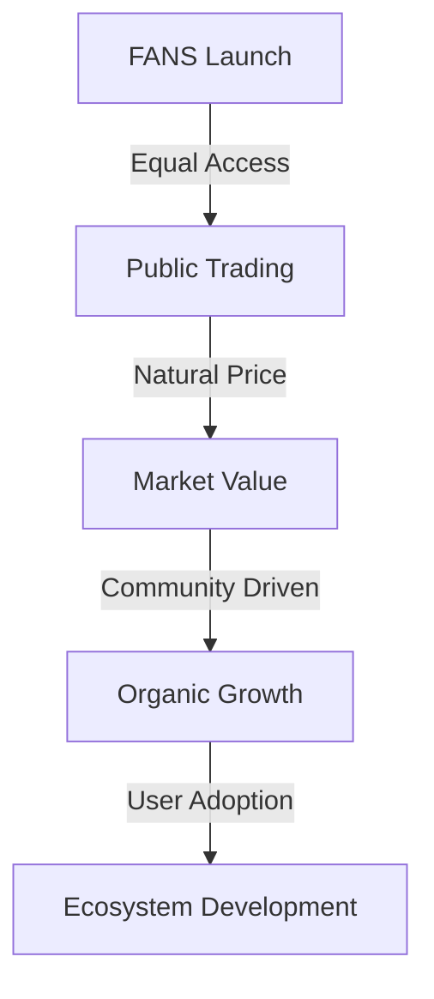

# Market Analysis

## Current State of Social Token Market

### Market Overview
- Global social token market cap: $500M+ (2023)
- YoY growth rate: 245%
- Active projects: 150+
- Total users: 2M+

### Key Market Trends
1. **Creator Economy Boom**
   - Individual creator revenue: $10B+ annually
   - Platform revenue share: 30-50%
   - Growing demand for creator monetization
   - Shift towards direct fan engagement

2. **Social Token Adoption**
   - Rising interest from mainstream creators
   - Integration with major platforms
   - Increasing institutional investment
   - Growing retail participation

3. **Technology Evolution**
   - Move towards Layer 2 solutions
   - Cross-chain compatibility
   - Enhanced user experience
   - Mobile-first approach

## Competitive Analysis

### Direct Competitors

1. **Roll**
   - Strengths:
     * Established brand
     * Strong partnerships
     * Multi-chain support
   - Weaknesses:
     * High fees
     * Complex user interface
     * Limited distribution options

2. **Rally**
   - Strengths:
     * Large creator base
     * Robust infrastructure
     * Good market presence
   - Weaknesses:
     * Centralized approach
     * Platform dependency
     * Limited scalability

3. **Bitclout**
   - Strengths:
     * Novel approach
     * Strong community
     * First-mover advantage
   - Weaknesses:
     * Technical issues
     * Poor user experience
     * Limited functionality

### Indirect Competitors
1. Traditional fan clubs
2. Patreon and subscription models
3. NFT platforms
4. Social media tipping systems

## Market Pain Points

### Creator Challenges
1. **Monetization Issues**
   - High platform fees
   - Limited revenue streams
   - Payment delays
   - Geographic restrictions

2. **Engagement Barriers**
   - Limited fan interaction tools
   - Poor retention mechanisms
   - Lack of incentive systems
   - Platform dependency

3. **Technical Complexity**
   - Difficult setup process
   - Complex token management
   - Poor integration options
   - Limited scalability

### Fan Challenges
1. **Access Issues**
   - High entry barriers
   - Limited participation options
   - Geographic restrictions
   - Payment difficulties

2. **Value Capture**
   - Limited benefits
   - No ownership rights
   - Poor reward systems
   - Lack of liquidity

## Our Solution

### Unique Value Proposition
1. **Seamless Integration**
   - One-click token creation
   - Automatic distribution
   - Platform-agnostic approach
   - Mobile-friendly design

2. **Enhanced Features**
   - Advanced analytics
   - Customizable rewards
   - Flexible distribution
   - Community governance

3. **Economic Benefits**
   - Lower fees
   - Instant settlements
   - Multiple revenue streams
   - Fair value distribution

### Competitive Advantages

1. **Technical Innovation**
   - Solana's high performance
   - PUMP DEX integration
   - Advanced security features
   - Scalable architecture

2. **User Experience**
   - Intuitive interface
   - Quick onboarding
   - Comprehensive support
   - Mobile optimization

3. **Business Model**
   - Sustainable revenue
   - Fair token economics
   - Growth incentives
   - Community alignment

## Token Launch Strategy

### Fair Launch Model
- **FANS Token Distribution**
  - 100% Market Distribution
  - No private sale rounds
  - No institutional investors
  - No early investor allocations
  - Pure market-driven pricing

### Community First Approach
- **Equal Opportunity**
  - All participants start equal
  - No privileged access
  - No price advantages
  - Fair market competition

### Launch Mechanism

### Launch Benefits
1. **完全公平**
   - 所有参与者平等
   - 没有价格优势
   - 没有份额优势
   - 市场决定价值

2. **社区驱动**
   - 真正的去中心化
   - 社区自主发展
   - 有机价格发现
   - 自然需求增长

3. **长期可持续**
   - 健康的代币经济
   - 自然的价格形成
   - 稳定的生态发展
   - 可持续的增长模式

## Market Strategy

### Target Segments
1. **Primary Markets**
   - Content creators (1M+)
   - Social media influencers
   - Community leaders
   - Digital artists

2. **Secondary Markets**
   - Brands and businesses
   - NFT creators
   - Gaming communities
   - Educational platforms

### Go-to-Market Strategy
1. **Phase 1: Launch**
   - Beta testing with select creators
   - Community building
   - Initial marketing campaign
   - Strategic partnerships

2. **Phase 2: Growth**
   - Feature expansion
   - Market penetration
   - User acquisition
   - Platform integration

3. **Phase 3: Scale**
   - Global expansion
   - Enterprise solutions
   - Advanced features
   - Ecosystem development

### Success Metrics
1. **User Growth**
   - Monthly active users
   - Creator adoption rate
   - User retention
   - Community engagement

2. **Platform Performance**
   - Transaction volume
   - Token distribution
   - Feature usage
   - System uptime

3. **Business Metrics**
   - Revenue growth
   - Market share
   - Partnership success
   - Brand awareness

[Continue to Product Features →](product-features.md)
