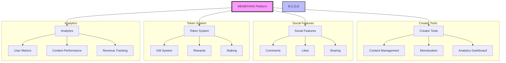
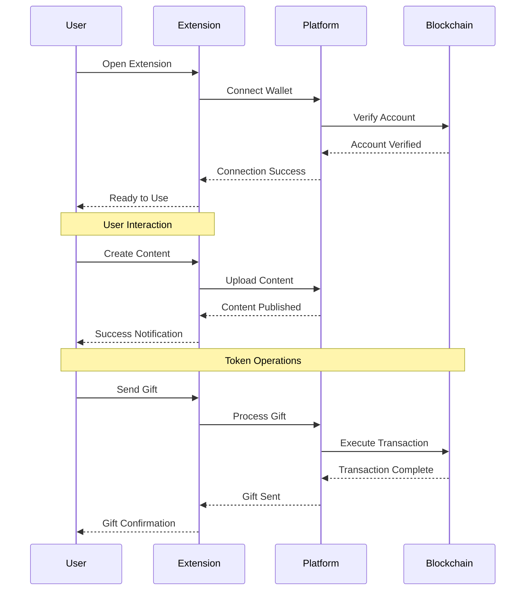
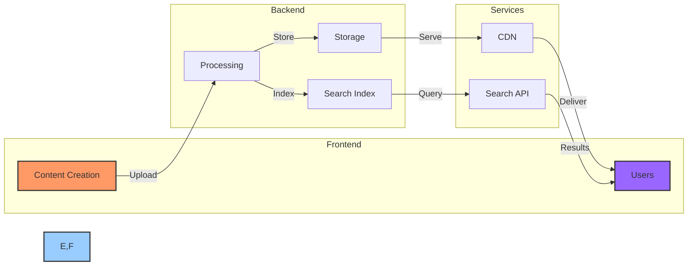
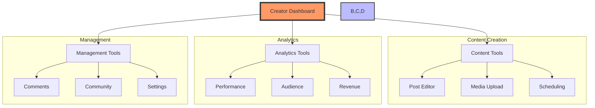
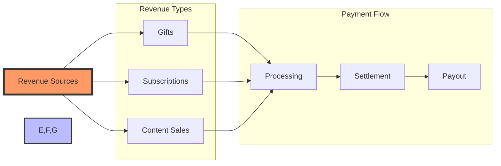
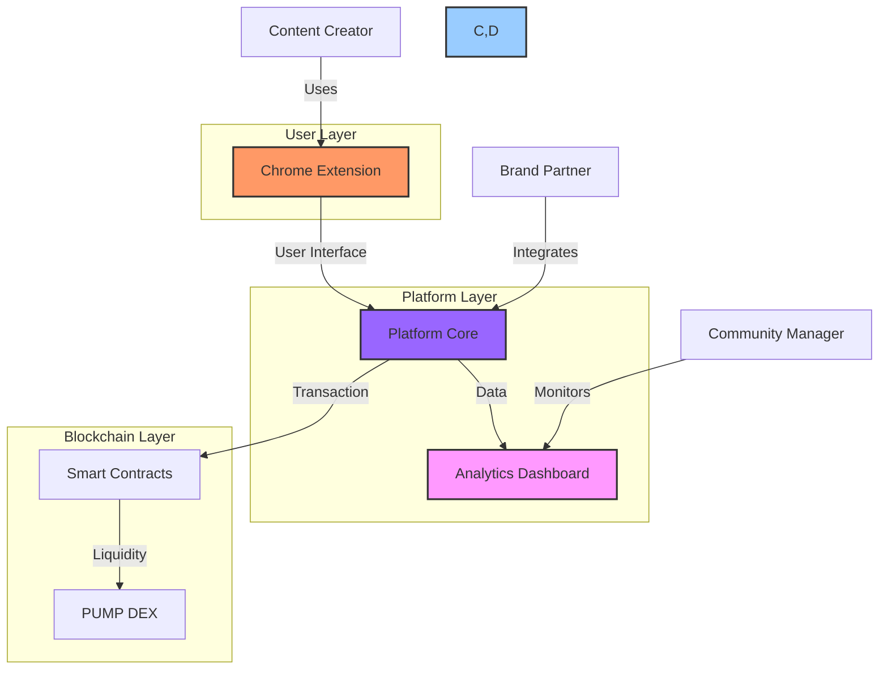

# Product Features

## Core Features Overview

MEMEFANS provides a comprehensive suite of features designed to empower creators and engage communities.

The platform consists of four main components:
1. **Creator Tools**: Comprehensive tools for content creation, monetization, and analytics
2. **Social Features**: Interactive features for community engagement
3. **Token System**: Blockchain-based token economy for rewards and transactions
4. **Analytics**: Detailed metrics and insights for performance tracking

### Technical Foundation
- **Analytics Dashboard**: Real-time tracking and visualization of platform metrics
- **Solana Blockchain**: High-performance blockchain infrastructure
- **PUMP DEX Integration**: Seamless token trading and liquidity management
- **Chrome Extension**: User-friendly browser interface
- **Smart Contracts**: Secure and automated transaction handling

### Market Ecosystem
- **Content Creators**: Primary content producers and community leaders
- **Social Influencers**: Key opinion leaders and trend setters
- **Community Managers**: Engagement and moderation specialists
- **Brand Partners**: Strategic collaborators and advertisers

### Core Features
- **Content Management**: Creation, storage, and delivery of content
- **Social Interaction**: User engagement and community building
- **Token Economics**: Token creation, distribution, and management
- **Governance**: Community decision-making and participation

## User Interaction Flow

The user interaction process involves three main phases:
1. **Connection Phase**: User connects wallet and verifies account
2. **Content Phase**: User creates and publishes content
3. **Transaction Phase**: User performs token operations like sending gifts

## Content Management Flow

The content management flow involves the following steps:
1. **Content Creation**: Users create content using the platform's tools and features
2. **Content Processing**: Content is processed and prepared for storage
3. **Storage & Indexing**: Content is stored and indexed for efficient retrieval
4. **Content Delivery**: Content is delivered to users through CDN and search services

## Creator Tools Flow

Creator tools provide three main functionalities:
1. **Content Creation**: Advanced tools for creating, editing, and scheduling content
2. **Analytics**: Comprehensive data analysis for performance tracking
3. **Management**: Tools for community management and platform settings

## Monetization Flow

The monetization process includes:
1. **Revenue Generation**: Multiple revenue streams including gifts, subscriptions, and content sales
2. **Payment Processing**: Secure transaction processing and verification
3. **Settlement & Payout**: Automated settlement and payout to creators

## Integration Flow

The platform components work together seamlessly:

The integration process follows these key steps:

1. **User Interface Integration**
   - Content creators interact through the Chrome Extension
   - Extension provides seamless access to platform features
   - User actions are captured and processed

2. **Platform Core Processing**
   - Transactions are processed via Smart Contracts
   - DEX provides liquidity for token operations
   - Analytics Dashboard monitors all activities

3. **Data Flow Management**
   - User actions generate platform metrics
   - Analytics Dashboard provides real-time insights
   - Community managers utilize data for optimization

4. **Stakeholder Integration**
   - Content creators engage through the extension
   - Community managers monitor through analytics
   - Brand partners integrate through platform APIs

## Platform Integration

### Browser Extension

1. Extension injects into web interface
2. User actions are monitored
3. Transactions are processed

### Chrome Extension Overview

#### Short Description
MEMEFANS is a Chrome extension that seamlessly connects your Twitter account with the Solana blockchain, allowing you to participate in token giveaways with just a few clicks.

#### Key Features
- One-click connection to your Solana wallet
- Automatic verification of Twitter interactions
- Secure token claiming system
- Real-time balance checking
- Easy token withdrawal to your wallet

#### How It Works
1. Connect your Twitter account and Solana wallet
2. Find supported token giveaways on Twitter
3. Like and retweet to participate
4. Claim your tokens directly through the extension
5. Withdraw tokens to your wallet anytime

#### Security Features
- No private keys stored
- Secure wallet connection
- Open source code
- Regular security audits

#### Support
For support or feedback, please visit our GitHub repository or contact us through Twitter.

## Feature Details

### 1. Token Creation & Management

#### Token Creation
- **Process Flow**
  1. Connect wallet
  2. Set token parameters
  3. Initialize on Solana
  4. Configure distribution rules

- **Parameters**
  - Token name
  - Symbol
  - Initial supply
  - Distribution rules
  - Reward mechanisms

#### Distribution Management
- **Distribution Methods**
  - Manual distribution
  - Automated rules
  - Scheduled releases
  - Event-triggered

- **Rules Engine**
  - Engagement metrics
  - Time-based rules
  - Complex conditions
  - Custom formulas

### 2. Social Media Integration

#### Twitter Integration
- **Account Connection**
  - OAuth authentication
  - Profile verification
  - Activity monitoring
  - Engagement tracking

- **Engagement Metrics**
  - Likes
  - Retweets
  - Comments
  - Follower growth
  - Engagement rate

#### Automated Actions
- **Event Triggers**
  - New followers
  - High engagement posts
  - Viral content
  - Community milestones

- **Response Actions**
  - Token distribution
  - Bonus rewards
  - Achievement badges
  - Special announcements

### 3. Analytics & Reporting

#### Real-time Analytics
- **Metrics Tracked**
  - Token circulation
  - User engagement
  - Distribution patterns
  - Community growth

- **Visualization**
  - Time-series graphs
  - Distribution maps
  - User rankings
  - Trend analysis

#### Performance Reports
- **Report Types**
  - Daily summaries
  - Weekly analytics
  - Monthly reviews
  - Custom periods

- **Export Options**
  - CSV download
  - PDF reports
  - API access
  - Data integration

### 4. Security Features

#### Wallet Security
- **Protection Measures**
  - Multi-sig support
  - Transaction limits
  - Whitelist control
  - Emergency freeze

- **Authentication**
  - 2FA support
  - Hardware wallet
  - Session management
  - Activity logs

#### Transaction Security
- **Safety Features**
  - Transaction preview
  - Gas optimization
  - Slippage protection
  - Fail-safe mechanisms

### 5. Advanced Features

#### Governance Tools
- **Proposal System**
  - Create proposals
  - Voting mechanism
  - Result execution
  - History tracking

- **Community Management**
  - Role assignment
  - Permission control
  - Moderation tools
  - Reward management

#### Integration APIs
- **API Features**
  - Token management
  - Distribution control
  - Analytics access
  - Webhook support

- **Documentation**
  - API reference
  - Code examples
  - SDKs
  - Integration guides

## User Experience

### 1. Onboarding Process
1. Install Chrome extension
2. Connect Twitter account
3. Setup wallet
4. Configure preferences
5. Start distribution

### 2. Daily Operations
1. Monitor dashboard
2. Review analytics
3. Adjust distribution rules
4. Engage with community
5. Generate reports

### 3. Advanced Usage
1. Custom rule creation
2. API integration
3. Governance participation
4. Community management
5. Performance optimization

## Technical Specifications

### System Requirements
- Chrome version 80+
- Stable internet connection
- Solana wallet
- Twitter account

### Performance Metrics
- Load time: < 2 seconds
- Transaction speed: < 1 second
- UI response: < 100ms
- Data refresh: Real-time

### Integration Capabilities
- Social platforms
- Wallet services
- Analytics tools
- Custom systems

[Continue to Business Model →](business-model.md)

## Product Features

## Core Features Overview

MEMEFANS provides a comprehensive suite of features designed to empower creators and engage communities.

### Technical Foundation
- **Analytics Dashboard**: Real-time tracking and visualization of platform metrics
- **Solana Blockchain**: High-performance blockchain infrastructure
- **PUMP DEX Integration**: Seamless token trading and liquidity management
- **Chrome Extension**: User-friendly browser interface
- **Smart Contracts**: Secure and automated transaction handling

### Market Ecosystem
- **Content Creators**: Primary content producers and community leaders
- **Social Influencers**: Key opinion leaders and trend setters
- **Community Managers**: Engagement and moderation specialists
- **Brand Partners**: Strategic collaborators and advertisers

### Core Features
- **Content Management**: Creation, storage, and delivery of content
- **Social Interaction**: User engagement and community building
- **Token Economics**: Token creation, distribution, and management
- **Governance**: Community decision-making and participation

## User Interaction Flow

## Content Management Flow

The content management flow involves the following steps:
1. **Content Creation**: Users create content using the platform's tools and features
2. **Content Processing**: Content is processed and prepared for storage
3. **Storage & Indexing**: Content is stored and indexed for efficient retrieval
4. **Content Delivery**: Content is delivered to users through CDN and search services

## Creator Tools Flow

## Monetization Flow

