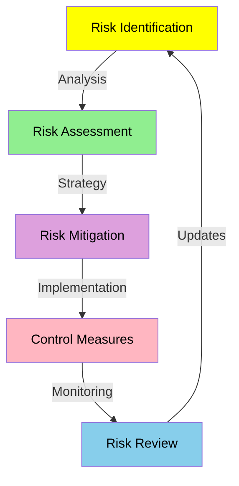
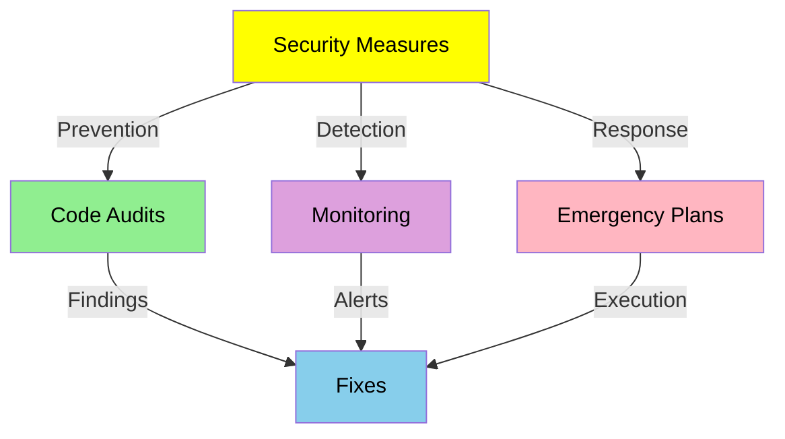
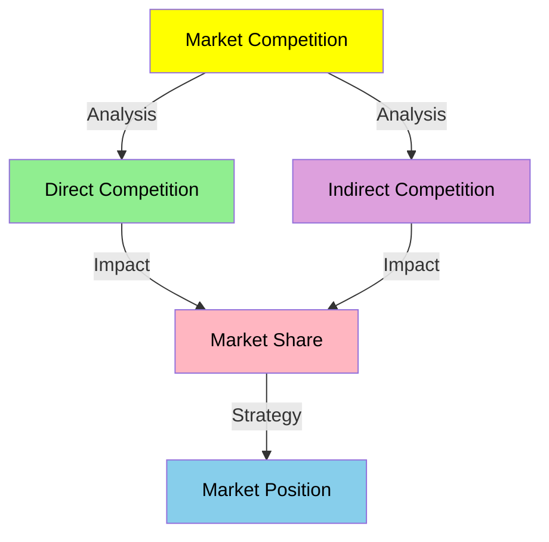
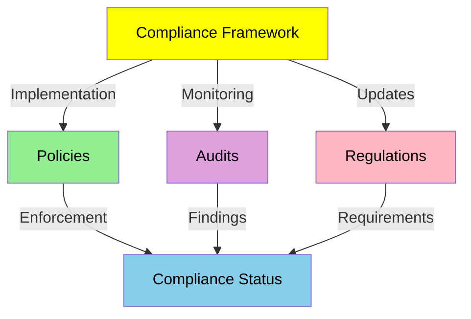

# Comprehensive Risk Analysis

## Risk Management Framework

### Risk Assessment Flow

## Technical Risks

### 1. Blockchain Infrastructure
- **Network Risks**
  - Solana network congestion
  - Transaction failures
  - High gas fees
  - Network upgrades

- **Mitigation Strategies**
  - Multiple node providers
  - Transaction retry mechanism
  - Gas optimization
  - Upgrade compatibility testing

### 2. Smart Contract Security

- **Potential Vulnerabilities**
  - Code exploits
  - Logic errors
  - Upgrade risks
  - Integration bugs

- **Security Measures**
  - Multiple audits
  - Bug bounty program
  - Upgrade timelock
  - Emergency pause

### 3. Platform Stability
- **Technical Issues**
  - System downtime
  - Performance degradation
  - Data inconsistency
  - Integration failures

- **Prevention Methods**
  - Redundant systems
  - Load balancing
  - Regular maintenance
  - Monitoring systems

## Market Risks

### 1. Competition

- **Direct Competition**
  - Similar platforms
  - Feature copying
  - Price competition
  - Market saturation

- **Mitigation Strategies**
  - Unique features
  - First-mover advantage
  - Community building
  - Strategic partnerships

### 2. Token Economics
- **Market Risks**
  - Price volatility
  - Liquidity issues
  - Market manipulation
  - Trading risks

- **Control Measures**
  - Price stability mechanisms
  - Liquidity pools
  - Trading restrictions
  - Market monitoring

## Operational Risks

### 1. Growth Management
- **Potential Risks**
  - Rapid growth challenges
  - Resource constraints
  - Quality issues
  - Team scaling

- **Management Strategies**
  - Phased growth plan
  - Resource planning
  - Quality controls
  - Team development

### 2. Compliance

- **Regulatory Risks**
  - Changing regulations
  - Cross-border compliance
  - Licensing requirements
  - Reporting obligations

- **Compliance Measures**
  - Legal consultation
  - Policy updates
  - Regular audits
  - Compliance training

## Risk Monitoring

### 1. Monitoring Systems
- **Technical Monitoring**
  - System health
  - Performance metrics
  - Security alerts
  - Error tracking

- **Market Monitoring**
  - Price movements
  - Trading volumes
  - User behavior
  - Competition analysis

### 2. Response Procedures
- **Incident Response**
  - Alert systems
  - Response teams
  - Recovery procedures
  - Communication plans

- **Continuous Improvement**
  - Incident analysis
  - Process updates
  - Team training
  - Documentation

## Risk Review and Updates

### 1. Regular Reviews
- Quarterly risk assessments
- Annual comprehensive review
- External audits
- Stakeholder feedback

### 2. Update Process
- Risk profile updates
- Policy revisions
- Control improvements
- Documentation updates

## Security Risks

### 1. Platform Security
- **Security Threats**
  - Cyber attacks
  - Data breaches
  - System vulnerabilities
  - Social engineering

- **Security Measures**
  - Regular audits
  - Penetration testing
  - Security updates
  - Staff training

### 2. User Security
- **User Risks**
  - Account compromise
  - Phishing attacks
  - Fraud attempts
  - Data theft

- **Protection Methods**
  - 2FA implementation
  - Security guidelines
  - Fraud detection
  - Insurance coverage

### 3. Data Protection
- **Data Risks**
  - Data leaks
  - Privacy violations
  - Compliance issues
  - Data corruption

- **Safety Protocols**
  - Encryption
  - Access control
  - Regular backups
  - Audit trails

## Insurance Coverage

### 1. Coverage Types
- Cyber liability
- Professional liability
- Business interruption
- Crime insurance

### 2. Coverage Details
- Policy limits
- Deductibles
- Exclusions
- Claims process

### 3. Risk Transfer
- Insurance partners
- Coverage review
- Policy updates
- Claims management

## Emergency Procedures

### 1. Crisis Management
- Response team
- Communication plan
- Action steps
- Recovery process

### 2. Business Continuity
- Backup systems
- Alternative processes
- Recovery time
- Service restoration

### 3. Stakeholder Management
- User communication
- Partner updates
- Media relations
- Regulatory reporting

[Back to Business Model →](business-model.md)
