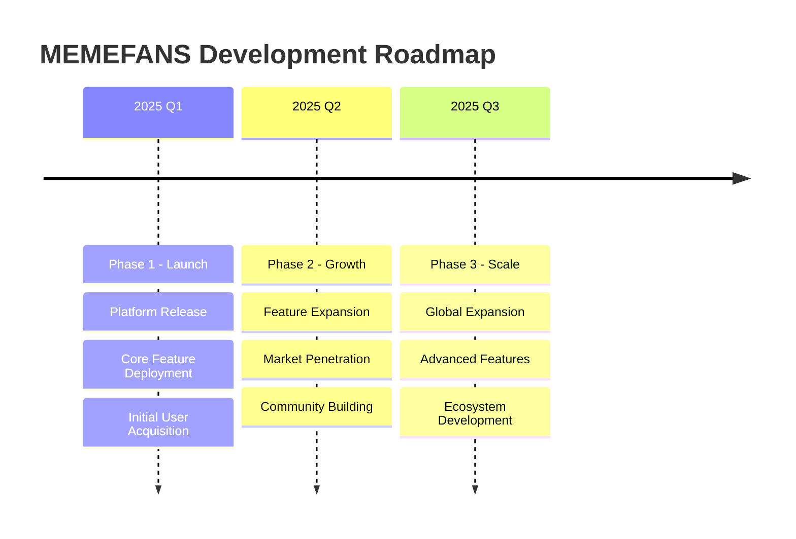
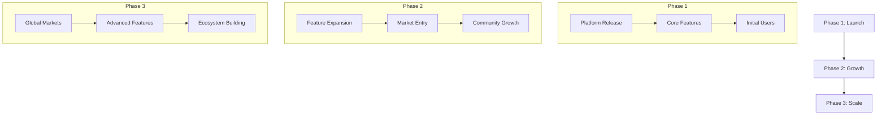

# Roadmap

## Development Timeline

## Development Flow

## Phase 1: Launch

* Platform release
  * Core platform development
  * Infrastructure setup
  * Initial testing and deployment

* Core feature deployment
  * Zero-gas transaction system
  * Social media integration
  * Basic wallet functionality

* Initial user acquisition
  * Early adopter program
  * Community engagement
  * Marketing initiatives

## Phase 2: Growth

* Feature expansion
  * Advanced trading features
  * Enhanced analytics
  * Additional platform integrations

* Market penetration
  * Strategic partnerships
  * Influencer collaborations
  * Market expansion campaigns

* Community building
  * Community programs
  * User incentives
  * Educational content

## Phase 3: Scale

* Global expansion
  * International markets
  * Multi-language support
  * Regional partnerships

* Advanced features
  * AI-powered recommendations
  * Advanced trading tools
  * Enhanced security features

* Ecosystem development
  * Developer tools
  * Partner integrations
  * Platform API
