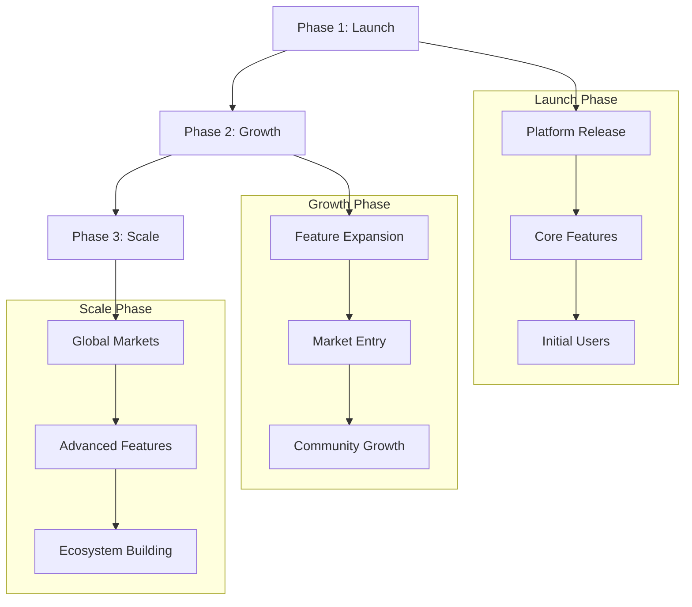

# Roadmap

## Development Timeline

```mermaid
gantt
    title MEMEFANS Development Roadmap
    dateFormat  YYYY-Q1
    axisFormat %Y-Q%q

    section Phase 1: Launch
    Platform release       :2024-Q1, 3M
    Core feature deployment :2024-Q1, 3M
    Initial user acquisition :2024-Q2, 3M

    section Phase 2: Growth
    Feature expansion      :2024-Q3, 3M
    Market penetration     :2024-Q3, 3M
    Community building     :2024-Q4, 3M

    section Phase 3: Scale
    Global expansion       :2025-Q1, 3M
    Advanced features      :2025-Q1, 3M
    Ecosystem development  :2025-Q2, 3M
```

## Development Flow



## Phase 1: Launch

* Platform release
  * Core platform development
  * Infrastructure setup
  * Initial testing and deployment

* Core feature deployment
  * Zero-gas transaction system
  * Social media integration
  * Basic wallet functionality

* Initial user acquisition
  * Early adopter program
  * Community engagement
  * Marketing initiatives

## Phase 2: Growth

* Feature expansion
  * Advanced trading features
  * Enhanced analytics
  * Additional platform integrations

* Market penetration
  * Strategic partnerships
  * Influencer collaborations
  * Market expansion campaigns

* Community building
  * Community programs
  * User incentives
  * Educational content

## Phase 3: Scale

* Global expansion
  * International markets
  * Multi-language support
  * Regional partnerships

* Advanced features
  * AI-powered recommendations
  * Advanced trading tools
  * Enhanced security features

* Ecosystem development
  * Developer tools
  * Partner integrations
  * Platform API
