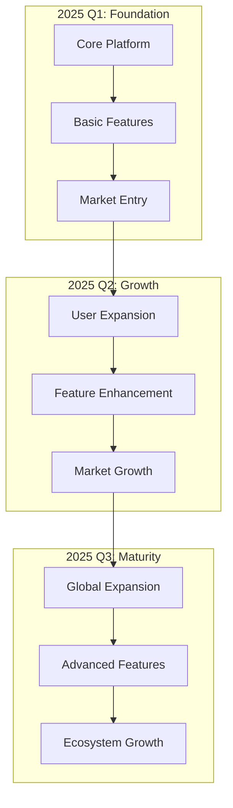
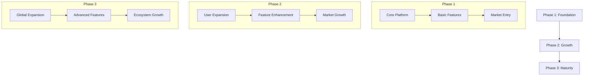
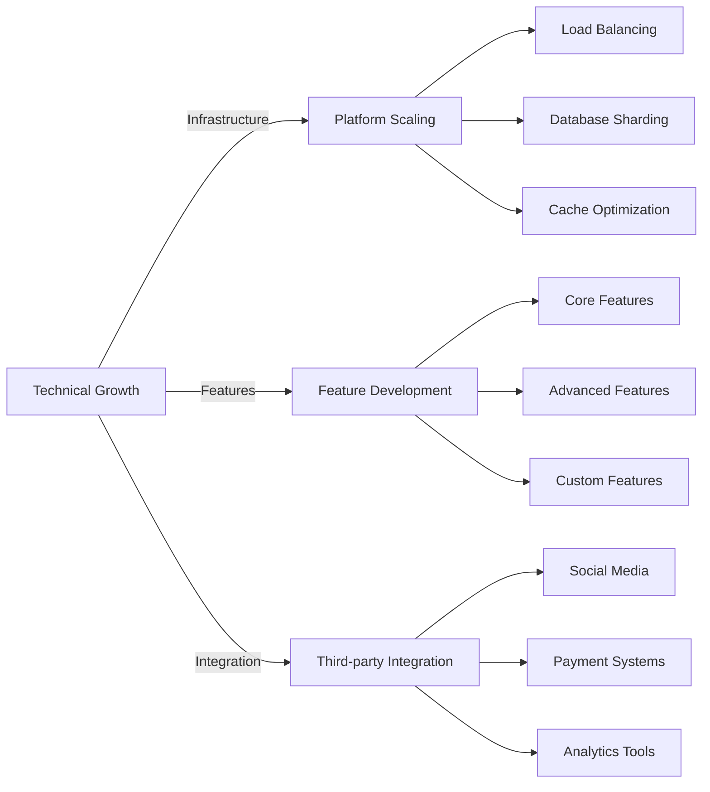

# Roadmap

## Development Timeline

## Development Flow

## Phase 1: Foundation

### Core Platform Development
- Infrastructure setup and optimization
- Security framework implementation
- Performance baseline establishment
- System architecture deployment

### Basic Features
- Zero-gas transaction system
  * Built-in SOL wallet integration
  * Gas-free transaction processing
  * Batch operation support
- Social media integration
  * X platform integration
  * Cross-platform compatibility
  * Content synchronization
- Basic wallet functionality
  * User authentication
  * Asset management
  * Transaction history

### Market Entry
- Beta testing program
- Initial user onboarding
- Community building initiatives
- Marketing campaign launch

## Phase 2: Growth

### User Expansion
- User acquisition campaigns
- Referral program launch
- Community events
- Educational content creation

### Feature Enhancement
- Advanced trading features
  * Enhanced analytics dashboard
  * Additional platform integrations
  * Performance optimization
- Security improvements
  * Advanced encryption
  * Multi-layer security
  * Real-time monitoring

### Market Growth
- Strategic partnerships
- Brand collaborations
- Market expansion initiatives
- Community program scaling

## Phase 3: Maturity

### Global Expansion
- International market entry
- Localization support
- Regional partnerships
- Global compliance framework

### Advanced Features
- AI-powered recommendations
- Advanced analytics tools
- Custom integrations
- Enhanced security features

### Ecosystem Growth
- Developer tools and SDK
- Partner ecosystem expansion
- API marketplace
- Community governance implementation

## Technical Evolution

## Future Innovations

### Interface Enhancement
- Mobile First Design
- Voice Commands
- Gesture Control
- AR Integration

### AI Integration
- Smart Recommendations
- Fraud Detection
- Content Moderation
- Trading Automation

### Blockchain Evolution
- Cross-chain Support
- Layer 2 Solutions
- New Token Standards
- Protocol Upgrades

## Risk Management

### Development Risks
- Technical challenges mitigation
- Resource allocation optimization
- Timeline management
- Quality assurance

### Market Risks
- Competition analysis
- Adoption rate monitoring
- Market trend adaptation
- User feedback integration
