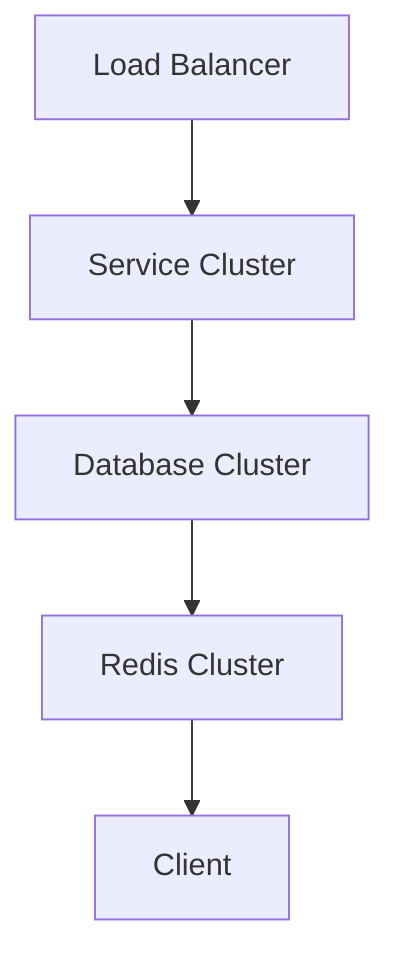
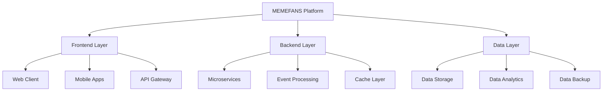
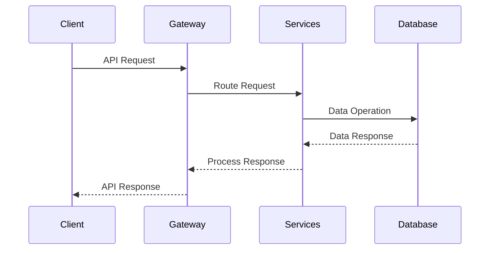
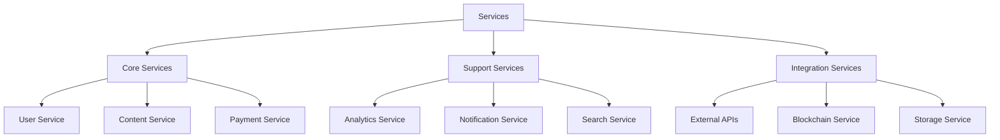
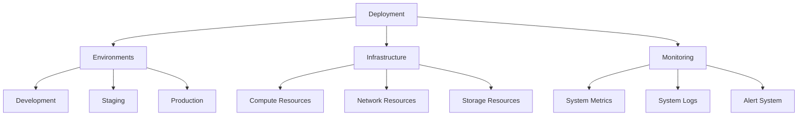
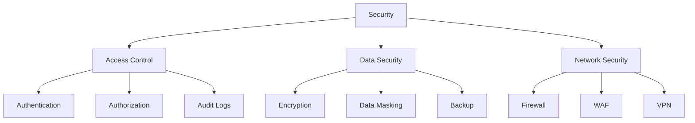

# Technical Architecture

## System Overview

> Last updated: 2024-12-25

Our platform is built on a modern, scalable architecture that combines the power of blockchain technology with the convenience of web browser extensions. This design enables seamless integration with social media platforms while maintaining high security and performance standards.

## Core Components

### Chrome Extension
- User interface layer
- Transaction management
- Local data storage
- Real-time updates

### Smart Contracts
- Token distribution logic
- Batch processing system
- Security protocols
- Access control

### Backend Services
- API integration
- Data processing
- Analytics engine
- Security monitoring

## Technical Stack

### Frontend Layer
- Chrome Extension
- React.js
- Web3.js

### Backend Layer
- Node.js
- Express
- Redis

### Blockchain Layer
- Solana
- Smart Contracts

### Database Layer
- MongoDB
- Redis Cache

## Security Architecture

### User Security

- Wallet encryption
- Private key management
- Transaction signing
- Access controls

### System Security

- DDoS protection
- Rate limiting
- Error handling
- Audit logging

## Performance Optimization

### Transaction Processing

- Batch operations
- Gas optimization
- Queue management
- Error recovery

### Data Management

- Caching strategy
- State management
- Data validation
- Backup systems

## Integration Points

### Social Media

- OAuth
- API Call
- Data Processing
- Storage

### Blockchain

- Web3
- Smart Contract
- State Change
- Event Notification

## Scalability Design

## System Architecture Overview

## Data Flow Architecture

## Service Architecture

## Deployment Architecture

## Security Architecture

