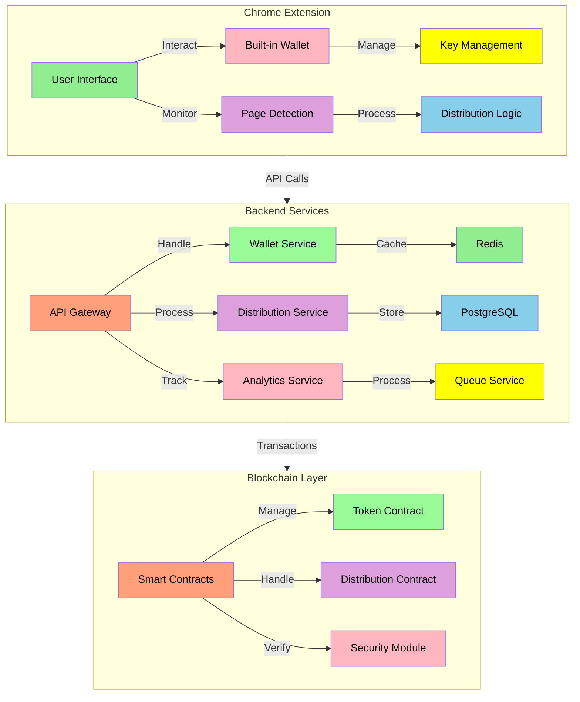
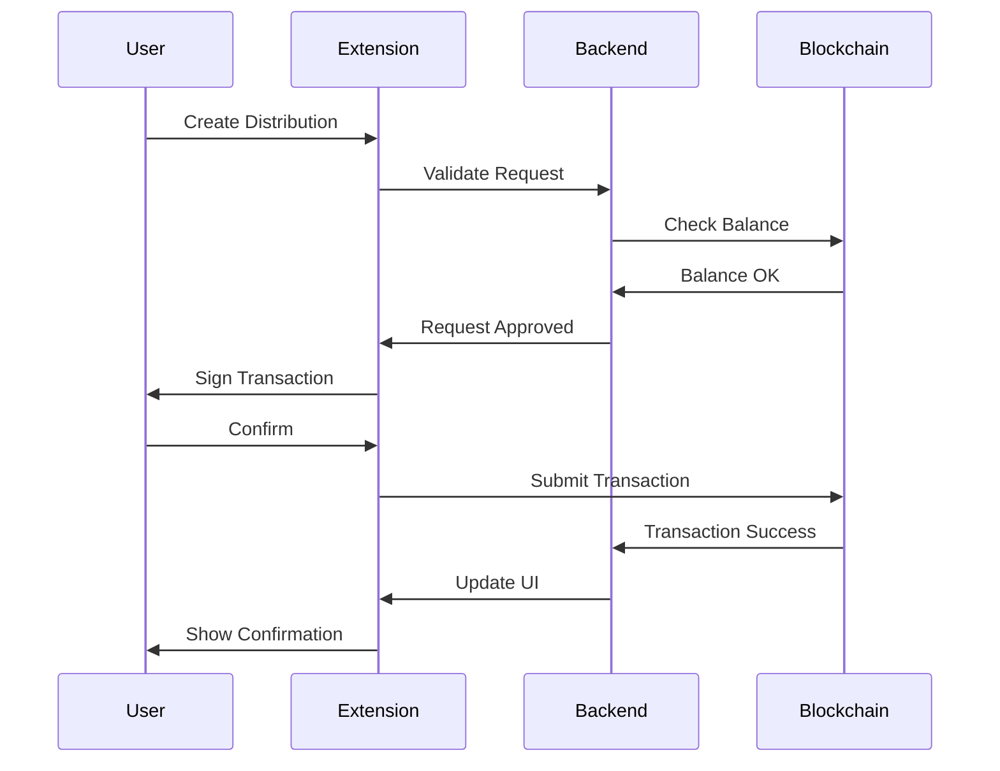
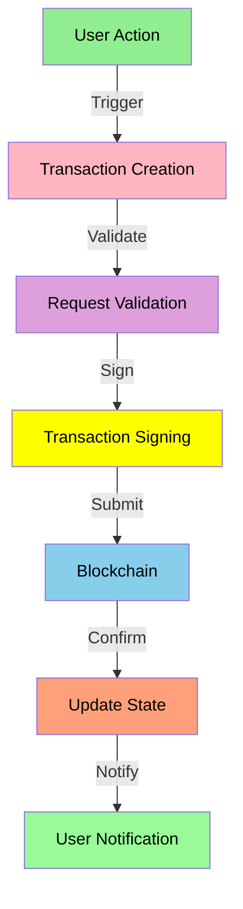

# Technical Architecture

## System Overview

MEMEFANS is built on a modular, scalable microservices architecture based on the Solana blockchain. The system consists of the following core components:



## Architecture Layers

### 1. Frontend Layer (Chrome Extension)
- **User Interface**
  - Gift distribution interface
  - Wallet management
  - Transaction history
  - Settings management

- **Built-in Wallet**
  - Key generation and storage
  - Transaction signing
  - Balance management
  - Security features

- **Page Detection**
  - X post monitoring
  - Content verification
  - User interaction tracking
  - Event handling

### 2. Backend Layer
- **API Gateway**
  - Request routing
  - Authentication
  - Rate limiting
  - Load balancing

- **Core Services**
  - Wallet service
  - Distribution service
  - Analytics service
  - Queue service

- **Data Services**
  - PostgreSQL for persistent storage
  - Redis for caching
  - Message queue for async tasks
  - Data analytics

### 3. Blockchain Layer
- **Smart Contracts**
  - Token contract
  - Distribution contract
  - Security module
  - Governance contract

## Data Flow

### Gift Distribution Flow


### Transaction Processing


## Implementation Details

### 1. Chrome Extension
```typescript
// Distribution Manager
class DistributionManager {
    private wallet: WalletService;
    private api: APIService;

    constructor() {
        this.wallet = new WalletService();
        this.api = new APIService();
    }

    // Create distribution with validation
    async createDistribution(params: DistributionParams): Promise<Distribution> {
        try {
            // Validate parameters
            this.validateParams(params);

            // Check balance
            const balance = await this.wallet.getBalance();
            if (balance < params.amount) {
                throw new Error('Insufficient balance');
            }

            // Create distribution
            const distribution = await this.api.createDistribution(params);

            // Monitor status
            this.monitorDistribution(distribution.id);

            return distribution;

        } catch (error) {
            this.handleError(error);
            throw error;
        }
    }

    // Monitor distribution status
    private async monitorDistribution(id: string): Promise<void> {
        const status = await this.api.getDistributionStatus(id);
        if (status === 'pending') {
            setTimeout(() => this.monitorDistribution(id), 5000);
        }
    }
}

// Content Detection
class ContentDetector {
    private config: DetectionConfig;

    constructor(config: DetectionConfig) {
        this.config = config;
    }

    // Verify page content
    async verifyContent(url: string): Promise<boolean> {
        try {
            // Check URL pattern
            if (!this.isValidUrl(url)) {
                return false;
            }

            // Extract content
            const content = await this.extractContent(url);

            // Verify content
            return this.validateContent(content);

        } catch (error) {
            console.error('Content detection error:', error);
            return false;
        }
    }

    // Extract content from page
    private async extractContent(url: string): Promise<Content> {
        // Implementation details
    }
}
```

### 2. Backend Services
```typescript
// API Gateway
class APIGateway {
    private auth: AuthService;
    private rate: RateLimiter;
    private router: Router;

    constructor() {
        this.auth = new AuthService();
        this.rate = new RateLimiter();
        this.router = new Router();
    }

    // Handle request
    async handleRequest(req: Request): Promise<Response> {
        try {
            // Authenticate
            await this.auth.verify(req);

            // Rate limit
            await this.rate.checkLimit(req);

            // Route request
            return await this.router.route(req);

        } catch (error) {
            return this.handleError(error);
        }
    }
}

// Distribution Service
class DistributionService {
    private db: Database;
    private blockchain: BlockchainService;
    private queue: QueueService;

    constructor() {
        this.db = new Database();
        this.blockchain = new BlockchainService();
        this.queue = new QueueService();
    }

    // Process distribution
    async processDistribution(
        distribution: Distribution
    ): Promise<boolean> {
        try {
            // Start transaction
            const tx = await this.db.beginTransaction();

            try {
                // Create blockchain transaction
                const blockchainTx = await this.blockchain
                    .createDistribution(distribution);

                // Record in database
                await this.db.distributions.create({
                    ...distribution,
                    status: 'pending',
                    txHash: blockchainTx.hash
                });

                // Queue for monitoring
                await this.queue.add('monitor_tx', {
                    txHash: blockchainTx.hash
                });

                // Commit transaction
                await tx.commit();
                return true;

            } catch (error) {
                await tx.rollback();
                throw error;
            }

        } catch (error) {
            this.handleError(error);
            return false;
        }
    }
}
```

### 3. Blockchain Integration
```typescript
// Blockchain Service
class BlockchainService {
    private provider: Provider;
    private contracts: Contracts;

    constructor() {
        this.provider = new Provider();
        this.contracts = new Contracts();
    }

    // Create distribution transaction
    async createDistribution(
        params: DistributionParams
    ): Promise<Transaction> {
        try {
            // Get contract
            const contract = await this.contracts
                .getDistributionContract();

            // Build transaction
            const tx = await contract.buildTransaction(
                params.recipients,
                params.amounts
            );

            // Sign transaction
            const signedTx = await this.provider
                .signTransaction(tx);

            // Send transaction
            return await this.provider
                .sendTransaction(signedTx);

        } catch (error) {
            this.handleError(error);
            throw error;
        }
    }
}
```

## Security Measures

### 1. Wallet Security
- **Key Generation**
  - Secure random generation
  - Encryption standards
  - Backup mechanisms
  - Recovery options

- **Transaction Signing**
  - Multi-signature support
  - Hardware wallet integration
  - Transaction verification
  - Rate limiting

### 2. Smart Contract Security
- **Access Control**
  - Role-based access
  - Function modifiers
  - Emergency pause
  - Upgrade controls

- **Transaction Validation**
  - Input validation
  - Balance checks
  - Gas optimization
  - Reentry protection

## Performance Optimization

### 1. Caching Strategy
- **Redis Cache**
  - User data caching
  - Balance caching
  - Transaction history
  - Distribution status

- **Database Optimization**
  - Index optimization
  - Query optimization
  - Connection pooling
  - Sharding strategy

### 2. Network Optimization
- **Load Balancing**
  - Request distribution
  - Service scaling
  - Failover handling
  - Health monitoring

- **API Optimization**
  - Response compression
  - Batch processing
  - Rate limiting
  - Cache headers

## Monitoring and Maintenance

### 1. System Monitoring
- **Performance Metrics**
  - Response times
  - Error rates
  - Resource usage
  - Transaction success

- **Alert System**
  - Error notifications
  - Performance alerts
  - Security alerts
  - System health

### 2. Maintenance Procedures
- **Backup Systems**
  - Database backups
  - Configuration backups
  - Key backups
  - Recovery procedures

- **Update Process**
  - Version control
  - Deployment strategy
  - Rollback plan
  - Testing procedures

```mermaid
graph TD
    A[Chrome Extension] -->|Interacts with| B[Solana Network]
    A -->|Manages| C[User Wallet]
    A -->|Monitors| D[Social Media]
    
    B -->|Processes| E[Token Transactions]
    C -->|Controls| F[User Assets]
    D -->|Triggers| G[Token Distribution]
    
    E -->|Updates| H[Blockchain State]
    F -->|Enables| I[User Operations]
    G -->|Executes| J[Smart Contracts]
    
    style A fill:#f9f,stroke:#333,stroke-width:4px
    style B fill:#bbf,stroke:#f66,stroke-width:2px,color:#fff,stroke-dasharray: 5 5
    style C fill:#f9f,stroke:#333,stroke-width:4px
    style D fill:#bbf,stroke:#f66,stroke-width:2px,color:#fff,stroke-dasharray: 5 5
    style E fill:#f9f,stroke:#333,stroke-width:4px
    style F fill:#bbf,stroke:#f66,stroke-width:2px,color:#fff,stroke-dasharray: 5 5
    style G fill:#f9f,stroke:#333,stroke-width:4px
    style H fill:#bbf,stroke:#f66,stroke-width:2px,color:#fff,stroke-dasharray: 5 5
    style I fill:#f9f,stroke:#333,stroke-width:4px
    style J fill:#bbf,stroke:#f66,stroke-width:2px,color:#fff,stroke-dasharray: 5 5
