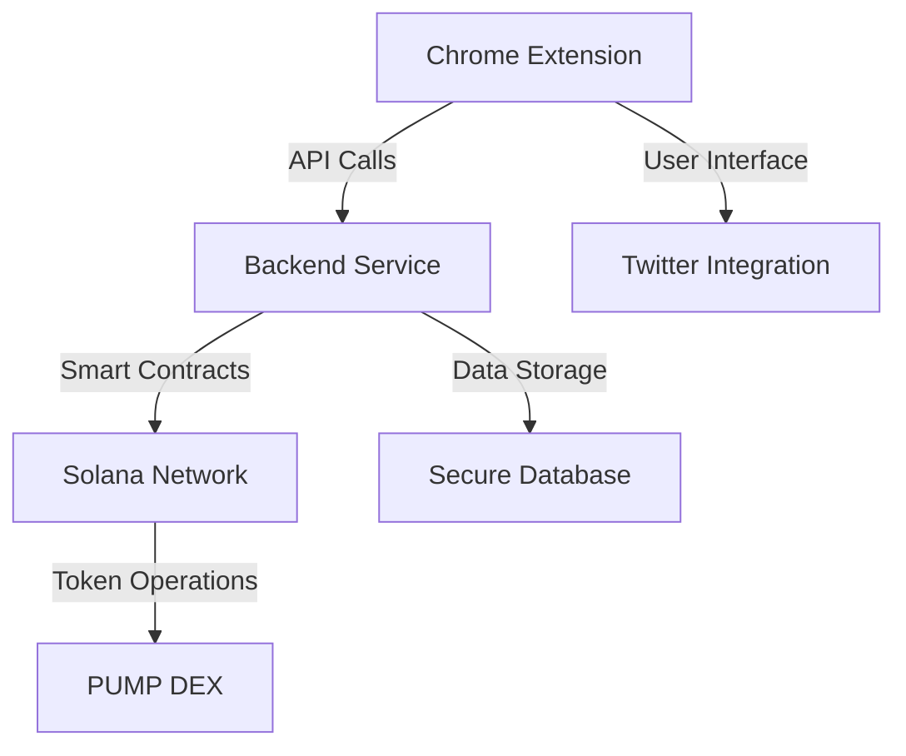

# Technical Architecture

## System Overview

MEMEFANS is built on a robust technical foundation that ensures high performance, security, and scalability. Our architecture leverages Solana's high-speed blockchain and integrates seamlessly with PUMP DEX for efficient token operations.

## Core Components

### PUMP DEX Integration
```typescript
interface PumpIntegration {
    swapEngine: {
        purchaseTokens(): Promise<boolean>;
        checkLiquidity(): number;
        optimizeGas(): void;
    };
    priceOracle: {
        getCurrentPrice(): number;
        getPriceHistory(): PriceData[];
    };
}
```

### Distribution Engine
- Automated token distribution
- Real-time transaction processing
- Smart contract optimization
- Gas fee minimization

### Security Layer
- Multi-layer encryption
- Transaction verification
- Anti-fraud systems
- Emergency protocols

## Technical Specifications

### Blockchain Infrastructure
- Network: Solana
- Consensus: Proof of History (PoH)
- Transaction Speed: 65,000 TPS
- Block Time: 400ms

### Smart Contracts
- Language: Rust
- Audited by: CertiK
- Gas Optimization: Implemented
- Upgrade Mechanism: Available

### Integration APIs
```typescript
interface MEMEFANSApi {
    // User Management
    createWallet(): Promise<string>;
    connectTwitter(): Promise<boolean>;
    
    // Token Operations
    distribute(recipients: string[]): Promise<boolean>;
    checkBalance(): Promise<number>;
    
    // Analytics
    getMetrics(): Promise<Analytics>;
    generateReport(): Report;
}
```

## System Architecture Diagram


## Performance Metrics
- Average Transaction Time: <1s
- Success Rate: 99.9%
- Uptime: 99.99%
- Max Concurrent Users: 1M+

[Continue to Token Economics →](token-economics.md)
