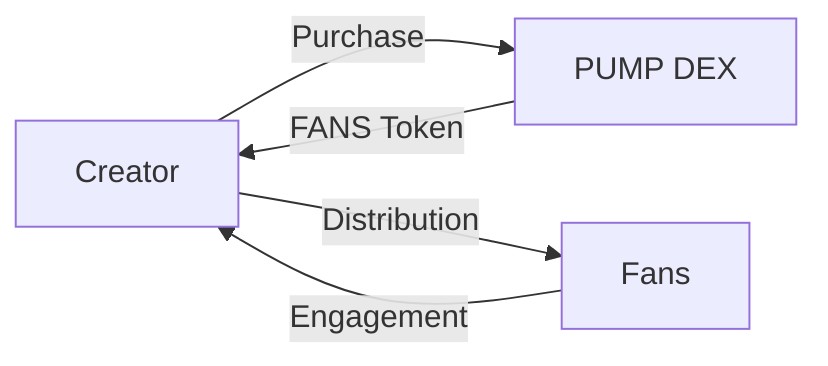

# Token Economics

## FANS Token Overview

The FANS token serves as the core utility token within the MEMEFANS ecosystem, facilitating creator-fan engagement and reward distribution through PUMP DEX.

## Token Utility

### For Creators
- Purchase tokens through PUMP DEX
- Distribute rewards to fans
- Access premium features
- Community management tools

### For Fans
- Receive creator rewards
- Participate in community activities
- Access exclusive content
- Token holding benefits

## Distribution Model

### Token Flow

[Continue to Platform Features →](platform-features.md)
