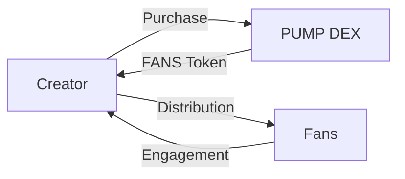

# Token Economics

## FANS Token Overview

The FANS token serves as the core utility token within the MEMEFANS ecosystem, facilitating creator-fan engagement and reward distribution through PUMP DEX.

## Token Utility

### For Creators
- Purchase tokens through PUMP DEX
- Distribute rewards to fans
- Access premium features
- Community management tools

### For Fans
- Receive creator rewards
- Participate in community activities
- Access exclusive content
- Token holding benefits

## Distribution Model

### Token Flow


## Tokenomics

### Total Supply: 1,000,000,000 FANS
- Fair Launch: 100%
  - No team allocation
  - No private sale
  - No reserved tokens
  - All tokens available for public purchase through PUMP DEX

### Fair Launch Mechanism
- Launch Platform: PUMP DEX
- Distribution Method: First Come, First Served
- Initial Price: Fixed price of X SOL per FANS
- No Vesting: Tokens are immediately tradeable
- Anti-Bot Measures: 
  - Purchase limits per wallet
  - CAPTCHA verification
  - Transaction monitoring

## Token Mechanics

### Reward Distribution
```typescript
interface RewardSystem {
    // Base reward for engagement
    baseReward: number;
    
    // Multiplier based on activity
    multiplier: {
        likes: number;
        retweets: number;
        comments: number;
    };
    
    // Bonus for consecutive days
    streakBonus: number;
}
```

### Price Stability
- Algorithmic price stabilization
- Liquidity pool management
- Buyback and burn mechanism
- Staking rewards

## Economic Model

### Revenue Streams
1. Transaction Fees
   - 0.1% on token purchases
   - 0.05% on distributions
   
2. Premium Features
   - Advanced analytics
   - Custom distribution rules
   - Bulk operations
   
3. Partnership Programs
   - Integration fees
   - API access
   - White-label solutions

### Sustainability
- Self-sustaining ecosystem through transaction fees
- Community-driven development fund
- Transparent treasury management
- Regular security audits

## Future Development

### Planned Features
- DAO governance
- Cross-chain integration
- NFT rewards
- Advanced analytics

### Economic Projections
- Phase 1: Fair Launch & Market Establishment
- Phase 2: Ecosystem Growth
- Phase 3: Community Governance
- Phase 4: Global Expansion

[Back to Technical Architecture](technical-architecture.md)
