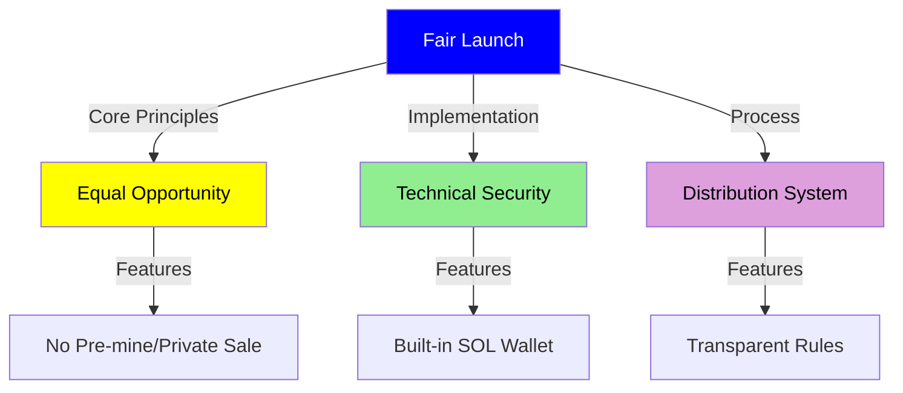

# Token Economics

## Token Overview

The FANS token is the core of the FANS ecosystem, adopting a community-driven distribution model via X posts.

<div class="mermaid">
graph TD
    FANS((FANS Token)) --> D[Distribution]
    FANS --> F[Features]
    FANS --> E[Economics]
    FANS --> S[Security]
    
    D --> CD[Community Driven]
    D --> PL[PUMP Launch]
    D --> ZG[Zero Gas Model]
    
    F --> SI[Social Integration]
    F --> CE[Chrome Extension]
    F --> AD[Automated Distribution]
    
    E --> FS[Fixed Supply]
    E --> BM[Burn Mechanism]
    E --> MD[Market Driven]
    
    S --> RL[Rate Limiting]
    S --> AB[Anti-bot]
    S --> TV[Transaction Verification]
    
    style FANS fill:#0000FF,color:#FFFFFF
    style D fill:#FFFF00,color:#000000
    style F fill:#90EE90,color:#000000
    style E fill:#DDA0DD,color:#000000
    style S fill:#FFB6C1,color:#000000
</div>

## FANS Token Specification

- **Name**: FANS Token
- **Symbol**: FANS
- **Blockchain**: Solana
- **Standard**: SPL Token
- **Total Supply**: 1,000,000,000 FANS
- **Initial Distribution**: Launch from PUMP

## Token Distribution

<div class="mermaid">
graph TD
    subgraph Token Details
    A[FANS Token] --> B[SPL Token]
    A --> C[1B Supply]
    A --> D[Solana Chain]
    end
    
    subgraph Distribution
    E[Community] --> F[50%]
    G[Team] --> H[15%]
    I[Development] --> J[20%]
    K[Marketing] --> L[15%]
    end
    
    style A fill:#0000FF,color:#FFFFFF
    style B fill:#FFFF00,color:#000000
    style C fill:#90EE90,color:#000000
    style D fill:#DDA0DD,color:#000000
    style E fill:#FFB6C1,color:#000000
    style F fill:#FFA07A,color:#000000
</div>

### Distribution Details
- **Community Pool (50%)**
  - Initial distribution via PUMP
  - Community rewards
  - Ecosystem growth
  - User incentives

- **Team Allocation (15%)**
  - 4-year vesting schedule
  - Quarterly unlocks
  - Performance-based bonuses
  - Long-term alignment

- **Development Fund (20%)**
  - Platform development
  - Technical infrastructure
  - Security audits
  - Protocol upgrades

- **Marketing & Partnerships (15%)**
  - Marketing campaigns
  - Strategic partnerships
  - Community events
  - Brand development

## Token Utility

### Platform Features
- **Zero Gas Model**
  - Free transactions for users
  - Platform covers gas fees
  - Enhanced user experience
  - Reduced barriers to entry

- **Social Integration**
  - X post integration
  - Automated distribution
  - Engagement tracking
  - Community rewards

- **Chrome Extension**
  - One-click gifting
  - Balance management
  - Transaction history
  - User preferences

### Token Flow

<div class="mermaid">
sequenceDiagram
    participant U as User
    participant P as Platform
    participant T as Token Pool
    participant R as Reward Pool

    U->>P: Create Content
    P->>T: Check Balance
    T->>P: Confirm Balance
    P->>R: Calculate Rewards
    R->>U: Distribute Tokens
    U->>P: Engage with Content
    P->>R: Generate Rewards
    R->>U: Send Rewards
</div>

## Economic Model

### Value Creation
<div class="mermaid">
graph TD
    A[User Activity] -->|Generate| B[Platform Revenue]
    B -->|Distribute| C[Token Holders]
    C -->|Incentivize| D[More Activity]
    D -->|Increase| E[Token Value]
    E -->|Attract| A
    
    style A fill:#FFFF00,color:#000000
    style B fill:#90EE90,color:#000000
    style C fill:#DDA0DD,color:#000000
    style D fill:#FFB6C1,color:#000000
    style E fill:#FFA07A,color:#000000
</div>

### Token Circulation
<div class="mermaid">
graph TD
    A[Market Purchase] -->|User Acquisition| B[Token Holding]
    B -->|Create Distribution| C[X Posts]
    C -->|Community Claims| D[Token Circulation]
    D -->|Creates Demand| A
    
    style A fill:#FFFF00,color:#000000
    style B fill:#90EE90,color:#000000
    style C fill:#DDA0DD,color:#000000
    style D fill:#FFB6C1,color:#000000
</div>

## Fair Launch Mechanism

### Launch Overview



### Core Principles

#### Fair Distribution

1. **Equal Opportunity**
   ```mermaid
   pie title Token Launch Distribution
     "Public Distribution" : 100
   ```
   - No pre-mine
   - No team allocation
   - No private sales
   - No early access

2. **Transparent Rules**
   - Clear distribution rules
   - Public verification
   - Open source code
   - Real-time tracking

3. **Security First**
   - Built-in SOL wallet
   - Local key generation
   - Secure storage
   - No external connections

### Distribution Mechanism

1. **Built-in Wallet**
   - Automatic generation with extension installation
   - Secure key storage
   - Easy token management
   - Direct distribution support

2. **Verification System**
   - Eligibility verification
   - Distribution tracking
   - Transaction monitoring
   - Security checks

## Token Security

### Security Measures
- **Rate Limiting**
  - Transaction limits
  - Anti-spam protection
  - Fair distribution
  - System stability

- **Anti-bot Protection**
  - User verification
  - Behavior analysis
  - Activity monitoring
  - Risk assessment

- **Transaction Verification**
  - Multi-sig requirements
  - Fraud detection
  - Automated checks
  - Manual review process

## Governance Model

### Governance Structure
- **Community Governance**
  - Token holder voting
  - Proposal submission
  - Parameter adjustments
  - Protocol upgrades

- **Development Decisions**
  - Feature prioritization
  - Technical improvements
  - Resource allocation
  - Security updates

### Governance Process
<div class="mermaid">
graph TD
    A[Proposal] -->|Community Review| B[Discussion]
    B -->|Token Holder Vote| C[Decision]
    C -->|Implementation| D[Execution]
    D -->|Monitoring| E[Review]
    E -->|Feedback| A
    
    style A fill:#FFFF00,color:#000000
    style B fill:#90EE90,color:#000000
    style C fill:#DDA0DD,color:#000000
    style D fill:#FFB6C1,color:#000000
    style E fill:#FFA07A,color:#000000
</div>

## Future Development

### Roadmap
- **Phase 1: Launch**
  - Token distribution
  - Platform release
  - Community building
  - Initial partnerships

- **Phase 2: Growth**
  - Feature expansion
  - User acquisition
  - Market development
  - Ecosystem integration

- **Phase 3: Maturity**
  - Full decentralization
  - Governance activation
  - Protocol optimization
  - Global expansion

### Sustainability
- **Revenue Model**
  - Transaction fees
  - Premium features
  - Partnership revenue
  - Value-added services

- **Cost Structure**
  - Development costs
  - Marketing expenses
  - Community rewards
  - Operational expenses

### Long-term Vision
- **Platform Evolution**
  - Enhanced features
  - New use cases
  - Technical innovation
  - Market expansion

- **Community Growth**
  - Global adoption
  - User engagement
  - Value creation
  - Sustainable growth
