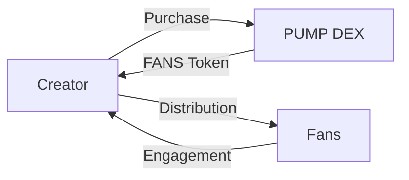

# Token Economics

## FANS Token Overview

The FANS token serves as the core utility token within the MEMEFANS ecosystem, facilitating creator-fan engagement and reward distribution through PUMP DEX.

## Token Utility

### For Creators
- Purchase tokens through PUMP DEX
- Distribute rewards to fans
- Access premium features
- Community management tools

### For Fans
- Receive creator rewards
- Participate in community activities
- Access exclusive content
- Token holding benefits

## Distribution Model

### Token Flow


## Tokenomics

### Total Supply: 1,000,000,000 FANS
- Public Sale: 40%
- Community Rewards: 30%
- Team & Advisors: 15%
- Development: 10%
- Marketing: 5%

### Vesting Schedule
- Public Sale: No lock-up
- Community Rewards: Released monthly
- Team & Advisors: 2-year vesting, 6-month cliff
- Development: 3-year vesting
- Marketing: 1-year vesting

## Token Mechanics

### Reward Distribution
```typescript
interface RewardSystem {
    // Base reward for engagement
    baseReward: number;
    
    // Multiplier based on activity
    multiplier: {
        likes: number;
        retweets: number;
        comments: number;
    };
    
    // Bonus for consecutive days
    streakBonus: number;
}
```

### Price Stability
- Algorithmic price stabilization
- Liquidity pool management
- Buyback and burn mechanism
- Staking rewards

## Economic Model

### Revenue Streams
1. Transaction Fees
   - 0.1% on token purchases
   - 0.05% on distributions
   
2. Premium Features
   - Advanced analytics
   - Custom distribution rules
   - Bulk operations
   
3. Partnership Programs
   - Integration fees
   - API access
   - White-label solutions

### Sustainability
- Self-sustaining ecosystem
- Deflationary token model
- Community governance
- Regular audits

## Future Development

### Planned Features
- DAO governance
- Cross-chain integration
- NFT rewards
- Advanced analytics

### Economic Projections
- Year 1: Market establishment
- Year 2: Ecosystem expansion
- Year 3: Full decentralization
- Year 4+: Global scaling

[Back to Technical Architecture](technical-architecture.md)
