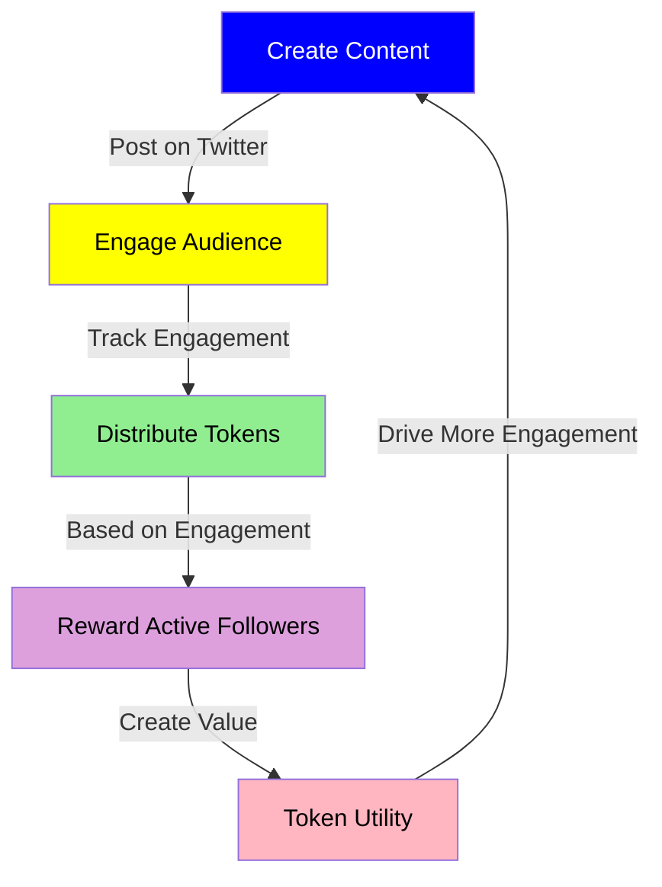
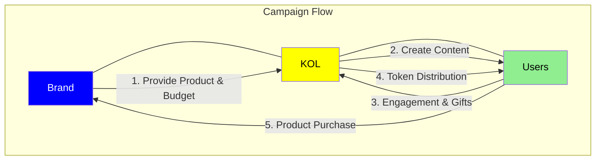
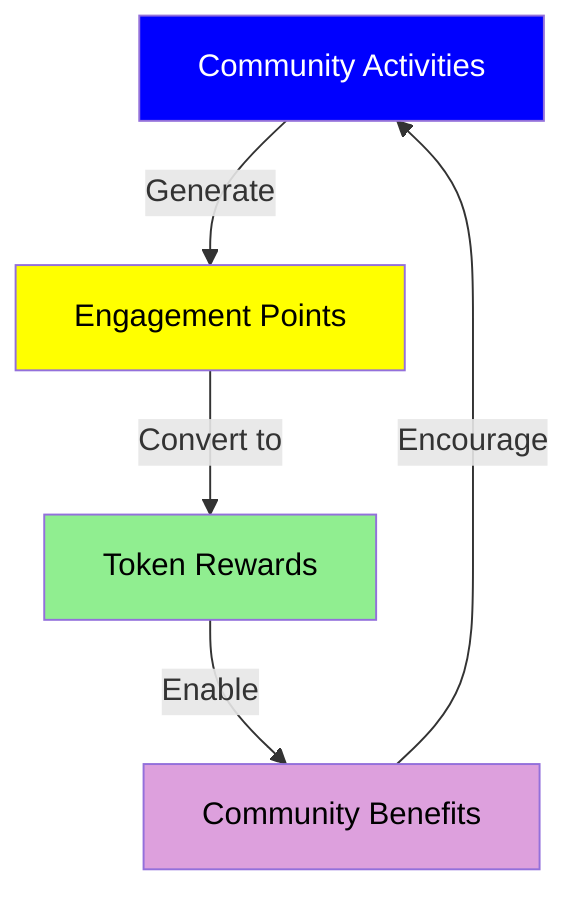
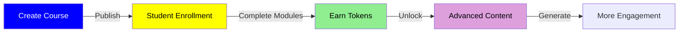
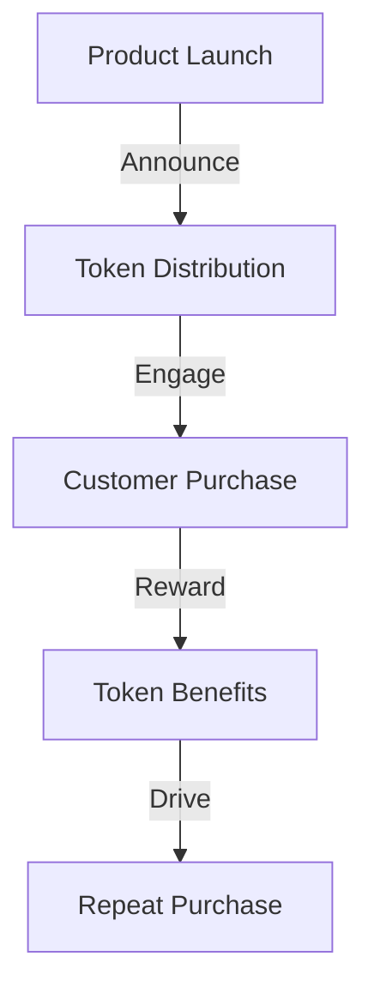
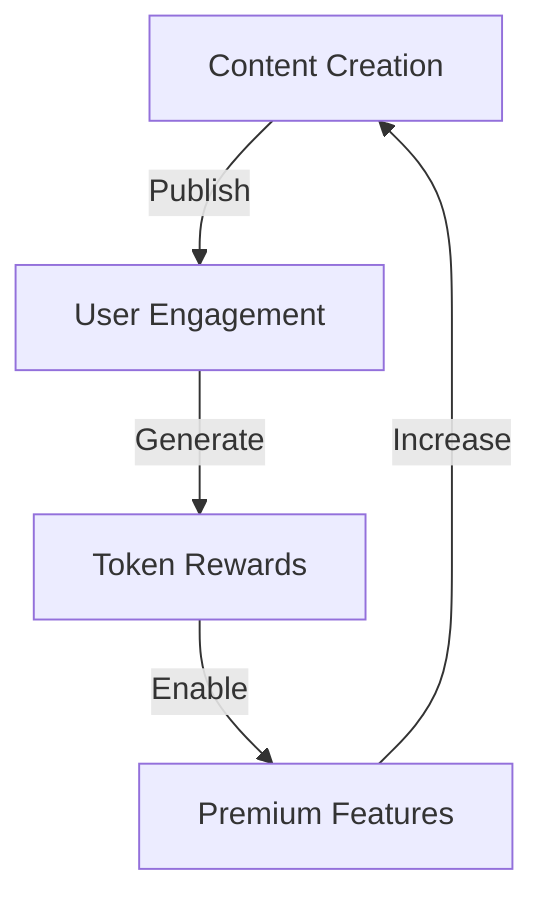
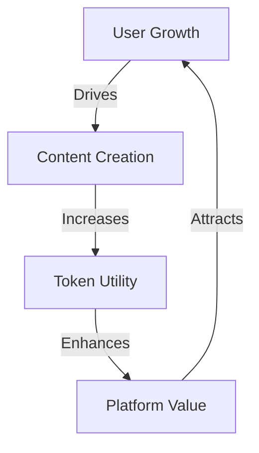

# Use Cases Analysis

## Content Creator Scenarios

### 1. Individual Content Creator
#### Profile
- **Creator Type**: Tech YouTuber
- **Followers**: 100,000+
- **Content Type**: Tech reviews, tutorials
- **Monetization**: Ad revenue, sponsorships
- **Growth Target**: 100K to 300K followers
- **Monthly Revenue Goal**: 8,000 USDT
- **Content Frequency**: 1-2 posts daily

#### Implementation

### 2. Brand Marketing
#### Campaign Structure
- **Campaign Type**: Product Launch
- **Duration**: 2-4 weeks
- **Target Audience**: Tech enthusiasts
- **Budget Range**: 5,000-20,000 USDT

#### Implementation Flow

### 3. Community Building
#### Community Profile
- **Type**: Tech Community
- **Size**: 50,000+ members
- **Focus**: Blockchain technology
- **Activities**: Weekly AMAs, tutorials

#### Engagement Model

### 4. Educational Content
#### Profile
- **Creator Type**: Online Educator
- **Course Type**: Technical Training
- **Student Base**: 20,000+
- **Content Format**: Video tutorials, workshops

#### Reward Structure

## Creator Categories

### 1. Professional Influencers
- **Profile**
  * Follower base: 100,000+
  * Regular content posting
  * Active community engagement
  * Brand collaborations

- **Usage Patterns**
  * Daily content creation
  * High engagement rate
  * Regular gift reception
  * Community interaction

- **Key Benefits**
  * Passive income stream
  * Community building
  * Fan engagement
  * Brand value growth

### 2. Emerging Creators
- **Profile**
  * Follower base: 10,000-100,000
  * Growing audience
  * Building engagement
  * Developing content style

- **Usage Patterns**
  * Regular posting
  * Community building
  * Gift system exploration
  * Audience growth

- **Key Benefits**
  * Monetization start
  * Community growth
  * Engagement tools
  * Platform learning

### 3. Casual Content Creators
- **Profile**
  * Follower base: <10,000
  * Part-time creation
  * Niche content
  * Personal branding

- **Usage Patterns**
  * Periodic posting
  * Community engagement
  * Basic gift features
  * Growth focus

- **Key Benefits**
  * Initial monetization
  * Community start
  * Basic tools
  * Growth potential

## Business Integration Cases

### 1. E-commerce Integration
#### Implementation
- Product launches
- Customer rewards
- Loyalty programs
- Exclusive access

#### Flow Diagram

### 2. Media Platform
#### Features
- Content monetization
- Subscriber rewards
- Premium access
- Community governance

#### Engagement Flow

## Token Utility Cases

### 1. Access Control
- Premium content access
- Early access rights
- Exclusive features
- VIP community access

### 2. Governance Rights
- Feature voting
- Content moderation
- Platform development
- Resource allocation

### 3. Economic Benefits
- Revenue sharing
- Trading privileges
- Staking rewards
- Fee reductions

## Success Metrics

### 1. Engagement Metrics
- Daily active users
- Content interaction rate
- Token circulation volume
- Community growth rate

### 2. Economic Metrics
- Revenue generation
- Token value stability
- Platform adoption
- Market penetration

### 3. Growth Indicators

## Risk Management

### 1. Platform Risks
- Content quality control
- User verification
- Fraud prevention
- Market manipulation

### 2. Mitigation Strategies
- Community guidelines
- KYC implementation
- Activity monitoring
- Value protection
